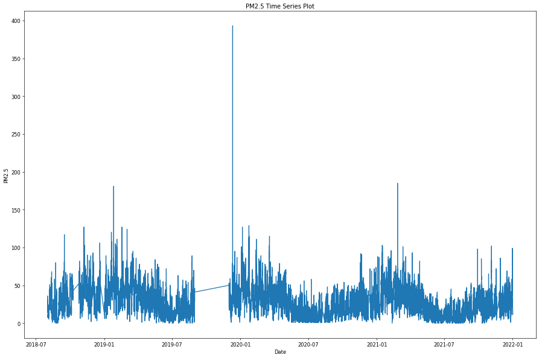
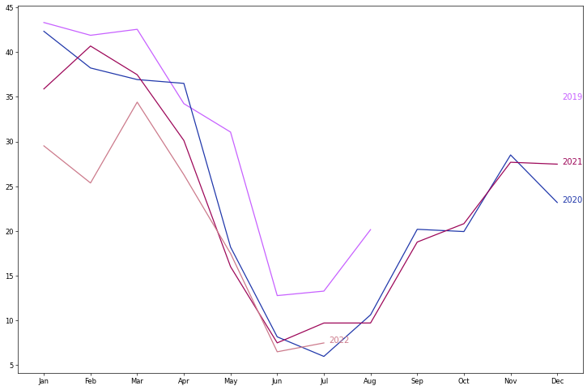
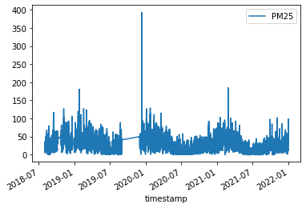
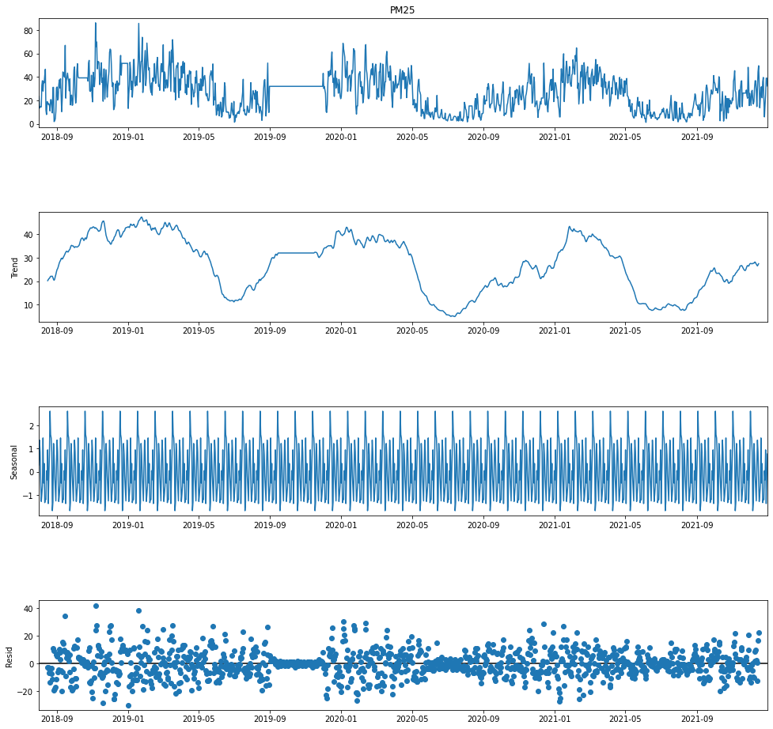
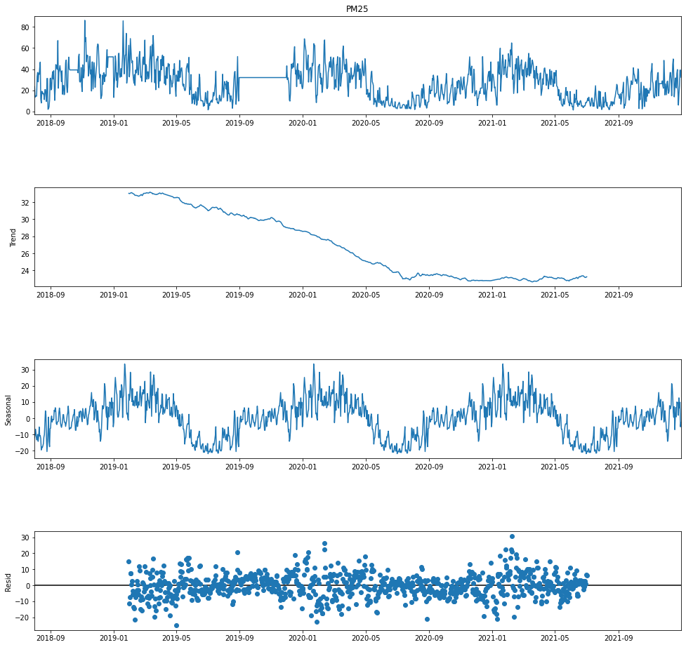

[](https://colab.research.google.com/drive/1MUHXiRiI7o56oZLCU2JrxI-aJEiM6RkJ?usp=sharing)



Time series data refers to information that is organized based on when it occurred or was recorded. This data is often set at regular time intervals, like every five minutes or hourly. It's used in a variety of areas including finance, space engineering, and signal processing, among others. Time series data also plays a big role in our daily lives. For instance, with the ongoing global climate change, we've seen a rise in average temperatures, leading to hotter summers. Similarly, air quality can vary significantly during different times of the year. Analyzing time series data helps us understand how these environmental changes occur over time by looking at the relationship between data points and time periods. 

In this chapter, we'll explore how to use time series data analysis through three specific types of data: air quality, water resources, and weather. These examples are taken from the Civil IoT Taiwan Data Service Platform, showing how this analysis can provide insights into environmental trends and changes.

## Goal

- observe time series data using visualization tools
- check and process time series data
- decompose time series data to investigate its trend and seasonality

## Package Installation and Importing

In this article, we're going to work with several useful tools, including pandas, matplotlib, numpy, seaborn, statsmodels, and warnings. These are all ready to use on Google Colab, our chosen development platform, so you don't have to worry about installing them. However, we'll also be using two extra packages, kats and calplot, which aren't pre-installed on Colab. To use these, we'll need to install them first.

```python
!pip install --upgrade pip

# Kats
!pip install kats==0.1 ax-platform==0.2.3 statsmodels==0.12.2

# calplot
!pip install calplot
```

Once the installation of kats and calplot is finished, we can begin by importing all the necessary packages to set up our working environment for this article. Here's how we do it:

```python
import warnings
import calplot
import pandas as pd
import numpy as np
import matplotlib as mpl
import matplotlib.pyplot as plt
import statsmodels.api as sm
import os, zipfile

from datetime import datetime, timedelta
from dateutil import parser as datetime_parser
from statsmodels.tsa.stattools import adfuller, kpss
from statsmodels.tsa.seasonal import seasonal_decompose
from kats.detectors.outlier import OutlierDetector
from kats.detectors.cusum_detection import CUSUMDetector
from kats.consts import TimeSeriesData, TimeSeriesIterator
from IPython.core.pylabtools import figsize
```

## Data Access

We'll be using a tool called pandas, which is popular in data science and is part of the Python programming language. Think of pandas like a spreadsheet, similar to Microsoft Excel, but for programming. It has a feature called 'Dataframe' that acts like a two-dimensional table, allowing us to organize data in rows and columns. This setup is very handy for various kinds of data work.

Our focus here is on analyzing and processing time series data, which means data that is collected over time. We'll be working with air quality, water level, and weather data from the Civil IoT Taiwan Data Service Platform. We'll especially focus on air quality data for a more in-depth analysis. This data comes from a network of monitoring stations and has been recorded over a long period. In our data table, or 'dataframe', the time of each data entry is labeled as 'timestamp'. Since each timestamp is unique, we use it as an index to organize our dataframe, making it easier to navigate and analyze the data.

### Air Quality Data

We're going to work with long-term historical data. Instead of using the standard data access methods provided by the pyCIOT package, we'll directly download a dataset named "Academia Sinica - Micro Air Quality Sensors" from the historical database of the Civil IoT Taiwan Data Service Platform. Once downloaded, we'll save this data in a folder named Air.

Since the data we download comes in a zip file, which is a type of compressed file, our first step will be to unzip it. Unzipping will give us a series of daily files, also compressed. We'll then need to decompress each of these daily files. After decompressing, we'll store them in a separate folder named CSV_Air. This step-by-step process ensures that we have all the historical air quality data ready and organized for our analysis.

```python
!mkdir Air CSV_Air
!wget -O Air/2018.zip -q "https://history.colife.org.tw/?r=/download&path=L%2Bepuuawo%2BWTgeizqi%2FkuK3noJTpmaJf5qCh5ZyS56m65ZOB5b6u5Z6L5oSf5ris5ZmoLzIwMTguemlw"
!wget -O Air/2019.zip -q "https://history.colife.org.tw/?r=/download&path=L%2Bepuuawo%2BWTgeizqi%2FkuK3noJTpmaJf5qCh5ZyS56m65ZOB5b6u5Z6L5oSf5ris5ZmoLzIwMTkuemlw"
!wget -O Air/2020.zip -q "https://history.colife.org.tw/?r=/download&path=L%2Bepuuawo%2BWTgeizqi%2FkuK3noJTpmaJf5qCh5ZyS56m65ZOB5b6u5Z6L5oSf5ris5ZmoLzIwMjAuemlw"
!wget -O Air/2021.zip -q "https://history.colife.org.tw/?r=/download&path=L%2Bepuuawo%2BWTgeizqi%2FkuK3noJTpmaJf5qCh5ZyS56m65ZOB5b6u5Z6L5oSf5ris5ZmoLzIwMjEuemlw"

#開始進行解壓縮
folder = 'Air'
extension_zip = '.zip'
extension_csv = '.csv'

for subfolder in os.listdir(folder):
    path = f'{folder}/{subfolder}'
    if path.endswith(extension_zip):
      print(path)
      zip_ref = zipfile.ZipFile(path)
      zip_ref.extractall(folder)
      zip_ref.close()

for subfolder in os.listdir(folder):
    path = f'{folder}/{subfolder}'
    if os.path.isdir(path):
        for item in os.listdir(path):
            if item.endswith(extension_zip):
                file_name = f'{path}/{item}'
                print(file_name)
                zip_ref = zipfile.ZipFile(file_name)
                zip_ref.extractall(path)
                zip_ref.close()

        for item in os.listdir(path):
          path2 = f'{path}/{item}'
          if os.path.isdir(path2):
            for it in os.listdir(path2):
              if it.endswith(extension_zip):
                file_name = f'{path2}/{it}'
                print(file_name)
                zip_ref = zipfile.ZipFile(file_name)
                zip_ref.extractall('CSV_Air') # decide path
                zip_ref.close()
          elif item.endswith(extension_csv):
            os.rename(path2, f'CSV_Air/{item}')
```

Now that we've decompressed the daily sensor data, the `CSV_Air` folder contains all of this data in CSV (Comma-Separated Values) format. CSV files are like simple spreadsheets where each line of text is a row of data, and each value in the row is separated by a comma.

Our next step is to focus on data from a specific monitoring station. Let's say we're interested in the station with the code `74DA38C7D2AC`. To extract data for this station, we will read each CSV file and select only the data from this station. This selected data will be gathered into a new dataframe, which we'll call `air`.

Once we've collected all the necessary data in the `air` dataframe, our final step is to delete all the downloaded and decompressed data. This is an important step to save storage space in the cloud, where we're working. This way, we keep only the essential data we need for analysis, making our work more efficient and organized.

```python
folder = 'CSV_Air'
extension_csv = '.csv'
id = '74DA38C7D2AC'

air = pd.DataFrame()
for item in os.listdir(folder):
  file_name = f'{folder}/{item}'
  df = pd.read_csv(file_name)
  if 'pm25' in list(df.columns):
    df.rename({'pm25':'PM25'}, axis=1, inplace=True)
  filtered = df.query(f'device_id==@id')
  air = pd.concat([air, filtered], ignore_index=True)
air.dropna(subset=['timestamp'], inplace=True)

for i, row in air.iterrows():
  aware = datetime_parser.parse(str(row['timestamp']))
  naive = aware.replace(tzinfo=None)
  air.at[i, 'timestamp'] = naive
air.set_index('timestamp', inplace=True)

!rm -rf Air CSV_Air
```

The last step in our data preparation process involves organizing the data we've collected for the specific monitoring station. Here's what we'll do:

1. **Rearrange the Data:** We'll adjust the layout of the data to make it easier to analyze. This might involve moving columns around or changing how the data is displayed in the dataframe.

2. **Delete Unnecessary Fields:** Our dataset might contain information that isn't relevant to our analysis. To simplify our work and focus on the essential data, we'll remove these unnecessary fields. This process is about streamlining the data to what's important for our specific study.

3. **Sort by Time:** Since we're dealing with time series data, it's crucial to have the data in chronological order. We'll sort the data based on the timestamp, ensuring that it's arranged from the earliest to the latest entry. This makes it easier to observe trends and patterns over time.

By completing these steps, we'll have a clean, well-organized dataset that's ready for detailed analysis. This organized approach not only makes our analysis more straightforward but also ensures accuracy in our findings.

```python
air.drop(columns=['device_id', 'SiteName'], inplace=True)
air.sort_values(by='timestamp', inplace=True)
air.info()
print(air.head())
```

```
<class 'pandas.core.frame.DataFrame'>
DatetimeIndex: 195305 entries, 2018-08-01 00:00:05 to 2021-12-31 23:54:46
Data columns (total 1 columns):
 \#   Column  Non-Null Count   Dtype 
---  ------  --------------   ----- 
 0   PM25    195305 non-null  object
dtypes: object(1)
memory usage: 3.0+ MB
                     PM25
timestamp                
2018-08-01 00:00:05  20.0
2018-08-01 00:30:18  17.0
2018-08-01 01:12:34  18.0
2018-08-01 01:18:36  21.0
2018-08-01 01:30:44  22.0
```

### Water Level Data

Just like with the air quality data, we're going to focus on using long-term historical data for our water level analysis. Instead of using the pyCIOT suite's built-in methods for accessing data, we'll take a different approach:

1. **Download the Data Archive:** We'll directly download the data set titled "Water Resources Agency - Groundwater Level Station" from the historical database of the Civil IoT Taiwan Data Service Platform. This dataset contains extensive historical data on groundwater levels.

2. **Save the Data:** After downloading, we'll store this data in a folder named `Water`. This step helps us keep our data organized and easily accessible.

3. **Decompress the Data:** The data we've downloaded will be in a zip compressed file. Our first task is to unzip this file. Unzipping will reveal a number of daily files, which are also in a compressed format.

4. **Decompress Daily Files:** We'll then decompress each of these daily files. This step is crucial as it converts the compressed files into a format that we can work with for our analysis.

5. **Store Decompressed Data:** Finally, we'll store the decompressed daily files in another folder, named `CSV_Water`. This folder will now contain all the daily groundwater level data in an accessible format, ready for us to process and analyze.

By following these steps, we ensure that we have a comprehensive and organized dataset of groundwater levels, which is crucial for accurate and effective analysis.

```python
!mkdir Water CSV_Water
!wget -O Water/2018.zip "https://history.colife.org.tw/?r=/download&path=L%2BawtOizh%2Ba6kC%2FmsLTliKnnvbJf5rKz5bed5rC05L2N56uZLzIwMTguemlw"
!wget -O Water/2019.zip "https://history.colife.org.tw/?r=/download&path=L%2BawtOizh%2Ba6kC%2FmsLTliKnnvbJf5rKz5bed5rC05L2N56uZLzIwMTkuemlw"
!wget -O Water/2020.zip "https://history.colife.org.tw/?r=/download&path=L%2BawtOizh%2Ba6kC%2FmsLTliKnnvbJf5rKz5bed5rC05L2N56uZLzIwMjAuemlw"
!wget -O Water/2021.zip "https://history.colife.org.tw/?r=/download&path=L%2BawtOizh%2Ba6kC%2FmsLTliKnnvbJf5rKz5bed5rC05L2N56uZLzIwMjEuemlw"

#開始進行解壓縮
folder = 'Water'
extension_zip = '.zip'
extension_csv = '.csv'

for subfolder in os.listdir(folder):
    path = f'{folder}/{subfolder}'
    if path.endswith(extension_zip):
      print(path)
      zip_ref = zipfile.ZipFile(path)
      zip_ref.extractall(folder)
      zip_ref.close()
for subfolder in os.listdir(folder):
    path = f'{folder}/{subfolder}'
    if os.path.isdir(path):
        for item in os.listdir(path):
            if item.endswith(extension_zip):
                file_name = f'{path}/{item}'
                print(file_name)
                zip_ref = zipfile.ZipFile(file_name)
                zip_ref.extractall(path)
                zip_ref.close()

        for item in os.listdir(path):
          path2 = f'{path}/{item}'
          if os.path.isdir(path2):
            for it in os.listdir(path2):
              if it.endswith(extension_zip) and not it.endswith('QC.zip'):
                file_name = f'{path2}/{it}'
                print(file_name)
                zip_ref = zipfile.ZipFile(file_name)
                zip_ref.extractall('CSV_Water') # decide path
                zip_ref.close()
          elif item.endswith(extension_csv):
            os.rename(path2, f'CSV_Water/{item}')
```

Now that we've decompressed the water level data, the `CSV_Water` folder is filled with daily sensor data in CSV format. Next, we'll focus on extracting and organizing data from a specific station. Here's how we'll do it:

1. **Filter Data for a Specific Station:** We'll target data from a particular station, for example, the one with the code `338c9c1c-57d8-41d7-9af2-731fb86e632c`. To do this, we need to read each CSV file and filter out only the data that corresponds to this station.

2. **Create a Dataframe:** We'll gather all the data for our chosen station and put it into a dataframe. A dataframe is a table-like structure in programming that makes data manipulation easier. We'll name this dataframe `water`.

3. **Delete Unnecessary Data:** After successfully extracting the necessary data and storing it in the `water` dataframe, we'll delete all the originally downloaded data and the data generated after decompression. This step is crucial for saving storage space in the cloud, ensuring that we keep only the data that is essential for our analysis.

By following these steps, we'll have a streamlined, specific dataset ready for in-depth analysis of water levels at the chosen station. This approach helps in maintaining an organized and efficient workflow, especially when dealing with large amounts of data.

```python
folder = 'CSV_Water'
extension_csv = '.csv'
id = '338c9c1c-57d8-41d7-9af2-731fb86e632c'

water = pd.DataFrame()
for item in os.listdir(folder):
  file_name = f'{folder}/{item}'
  df = pd.read_csv(file_name)
  if 'pm25' in list(df.columns):
    df.rename({'pm25':'PM25'}, axis=1, inplace=True)
  filtered = df.query(f'station_id==@id')
  water = pd.concat([water, filtered], ignore_index=True)
water.dropna(subset=['timestamp'], inplace=True)

for i, row in water.iterrows():
  aware = datetime_parser.parse(str(row['timestamp']))
  naive = aware.replace(tzinfo=None)
  water.at[i, 'timestamp'] = naive
water.set_index('timestamp', inplace=True)

!rm -rf Water CSV_Water
```

As the final step in preparing our water level data for analysis, we'll undertake three key actions to organize and streamline the dataset:

1. **Rearrange the Data:** We'll adjust the layout of the data within the dataframe to make it more intuitive and easier to analyze. This could involve reordering columns, grouping similar data together, or any other structural changes that enhance clarity and accessibility.

2. **Delete Unnecessary Fields:** Our dataset may contain some fields (columns of data) that aren't relevant to our specific analysis objectives. To keep our focus sharp and the dataset lean, we'll identify and remove these unnecessary fields. This step is all about trimming the data down to what's most useful for our study.

3. **Sort by Time:** Since we're dealing with time series data, sorting it chronologically is crucial. We'll organize the data so that it's in order from the earliest to the most recent records. This chronological arrangement is vital for any analysis that tracks changes over time, as it helps in identifying trends, patterns, and anomalies.

By carrying out these steps, we ensure that our water level dataset is not only tailored to our specific research needs but also organized in a way that facilitates efficient and accurate analysis. This organized approach is particularly important in data science, as it lays the groundwork for insightful and reliable results.

```python
water.drop(columns=['station_id', 'ciOrgname', 'ciCategory', 'Organize_Name', 'CategoryInfos_Name', 'PQ_name', 'PQ_fullname', 'PQ_description', 'PQ_unit', 'PQ_id'], inplace=True)
water.sort_values(by='timestamp', inplace=True)
water.info()
print(water.head())
```

```
<class 'pandas.core.frame.DataFrame'>
DatetimeIndex: 213466 entries, 2018-01-01 00:20:00 to 2021-12-07 11:00:00
Data columns (total 1 columns):
 #   Column  Non-Null Count   Dtype  
---  ------  --------------   -----  
 0   value   213465 non-null  float64
dtypes: float64(1)
memory usage: 3.3 MB
                         value
timestamp                     
2018-01-01 00:20:00  49.130000
2018-01-01 00:25:00  49.139999
2018-01-01 00:30:00  49.130001
2018-01-01 00:35:00  49.130001
2018-01-01 00:40:00  49.130001
```

### Meteorological Data

For our weather data analysis, we will follow a similar process to what we did with the air quality and water level data:

1. **Download the Data Archive:** We'll start by downloading the "Central Weather Bureau - Automatic Weather Station" data from the historical database of the Civil IoT Taiwan Data Service Platform. This dataset provides comprehensive historical weather data.

2. **Store the Data:** After downloading, we'll save this data in a folder named `Weather`. Organizing data into specific folders helps keep our workspace tidy and makes it easier to locate the data we need for our analysis.

3. **Decompress the Data:** The downloaded data will be in a zip compressed file format. Our first task is to decompress this file, which will reveal a number of daily files. These daily files will also be in a compressed format.

4. **Decompress Daily Files:** Next, we'll decompress each of these daily files. This step is essential as it makes the data accessible and ready for analysis.

5. **Store Decompressed Data:** Finally, we'll store the decompressed daily files in a separate folder, named `CSV_Weather`. This folder will now contain all the daily weather data in a format that's ready for processing and analysis.

By completing these steps, we ensure that our weather data is well-organized and prepared for detailed analysis. This process is crucial in data science for maintaining an efficient workflow and ensuring that the data is in a usable state for any analytical tasks that follow.

```python
!mkdir Weather CSV_Weather
!wget -O Weather/2019.zip "https://history.colife.org.tw/?r=/download&path=L%2Bawo%2BixoS%2FkuK3lpK7msKPosaHlsYBf6Ieq5YuV5rCj6LGh56uZLzIwMTkuemlw"
!wget -O Weather/2020.zip "https://history.colife.org.tw/?r=/download&path=L%2Bawo%2BixoS%2FkuK3lpK7msKPosaHlsYBf6Ieq5YuV5rCj6LGh56uZLzIwMjAuemlw"
!wget -O Weather/2021.zip "https://history.colife.org.tw/?r=/download&path=L%2Bawo%2BixoS%2FkuK3lpK7msKPosaHlsYBf6Ieq5YuV5rCj6LGh56uZLzIwMjEuemlw"

#開始進行解壓縮
folder = 'Weather'
extension_zip = '.zip'
extension_csv = '.csv'

for subfolder in os.listdir(folder):
    path = f'{folder}/{subfolder}'
    if path.endswith(extension_zip):
      print(path)
      zip_ref = zipfile.ZipFile(path)
      zip_ref.extractall(folder)
      zip_ref.close()

for subfolder in os.listdir(folder):
    path = f'{folder}/{subfolder}'
    if os.path.isdir(path):
        for item in os.listdir(path):
            if item.endswith(extension_zip):
                file_name = f'{path}/{item}'
                print(file_name)
                zip_ref = zipfile.ZipFile(file_name)
                zip_ref.extractall(path)
                zip_ref.close()

        for item in os.listdir(path):
          path2 = f'{path}/{item}'
          if os.path.isdir(path2):
            for it in os.listdir(path2):
              if it.endswith(extension_zip):
                file_name = f'{path2}/{it}'
                print(file_name)
                zip_ref = zipfile.ZipFile(file_name)
                zip_ref.extractall('CSV_Weather') # decide path
                zip_ref.close()
          elif item.endswith(extension_csv):
            os.rename(path2, f'CSV_Weather/{item}')
```

Having successfully decompressed the weather data, the `CSV_Weather` folder now contains all the daily sensor data in CSV format. Our next steps focus on extracting specific data and organizing it effectively:

1. **Filter Data for a Specific Station:** We'll concentrate on data from a particular weather station, for example, the one identified by the code `C0U750`. To do this, we need to sift through each CSV file, extracting only the data relevant to this station.

2. **Create a Dataframe:** We'll compile all the selected data from the `C0U750` station into a dataframe, a table-like structure used in programming for data analysis. This dataframe will be named `weather`, and it will contain all the relevant weather data from the chosen station.

3. **Delete Unnecessary Data:** After we've gathered all the needed data in the `weather` dataframe, we'll remove all the original downloaded data and the data generated after decompression. This step is important to conserve storage space in the cloud. Keeping only the essential data ensures a more streamlined and efficient dataset for analysis.

By completing these steps, we ensure that our weather dataset is focused, well-organized, and ready for in-depth analysis, specifically tailored to the `C0U750` weather station. This approach is key in data science, helping maintain an organized workflow and ensuring the integrity and relevance of the data being analyzed.

```python
folder = 'CSV_Weather'
extension_csv = '.csv'
id = 'C0U750'

weather = pd.DataFrame()
for item in os.listdir(folder):
  file_name = f'{folder}/{item}'
  df = pd.read_csv(file_name)
  if 'pm25' in list(df.columns):
    df.rename({'pm25':'PM25'}, axis=1, inplace=True)
  filtered = df.query(f'station_id==@id')
  weather = pd.concat([weather, filtered], ignore_index=True)
weather.rename({'obsTime':'timestamp'}, axis=1, inplace=True)
weather.dropna(subset=['timestamp'], inplace=True)

for i, row in weather.iterrows():
  aware = datetime_parser.parse(str(row['timestamp']))
  naive = aware.replace(tzinfo=None)
  weather.at[i, 'timestamp'] = naive
weather.set_index('timestamp', inplace=True)

!rm -rf Weather CSV_Weather
```

To finalize our preparation of the weather data for analysis, we'll perform three crucial steps to ensure the dataset is well-organized and tailored to our needs:

1. **Rearrange the Data:** We'll reorganize the data within the `weather` dataframe to make it more user-friendly and conducive to analysis. This may involve changing the order of columns, grouping similar types of data together, or altering the layout to improve readability and ease of use.

2. **Delete Unnecessary Fields:** In our dataset, there may be some fields (columns) that are not relevant to our specific analysis goals. To streamline our dataset, we'll identify and remove these unnecessary fields. This step helps focus our dataset on only the most pertinent information, making our analysis more efficient and effective.

3. **Sort by Time:** Since the essence of our dataset is time series data, arranging it chronologically is essential. We'll sort the data in the `weather` dataframe so that it's in order from the earliest data entry to the most recent. This chronological sorting is crucial for analyses that track changes over time, as it aids in identifying trends, patterns, and anomalies more clearly.

By executing these steps, we ensure that our weather data is not only precisely tailored for our research but also organized in a way that facilitates effective and accurate analysis. Proper data organization is a fundamental aspect of data science, as it sets the foundation for insightful and reliable analytical outcomes.

```python
weather.drop(columns=['station_id'], inplace=True)
weather.sort_values(by='timestamp', inplace=True)
weather.info()
print(weather.head())
```

```
<class 'pandas.core.frame.DataFrame'>
DatetimeIndex: 27093 entries, 2019-01-01 00:00:00 to 2021-12-31 23:00:00
Data columns (total 15 columns):
 #   Column  Non-Null Count  Dtype  
---  ------  --------------  -----  
 0   ELEV    27093 non-null  float64
 1   WDIR    27089 non-null  float64
 2   WDSD    27089 non-null  float64
 3   TEMP    27093 non-null  float64
 4   HUMD    27089 non-null  float64
 5   PRES    27093 non-null  float64
 6   SUN     13714 non-null  float64
 7   H_24R   27089 non-null  float64
 8   H_FX    27089 non-null  float64
 9   H_XD    27089 non-null  object 
 10  H_FXT   23364 non-null  object 
 11  D_TX    27074 non-null  object 
 12  D_TXT   7574 non-null   object 
 13  D_TN    27074 non-null  object 
 14  D_TNT   17 non-null     object 
dtypes: float64(9), object(6)
memory usage: 3.3+ MB
                      ELEV  WDIR  WDSD  TEMP  HUMD   PRES   SUN  H_24R  H_FX  \
timestamp                                                                      
2019-01-01 00:00:00  398.0  35.0   5.8  13.4  0.99  981.1 -99.0   18.5 -99.0   
2019-01-01 01:00:00  398.0  31.0   5.7  14.1  0.99  981.0 -99.0    0.5  10.8   
2019-01-01 02:00:00  398.0  35.0   5.3  13.9  0.99  980.7 -99.0    1.0 -99.0   
2019-01-01 03:00:00  398.0  32.0   5.7  13.8  0.99  980.2 -99.0    1.5 -99.0   
2019-01-01 04:00:00  398.0  37.0   6.9  13.8  0.99  980.0 -99.0    2.0  12.0   

                     H_XD H_FXT  D_TX D_TXT  D_TN D_TNT  
timestamp                                                
2019-01-01 00:00:00 -99.0 -99.0  14.5   NaN  13.4   NaN  
2019-01-01 01:00:00  35.0   NaN  14.1   NaN  13.5   NaN  
2019-01-01 02:00:00 -99.0 -99.0  14.1   NaN  13.5   NaN  
2019-01-01 03:00:00 -99.0 -99.0  14.1   NaN  13.5   NaN  
2019-01-01 04:00:00  39.0   NaN  14.1   NaN  13.5   NaN
```

In our tutorial so far, we've successfully walked through the process of accessing and organizing three types of data: air quality (`air`), water level (`water`), and meteorological (`weather`) data. Each dataset was prepared by downloading, decompressing, filtering, and arranging the data for specific monitoring stations. This process sets a strong foundation for our next steps.

Now, we're going to delve into basic time series data processing using the air quality data as our example. Time series data processing is a method used to analyze and interpret data that is collected over time. Here's what we'll cover:

1. **Basic Time Series Data Processing:** We'll explore techniques to analyze the air quality data, looking at trends, patterns, and changes over time. This will involve techniques like plotting the data over time, calculating averages, and possibly identifying any anomalies or significant changes.

2. **Application to Other Data Types:** The methods we use for the air quality data can be similarly applied to both water level and meteorological data. The principles of time series analysis remain the same, even though the specific data points and their implications may differ.

3. **Encouragement to Experiment:** You're encouraged to try these methods on your own. Whether you choose to work with the water level or meteorological data, applying these time series data processing techniques will enhance your understanding and skills. Experimenting with different datasets is a great way to deepen your grasp of these concepts and discover insights specific to each type of data.

By engaging in this hands-on process, you'll gain practical experience in handling and analyzing time series data, a valuable skill in many areas of research and data science.

## Data Visualization

Data visualization plays a crucial role in the analysis of time series data. It transforms raw data into a visual context, such as charts or graphs, making it easier to understand, interpret, and derive insights. Let's explore how we can use data visualization, specifically focusing on air quality data:

1. **Chronological Presentation:** The first step in visualizing time series data is to present it in chronological order. This means arranging the data so that it shows changes over time. By doing this, users can quickly see overall trends, patterns, and anomalies within the dataset, which can spark new ideas and approaches for further analysis.

2. **Using Line Charts:** One of the most common methods for visualizing time series data is through line charts. Line charts are particularly effective because they show how data points change over time, with the passage of time usually represented on the x-axis (horizontal) and the data points on the y-axis (vertical).

3. **Example with Air Quality Data:**
   - **Plotting the Data:** To visualize air quality data, we can plot various air quality metrics (like PM2.5, CO2 levels, etc.) on a line chart. Each line on the chart would represent a different metric.
   - **Identifying Trends:** Line charts allow us to easily identify trends, such as periods of high pollution or sudden changes in air quality. 
   - **Comparisons Over Time:** We can also compare different time periods, such as different months or years, to see how air quality has changed over longer periods.

By using data visualization techniques like line charts, we make complex data more accessible and understandable. This is a powerful way to communicate data-driven insights and can be a stepping stone to more advanced analyses, such as identifying the causes of trends or predicting future air quality conditions.

```python
plt.figure(figsize=(15, 10), dpi=60)
plt.plot(air[:]["PM25"])

plt.xlabel("Date")
plt.ylabel("PM2.5")
plt.title("PM2.5 Time Series Plot")

plt.tight_layout()

plt.show()
```



### Data Resample

Data resampling is an important technique in time series analysis, especially when dealing with dense datasets like air quality measurements. Let's break down the concept and its application:

1. **Understanding Data Density and Variability:** In our air quality dataset, data is collected roughly every five minutes, resulting in a high density of data points. Additionally, the values can change rapidly due to environmental factors, leading to high variability. This level of detail can sometimes obscure broader trends in the data.

2. **The Challenge with High-Frequency Data:** With data recorded every five minutes, it can be difficult to discern the overall trends in ambient air pollution. The frequent sampling captures a lot of detail, but this can also lead to a cluttered and overwhelming dataset.

3. **Resampling for Clarity:** To address this, we use a technique called resampling. Resampling involves recalculating the data values over a larger, fixed time interval. This process simplifies the dataset, making it easier to see long-term trends and patterns.

4. **Resampling Syntax and Scales:** To resample the data, we use specific programming commands. These commands allow us to change the sampling rate from every five minutes to a larger scale, such as hourly, daily, or monthly. By resampling, we can adjust the granularity of our data analysis to suit our needs.

For example, if we're interested in daily trends in air quality, we can resample the data to calculate the average air quality for each day. This would give us a clearer view of how air quality changes day-to-day, rather than getting lost in the minute-to-minute fluctuations.

Resampling is a powerful tool in data analysis, as it allows us to tailor the dataset to our specific research questions and make more meaningful interpretations from the data.

```python
air_hour = air.resample('H').mean() # hourly average
air_day = air.resample('D').mean()  # daily average
air_month = air.resample('M').mean()  # monthly average

print(air_hour.head())
print(air_day.head())
print(air_month.head())
```

```
                         PM25
timestamp                     
2018-08-01 00:00:00  18.500000
2018-08-01 01:00:00  20.750000
2018-08-01 02:00:00  24.000000
2018-08-01 03:00:00  27.800000
2018-08-01 04:00:00  22.833333
                 PM25
timestamp            
2018-08-01  23.384615
2018-08-02  13.444444
2018-08-03  14.677419
2018-08-04  14.408451
2018-08-05        NaN
                 PM25
timestamp            
2018-08-31  21.704456
2018-09-30  31.797806
2018-10-31  37.217788
2018-11-30  43.228939
```

When we apply resampling to our air quality data, specifically averaging it on an hourly basis, the result is a transformed dataset that offers new insights:

1. **Clearer Trends:** By plotting the hourly averaged data, the overall trends in air quality become more apparent. This is because averaging the data over each hour smooths out the minute-to-minute variations, highlighting broader patterns that might be occurring throughout the day.

2. **Persistent Fluctuations:** Despite this averaging, you might still observe significant fluctuations in the data. This indicates that even on an hourly scale, air quality can vary considerably. These fluctuations could be due to a variety of environmental factors, such as changes in traffic patterns, industrial activities, or natural phenomena affecting air quality.

3. **Visualizing the Data:** In a line chart representing this resampled data, each point on the line now represents the average air quality for an hour. This visualization helps in identifying hours with particularly high or low air quality levels, which can be crucial for understanding air pollution trends and their potential impacts.

4. **Analytical Implications:** The presence of large fluctuations even in the hourly data suggests that air quality is a dynamic attribute of the environment, influenced by many rapidly changing factors. This insight can guide further analysis, prompting questions about what causes these fluctuations and how they relate to human activities and natural processes.

Overall, resampling and re-plotting the data in this manner is an essential step in time series analysis. It allows us to view the data at different scales, revealing patterns that might not be evident in the original, more granular dataset.

```python
plt.figure(figsize=(15, 10), dpi=60)
plt.plot(air_hour[:]["PM25"])

plt.xlabel("Date")
plt.ylabel("PM2.5")
plt.title("PM2.5 Time Series Plot")

plt.tight_layout()

plt.show()
```


### Moving Average

The moving average is a useful technique for smoothing out time series data, particularly when you're interested in identifying broader trends rather than focusing on individual data points. Here's how it works in the context of our air quality dataset:

1. **Concept of the Moving Average:** The moving average involves creating a 'sampling window' that slides across the time series data. At each position of this window, we calculate the average value of all the data points within it. This process effectively smooths out short-term fluctuations and highlights longer-term trends in the data.

2. **Setting the Sampling Window Size:** The size of the sampling window is a crucial decision. For instance, a window size of 10 means that each data point in the moving average will be the average of the current value and the previous 9 values. This window size can be adjusted depending on how much smoothing is desired.

3. **Interpreting the Smoothed Data:** After applying the moving average, each data point represents an average over a period, rather than a single moment in time. This smooths out abrupt changes and reduces the 'noise' in the data, making it easier to see overall trends.

4. **Visualizing Trends:** When we plot this moving average on a chart, the result is a smoother curve that more clearly shows how the air quality changes over time. This can be particularly helpful in identifying trends that might be obscured in the more volatile original data.

5. **Analytical Benefits:** Applying a moving average is especially useful in environments where conditions change rapidly, like air quality. It helps in understanding the general pattern of air quality over time, without getting distracted by short-term spikes or drops.

In summary, the moving average is a powerful tool for simplifying and clarifying time series data, making it an invaluable method for analyzing and understanding complex datasets like air quality measurements.

```python
# plt.figure(figsize=(15, 10), dpi=60)
MA = air_hour
MA10 = MA.rolling(window=500, min_periods=1).mean()

MA.join(MA10.add_suffix('_mean_500')).plot(figsize=(20, 15))
# MA10.plot(figsize(15, 10))
```


The comparison between the original data and the moving average in your visualization, represented by the blue and orange lines respectively, illustrates the effectiveness of the moving average method in time series analysis:

1. **Contrast in Trends:** The blue line, representing the original data, likely shows more variability and rapid fluctuations. This is typical of raw time series data, where every small change is recorded. The orange line, on the other hand, represents the data after applying the moving average. This line will appear smoother, with fewer peaks and troughs.

2. **Improved Representation of Trends:** The smoother curve of the moving average (orange line) provides a clearer picture of the overall trend in the air quality data. By averaging out the data over a set period, it removes the noise caused by short-term fluctuations, making it easier to discern longer-term patterns and trends.

3. **Regular Fluctuations:** Despite the smoothing, the orange line may still show regular fluctuations. These fluctuations, now more discernible due to the reduced noise, can indicate underlying patterns in the data, such as daily or weekly cycles in air quality changes.

4. **Further Analysis:** The presence of these regular fluctuations in the moving average curve is noteworthy. It suggests that there are consistent factors affecting air quality over time, which could be linked to human activities (like traffic patterns or industrial emissions) or natural phenomena (like weather changes). This observation can lead to more targeted and in-depth analysis.

In summary, the moving average technique not only simplifies the data for easier interpretation but also reveals important aspects of the data that may not be immediately apparent in the original time series. This makes it a valuable tool for initial exploration and identification of trends in complex datasets.

### Multi-line Charts

Segmenting data into distinct time periods and then visualizing these segments together is an effective way to compare how data trends vary over different times. Here's how this approach can be applied to your air quality data:

1. **Segmentation by Time Periods:** First, we divide the air quality data into separate subsets based on specific time intervals, like years. In your case, you're considering four subsets: 2019, 2020, 2021, and 2022.

2. **Creating Individual Line Charts:** For each subset, we create a line chart that represents the air quality trends during that particular time period. Each line chart will reflect the unique characteristics of its respective year.

3. **Superimposing on a Multi-Line Chart:** Once we have individual line charts for each year, we overlay them onto a single chart. This multi-line chart allows us to directly compare the different time periods. Each year’s data can be represented by a line of a different color for clarity.

4. **Analysis and Comparison:** With this visualization, it becomes easier to observe how air quality has changed year over year. You can identify patterns, such as specific times of the year where air quality tends to worsen or improve, and see how these patterns shift from one year to the next.

5. **Insights and Implications:** This kind of comparison is particularly useful for understanding long-term trends and the impact of external factors (like policy changes, environmental events, or industrial activities) on air quality over time. It can also help in predicting future trends based on past patterns.

Overall, this method of segmenting data and comparing it across different time periods in a multi-line chart is a powerful tool for data visualization. It helps in uncovering deeper insights and makes complex time series data more approachable and understandable.

```python
air_month.reset_index(inplace=True)
air_month['year'] = [d.year for d in air_month.timestamp]
air_month['month'] = [d.strftime('%b') for d in air_month.timestamp]
years = air_month['year'].unique()
print(air)

np.random.seed(100)
mycolors = np.random.choice(list(mpl.colors.XKCD_COLORS.keys()), len(years), replace=False)

plt.figure(figsize=(15, 10), dpi=60)
for i, y in enumerate(years):
  if i > 0:
    plt.plot('month', 'PM25', data=air_month.loc[air_month.year==y, :], color=mycolors[i], label=y)
    plt.text(air_month.loc[air_month.year==y, :].shape[0]-.9, air_month.loc[air_month.year==y, 'PM25'][-1:].values[0], y, fontsize=12, color=mycolors[i])

# plt.gca().set(xlim=(-0.3, 11), ylim=(2, 30), ylabel='PM25', xlabel='Month')
# plt.yticks(fontsize=12, alpha=.7)
# plt.title('Seasonal Plot of PM25 Time Series', fontsize=20)
plt.show()
```



The observations we've made from the multi-line chart of air quality data across different years provide valuable insights into both the data quality and the seasonal trends in air quality:

1. **Missing Values in 2019 Data:** The significant portion of missing values in the 2019 data highlights an issue with data completeness. This can occur due to various reasons such as sensor malfunctions, data recording issues, or gaps in data collection. It's important to note these missing values, as they can affect the reliability and accuracy of any analysis conducted for that year.

2. **Partial Data for 2022:** The observation that the 2022 data only extends until July indicates that the dataset is not complete for the current year. This is a common scenario in real-time or ongoing data collection processes. For any analysis or conclusions drawn for 2022, it's important to remember that they are based on partial-year data and might not represent the full year's trends.

3. **Seasonal Trends Across Years:** The consistent pattern observed across different years, where air quality reaches its lowest point in summer, begins to worsen in autumn, and peaks in winter, is a significant finding. This pattern suggests a strong seasonal influence on air quality. Such trends can be due to a variety of factors, including changes in weather conditions, heating usage, and variations in human activities across seasons.

4. **Implications for Analysis and Policy:** Understanding these seasonal trends is crucial for air quality management and policy-making. For instance, measures to improve air quality might need to be intensified in autumn and winter months. Additionally, this insight can guide further research to investigate the specific causes of these seasonal fluctuations.

By analyzing these multi-year trends and noting both data completeness and seasonal patterns, we can gain a deeper understanding of the dynamics affecting air quality. This kind of analysis is vital for informed decision-making in environmental management and public health policy.

### Calendar Heatmap

The calendar heatmap is an innovative way to visualize time series data, particularly effective for showing how values change over time and identifying patterns related to specific dates or time periods. Here's a breakdown of how it works using air quality data, specifically PM2.5 averages:

1. **Combining Calendar and Heatmap:** A calendar heatmap combines elements of a traditional calendar with a heatmap. Each day is represented as a cell in the calendar, and the color intensity in each cell indicates the value of the data for that day. This format makes it easy to see trends and patterns at a glance.

2. **Using Calplot in Python:** Calplot is a Python library specifically designed for creating calendar heatmaps. It's an effective tool for this type of visualization because it's tailored to represent time series data in a calendar format.

3. **Color Coding with `cmap`:** The `cmap` parameter in Calplot allows you to select the color scheme for the heatmap. In our case, we're using `GnBu`, which typically ranges from green (representing lower values) to blue (indicating higher values). The choice of color scheme is important as it visually communicates the data's range and intensity.

4. **Interpreting the Heatmap:** In the resulting heatmap, days with higher PM2.5 averages will appear in darker blue, while days with lower averages will be in lighter green or white. Days without data or with a value of zero will be uncolored or differently marked, indicating missing data.

5. **Correlation with Seasonal Trends:** The calendar heatmap for PM2.5 levels complements our earlier observations with the multi-line chart. For example, we might observe that the summer months are represented with lighter colors (lower PM2.5 values), while the winter months are darker (higher PM2.5 values), aligning with the seasonal trends identified earlier.

6. **Analytical Insights:** This visualization method is particularly useful for identifying specific days or periods with unusually high or low air quality. It can also help in correlating air quality with specific events or environmental factors.

In summary, the calendar heatmap is a powerful tool for visualizing and analyzing time series data, offering an intuitive and visually engaging way to understand complex patterns and trends over time.

```python
# cmap: color map (https://matplotlib.org/stable/gallery/color/colormap_reference.html)
# textformat: specify the format of the text
pl1 = calplot.calplot(data = air_day['PM25'], cmap = 'GnBu', textformat = '{:.0f}', 
											figsize = (24, 12), suptitle = "PM25 by Month and Year")
```


## Data Quality Inspection

Data quality inspection is a critical aspect of time series analysis, ensuring that the data you're working with is reliable and accurate. Here, we'll delve into some fundamental methods for assessing and improving data quality, using a Python library called kats.

1. **Outlier Detection:**
   - **Purpose:** Outliers are data points that significantly differ from other observations. They can arise due to measurement errors, data entry errors, or genuine but rare variations.
   - **Method with kats:** Kats provides functions to identify these outliers. By detecting outliers, you can decide whether to investigate them further, adjust them, or exclude them from your analysis, depending on their nature and impact.

2. **Change Point Detection:**
   - **Purpose:** Change point detection involves identifying points in time where the statistical properties of the data series change significantly. These points can indicate important shifts in the underlying system that generates the data.
   - **Method with kats:** Kats can detect these change points, helping you understand when and possibly why these shifts occur. This is particularly useful in time series data like air quality measurements, where changes could indicate environmental events or policy impacts.

3. **Handling Missing Values:**
   - **Challenge:** Missing values can skew analysis and lead to inaccurate conclusions. They can occur due to various reasons, such as data collection issues or sensor malfunctions.
   - **Method with kats:** Kats offers tools to handle missing values effectively. This might involve imputing missing data based on surrounding data points, or excluding periods with missing data from certain types of analysis.

By utilizing kats for data quality inspection, you can enhance the integrity of your data analysis. This process is crucial in ensuring that your findings and conclusions are based on robust and reliable data, which is especially important in fields where data-driven decisions can have significant impacts, such as environmental monitoring and public health.

### Outlier Detection

Dealing with outliers is an essential step in ensuring the accuracy of your time series analysis. Here's how you can identify and manage outliers in your air quality data using the kats package in Python:

1. **Understanding Outliers:** Outliers are data points that are significantly different from the majority of the data. They can occur due to various reasons, such as measurement errors, data entry mistakes, or unusual but real variations. In the context of air quality data, outliers could represent unexpected pollution events or sensor malfunctions.

2. **Conversion to `TimeSeriesData`:**
   - **Initial Step:** Before you can use kats to analyze your data, you need to convert the data from its current DataFrame format into the `TimeSeriesData` format that kats uses.
   - **Conversion Process:** This involves transforming the data stored in the `air_hour` variable (which is presumably an hourly aggregated DataFrame) into the `TimeSeriesData` format. This format is designed specifically for time series analysis in kats.
   - **Saving the Converted Data:** Once converted, save this new time series data into a variable, let's call it `air_ts`.

3. **Re-plotting the Data:**
   - **Visual Inspection:** After conversion, re-plotting the data as a line chart can be a good starting point. This visual representation can sometimes make outliers immediately apparent, showing data points that deviate significantly from the overall trend.
   - **Analysis with kats:** With the data in the correct format, you can now use kats to perform a more systematic outlier detection. Kats offer various methods to identify outliers, considering the unique characteristics of time series data.

4. **Dealing with Outliers:**
   - **Flagging:** Identify and mark outliers without removing them. This approach is useful if you want to study the outliers separately or if you suspect they might represent significant but rare events.
   - **Removing:** Exclude outliers from the dataset. This approach is more suitable if the outliers are due to errors and are not representative of the underlying phenomenon you're studying.
   - **Special Treatment:** Adjust outliers using statistical methods, such as imputation, to align them more closely with other data points. This method is used when you want to retain the information provided by the outliers but mitigate their impact on the analysis.

By carefully managing outliers, you ensure that your analysis of air quality data is both accurate and representative, leading to more reliable conclusions and insights.

```python
air_ts = TimeSeriesData(air_hour.reset_index(), time_col_name='timestamp')
air_ts.plot(cols=["PM25"])
```


Using the `OutlierDetector` tool from the kats suite is a robust way to detect outliers in your time series data. This method relies on statistical measures to identify data points that are significantly different from the rest. Here's how it works:

1. **Understanding Quartiles and IQR:**
   - **Quartiles:** In statistics, quartiles divide a data set into four equal parts. The first quartile (Q1) is the median of the lower half of the dataset, while the third quartile (Q3) is the median of the upper half.
   - **Interquartile Range (IQR):** The IQR is the range between the first and third quartiles (Q3 - Q1). It measures the spread of the middle 50% of the data.

2. **Outlier Detection Criteria:**
   - **Lower Bound:** A data point is considered an outlier if it is less than 1.5 times the IQR below the first quartile (Q1 - 1.5 * IQR).
   - **Upper Bound:** Similarly, a data point is an outlier if it is more than 1.5 times the IQR above the third quartile (Q3 + 1.5 * IQR).
   - **Rationale:** This method, based on the IQR, is effective because it defines outliers in the context of the data's overall distribution, accounting for its variability.

3. **Using `OutlierDetector` in kats:**
   - **Application:** You can apply the `OutlierDetector` tool to your `air_ts` data. This tool will automatically calculate Q1, Q3, and the IQR, and then use these to identify outliers based on the criteria mentioned above.
   - **Configuration:** Ensure that the `OutlierDetector` is configured to use the IQR method for outlier detection. Kats may offer multiple methods, so selecting the right one for your specific analysis is important.

4. **Results Interpretation:**
   - **Identifying Outliers:** The `OutlierDetector` will flag the outliers in your dataset. These might be unusually high or low air quality readings.
   - **Decision Making:** Once identified, you can decide how to handle these outliers – whether to remove them, adjust them, or analyze them separately to understand their cause.

This approach to outlier detection is particularly useful in time series data like air quality measurements, where outliers can significantly impact the analysis. By identifying and appropriately handling these outliers, you can ensure that your analysis is more accurate and representative of the actual trends and patterns in the data.

```python
outlierDetection = OutlierDetector(air_ts, 'additive')
outlierDetection.detector()
outlierDetection.outliers
```

```
[[Timestamp('2018-08-10 16:00:00'),
  Timestamp('2018-08-10 17:00:00'),
  Timestamp('2018-08-20 00:00:00'),
  Timestamp('2018-08-23 03:00:00'),
  Timestamp('2018-08-23 04:00:00'),
  Timestamp('2018-09-02 11:00:00'),
  Timestamp('2018-09-11 00:00:00'),
  Timestamp('2018-09-13 14:00:00'),
  Timestamp('2018-09-13 15:00:00'),
  Timestamp('2018-09-13 16:00:00'),
  Timestamp('2018-09-15 08:00:00'),
  Timestamp('2018-09-15 09:00:00'),
  Timestamp('2018-09-15 10:00:00'),
  Timestamp('2018-09-15 11:00:00'),
  Timestamp('2018-09-22 05:00:00'),
  Timestamp('2018-09-22 06:00:00'),
  Timestamp('2018-10-26 01:00:00'),
  Timestamp('2018-11-06 13:00:00'),
  Timestamp('2018-11-06 15:00:00'),
  Timestamp('2018-11-06 16:00:00'),
  Timestamp('2018-11-06 19:00:00'),
  Timestamp('2018-11-06 20:00:00'),
  Timestamp('2018-11-06 21:00:00'),
  Timestamp('2018-11-06 22:00:00'),
  Timestamp('2018-11-07 07:00:00'),
  Timestamp('2018-11-07 08:00:00'),
  Timestamp('2018-11-07 09:00:00'),
  Timestamp('2018-11-09 00:00:00'),
  Timestamp('2018-11-09 01:00:00'),
  Timestamp('2018-11-09 02:00:00'),
  Timestamp('2018-11-09 03:00:00'),
  Timestamp('2018-11-10 02:00:00'),
  Timestamp('2018-11-10 03:00:00'),
  Timestamp('2018-11-16 01:00:00'),
  Timestamp('2018-11-16 02:00:00'),
  Timestamp('2018-11-16 03:00:00'),
  Timestamp('2018-11-16 04:00:00'),
  Timestamp('2018-11-21 00:00:00'),
  Timestamp('2018-11-21 18:00:00'),
  Timestamp('2018-11-21 19:00:00'),
  Timestamp('2018-11-25 08:00:00'),
  Timestamp('2018-11-30 14:00:00'),
  Timestamp('2018-12-01 06:00:00'),
  Timestamp('2018-12-01 16:00:00'),
  Timestamp('2018-12-01 17:00:00'),
  Timestamp('2018-12-15 02:00:00'),
  Timestamp('2018-12-19 03:00:00'),
  Timestamp('2018-12-19 04:00:00'),
  Timestamp('2018-12-19 05:00:00'),
  Timestamp('2018-12-19 06:00:00'),
  Timestamp('2018-12-19 07:00:00'),
  Timestamp('2018-12-19 08:00:00'),
  Timestamp('2018-12-19 10:00:00'),
  Timestamp('2018-12-19 11:00:00'),
  Timestamp('2018-12-19 12:00:00'),
  Timestamp('2018-12-19 13:00:00'),
  Timestamp('2018-12-19 14:00:00'),
  Timestamp('2018-12-19 15:00:00'),
  Timestamp('2018-12-19 16:00:00'),
  Timestamp('2018-12-19 17:00:00'),
  Timestamp('2018-12-20 03:00:00'),
  Timestamp('2018-12-20 04:00:00'),
  Timestamp('2018-12-20 05:00:00'),
  Timestamp('2018-12-20 06:00:00'),
  Timestamp('2018-12-20 07:00:00'),
  Timestamp('2018-12-20 08:00:00'),
  Timestamp('2018-12-20 11:00:00'),
  Timestamp('2018-12-20 12:00:00'),
  Timestamp('2018-12-20 13:00:00'),
  Timestamp('2018-12-20 14:00:00'),
  Timestamp('2018-12-20 15:00:00'),
  Timestamp('2019-01-05 02:00:00'),
  Timestamp('2019-01-05 08:00:00'),
  Timestamp('2019-01-05 09:00:00'),
  Timestamp('2019-01-05 22:00:00'),
  Timestamp('2019-01-19 06:00:00'),
  Timestamp('2019-01-19 07:00:00'),
  Timestamp('2019-01-19 08:00:00'),
  Timestamp('2019-01-19 09:00:00'),
  Timestamp('2019-01-19 13:00:00'),
  Timestamp('2019-01-19 14:00:00'),
  Timestamp('2019-01-19 15:00:00'),
  Timestamp('2019-01-25 18:00:00'),
  Timestamp('2019-01-25 19:00:00'),
  Timestamp('2019-01-25 20:00:00'),
  Timestamp('2019-01-26 00:00:00'),
  Timestamp('2019-01-26 01:00:00'),
  Timestamp('2019-01-26 02:00:00'),
  Timestamp('2019-01-26 03:00:00'),
  Timestamp('2019-01-26 04:00:00'),
  Timestamp('2019-01-30 06:00:00'),
  Timestamp('2019-01-30 11:00:00'),
  Timestamp('2019-01-30 12:00:00'),
  Timestamp('2019-01-30 13:00:00'),
  Timestamp('2019-01-30 14:00:00'),
  Timestamp('2019-02-02 16:00:00'),
  Timestamp('2019-02-02 17:00:00'),
  Timestamp('2019-02-02 18:00:00'),
  Timestamp('2019-02-02 19:00:00'),
  Timestamp('2019-02-02 20:00:00'),
  Timestamp('2019-02-03 03:00:00'),
  Timestamp('2019-02-03 04:00:00'),
  Timestamp('2019-02-03 05:00:00'),
  Timestamp('2019-02-03 06:00:00'),
  Timestamp('2019-02-03 07:00:00'),
  Timestamp('2019-02-03 10:00:00'),
  Timestamp('2019-02-03 11:00:00'),
  Timestamp('2019-02-03 12:00:00'),
  Timestamp('2019-02-03 13:00:00'),
  Timestamp('2019-02-03 22:00:00'),
  Timestamp('2019-02-03 23:00:00'),
  Timestamp('2019-02-07 05:00:00'),
  Timestamp('2019-02-07 06:00:00'),
  Timestamp('2019-02-16 22:00:00'),
  Timestamp('2019-02-16 23:00:00'),
  Timestamp('2019-02-18 18:00:00'),
  Timestamp('2019-02-18 20:00:00'),
  Timestamp('2019-02-18 21:00:00'),
  Timestamp('2019-02-19 10:00:00'),
  Timestamp('2019-02-19 11:00:00'),
  Timestamp('2019-02-19 12:00:00'),
  Timestamp('2019-02-19 13:00:00'),
  Timestamp('2019-02-19 14:00:00'),
  Timestamp('2019-02-19 15:00:00'),
  Timestamp('2019-02-19 16:00:00'),
  Timestamp('2019-02-19 23:00:00'),
  Timestamp('2019-02-20 00:00:00'),
  Timestamp('2019-02-20 03:00:00'),
  Timestamp('2019-03-02 17:00:00'),
  Timestamp('2019-03-03 06:00:00'),
  Timestamp('2019-03-05 13:00:00'),
  Timestamp('2019-03-09 23:00:00'),
  Timestamp('2019-03-12 01:00:00'),
  Timestamp('2019-03-16 01:00:00'),
  Timestamp('2019-03-16 02:00:00'),
  Timestamp('2019-03-16 03:00:00'),
  Timestamp('2019-03-20 00:00:00'),
  Timestamp('2019-03-20 01:00:00'),
  Timestamp('2019-03-20 02:00:00'),
  Timestamp('2019-03-20 03:00:00'),
  Timestamp('2019-03-20 11:00:00'),
  Timestamp('2019-03-27 00:00:00'),
  Timestamp('2019-03-27 01:00:00'),
  Timestamp('2019-04-05 03:00:00'),
  Timestamp('2019-04-18 17:00:00'),
  Timestamp('2019-04-20 16:00:00'),
  Timestamp('2019-05-10 07:00:00'),
  Timestamp('2019-05-22 20:00:00'),
  Timestamp('2019-05-23 03:00:00'),
  Timestamp('2019-05-23 16:00:00'),
  Timestamp('2019-05-26 18:00:00'),
  Timestamp('2019-05-27 05:00:00'),
  Timestamp('2019-07-28 01:00:00'),
  Timestamp('2019-08-23 08:00:00'),
  Timestamp('2019-08-24 02:00:00'),
  Timestamp('2019-08-24 03:00:00'),
  Timestamp('2019-08-24 04:00:00'),
  Timestamp('2019-08-24 05:00:00'),
  Timestamp('2019-08-24 07:00:00'),
  Timestamp('2019-08-24 08:00:00'),
  Timestamp('2019-12-10 11:00:00'),
  Timestamp('2019-12-10 12:00:00'),
  Timestamp('2019-12-10 13:00:00'),
  Timestamp('2019-12-10 20:00:00'),
  Timestamp('2019-12-11 04:00:00'),
  Timestamp('2019-12-16 20:00:00'),
  Timestamp('2019-12-17 11:00:00'),
  Timestamp('2020-01-03 15:00:00'),
  Timestamp('2020-01-05 08:00:00'),
  Timestamp('2020-01-05 09:00:00'),
  Timestamp('2020-01-06 08:00:00'),
  Timestamp('2020-01-07 10:00:00'),
  Timestamp('2020-01-07 15:00:00'),
  Timestamp('2020-01-10 11:00:00'),
  Timestamp('2020-01-15 08:00:00'),
  Timestamp('2020-01-22 14:00:00'),
  Timestamp('2020-01-22 17:00:00'),
  Timestamp('2020-01-22 22:00:00'),
  Timestamp('2020-01-22 23:00:00'),
  Timestamp('2020-01-23 00:00:00'),
  Timestamp('2020-01-23 01:00:00'),
  Timestamp('2020-01-23 02:00:00'),
  Timestamp('2020-01-23 10:00:00'),
  Timestamp('2020-01-23 11:00:00'),
  Timestamp('2020-01-23 12:00:00'),
  Timestamp('2020-01-23 13:00:00'),
  Timestamp('2020-01-23 15:00:00'),
  Timestamp('2020-01-23 16:00:00'),
  Timestamp('2020-01-23 17:00:00'),
  Timestamp('2020-01-23 18:00:00'),
  Timestamp('2020-01-23 20:00:00'),
  Timestamp('2020-01-23 21:00:00'),
  Timestamp('2020-01-23 22:00:00'),
  Timestamp('2020-01-23 23:00:00'),
  Timestamp('2020-01-24 00:00:00'),
  Timestamp('2020-01-24 01:00:00'),
  Timestamp('2020-01-24 02:00:00'),
  Timestamp('2020-01-24 03:00:00'),
  Timestamp('2020-02-12 10:00:00'),
  Timestamp('2020-02-12 11:00:00'),
  Timestamp('2020-02-12 12:00:00'),
  Timestamp('2020-02-12 13:00:00'),
  Timestamp('2020-02-12 14:00:00'),
  Timestamp('2020-02-12 19:00:00'),
  Timestamp('2020-02-12 20:00:00'),
  Timestamp('2020-02-12 22:00:00'),
  Timestamp('2020-02-12 23:00:00'),
  Timestamp('2020-02-13 20:00:00'),
  Timestamp('2020-02-14 00:00:00'),
  Timestamp('2020-02-14 01:00:00'),
  Timestamp('2020-02-15 10:00:00'),
  Timestamp('2020-02-19 08:00:00'),
  Timestamp('2020-02-19 09:00:00'),
  Timestamp('2020-02-19 10:00:00'),
  Timestamp('2020-02-25 02:00:00'),
  Timestamp('2020-02-25 03:00:00'),
  Timestamp('2020-03-09 07:00:00'),
  Timestamp('2020-03-18 21:00:00'),
  Timestamp('2020-03-18 22:00:00'),
  Timestamp('2020-03-19 01:00:00'),
  Timestamp('2020-03-20 04:00:00'),
  Timestamp('2020-03-21 09:00:00'),
  Timestamp('2020-03-21 10:00:00'),
  Timestamp('2020-03-28 22:00:00'),
  Timestamp('2020-04-15 03:00:00'),
  Timestamp('2020-04-28 03:00:00'),
  Timestamp('2020-04-28 04:00:00'),
  Timestamp('2020-05-01 13:00:00'),
  Timestamp('2020-05-01 15:00:00'),
  Timestamp('2020-05-01 23:00:00'),
  Timestamp('2020-05-02 00:00:00'),
  Timestamp('2020-11-17 14:00:00'),
  Timestamp('2020-11-17 20:00:00'),
  Timestamp('2020-11-17 21:00:00'),
  Timestamp('2020-11-17 22:00:00'),
  Timestamp('2020-11-18 19:00:00'),
  Timestamp('2020-11-18 20:00:00'),
  Timestamp('2020-11-18 23:00:00'),
  Timestamp('2020-11-19 00:00:00'),
  Timestamp('2020-11-19 01:00:00'),
  Timestamp('2020-12-21 15:00:00'),
  Timestamp('2020-12-27 14:00:00'),
  Timestamp('2020-12-27 15:00:00'),
  Timestamp('2020-12-27 16:00:00'),
  Timestamp('2020-12-27 21:00:00'),
  Timestamp('2021-01-16 09:00:00'),
  Timestamp('2021-01-16 10:00:00'),
  Timestamp('2021-01-16 11:00:00'),
  Timestamp('2021-02-01 10:00:00'),
  Timestamp('2021-02-03 09:00:00'),
  Timestamp('2021-02-03 10:00:00'),
  Timestamp('2021-02-06 11:00:00'),
  Timestamp('2021-02-06 17:00:00'),
  Timestamp('2021-02-08 11:00:00'),
  Timestamp('2021-02-11 14:00:00'),
  Timestamp('2021-02-25 22:00:00'),
  Timestamp('2021-03-12 08:00:00'),
  Timestamp('2021-03-19 15:00:00'),
  Timestamp('2021-03-19 20:00:00'),
  Timestamp('2021-03-29 13:00:00'),
  Timestamp('2021-04-06 07:00:00'),
  Timestamp('2021-04-12 15:00:00'),
  Timestamp('2021-04-13 16:00:00'),
  Timestamp('2021-11-04 14:00:00'),
  Timestamp('2021-11-04 15:00:00'),
  Timestamp('2021-11-04 23:00:00'),
  Timestamp('2021-11-05 00:00:00'),
  Timestamp('2021-11-05 01:00:00'),
  Timestamp('2021-11-05 05:00:00'),
  Timestamp('2021-11-05 06:00:00'),
  Timestamp('2021-11-05 11:00:00'),
  Timestamp('2021-11-05 15:00:00'),
  Timestamp('2021-11-28 15:00:00'),
  Timestamp('2021-11-29 10:00:00'),
  Timestamp('2021-12-21 11:00:00')]]
```
Removing detected outliers and then comparing the revised dataset to the original is a key step in understanding the impact of outliers on your time series analysis. Here’s how we proceed with our air quality data:

1. **Deleting Outliers:**
   - Once the `OutlierDetector` from kats has identified the outliers in our `air_ts` data, we can proceed to remove these points. 
   - This involves modifying the original dataset by either excluding the outlier data points or replacing them with null values, depending on our analysis needs.

2. **Re-Plotting the Chart:**
   - After removing the outliers, re-plot the time series data. This new plot will now represent the air quality data without the influence of the outliers.
   - Ensure that this revised chart is plotted in the same format as the original for accurate comparison.

3. **Comparing with the Original Dataset:**
   - Place the original and revised charts side by side to visually compare the differences. This will help us understand how the outliers were affecting the overall data trends.
   - Pay particular attention to areas where we previously noticed anomalies, such as the abnormal peak in July 2022. Observe how the removal of outliers has altered these sections.

4. **Analyzing the Impact:**
   - Removing outliers can often result in a smoother, more consistent trend line, which may reveal underlying patterns more clearly.
   - However, it’s also important to consider the nature of these outliers – whether they were due to errors or genuine unusual occurrences – as this can affect the interpretation of our data.

By completing this process, we not only clean our dataset but also gain a deeper understanding of how certain data points were influencing the overall analysis. This step is crucial in ensuring that our time series analysis is both accurate and reflective of the true trends in the data.

```
outliers_removed = outlierDetection.remover(interpolate=False)
outliers_removed
outliers_removed.plot(cols=['y_0'])
```


### Change Point Detection)

Change point detection is a valuable technique in time series analysis, used to identify significant shifts in data trends. These shifts could be indicative of important events or changes in the underlying system. Here’s how we can apply change point detection to our air quality data using kats:

1. **Understanding Change Points:**
   - A change point represents a significant shift in the pattern or distribution of the data. In the context of air quality, this could indicate a major environmental event, a change in pollution sources, or other significant factors affecting air quality.

2. **Preparing Data for Detection:**
   - Use daily averages of air quality data for this analysis. This helps in smoothing out short-term fluctuations and focusing on broader trends.
   - Convert this data into the `TimeSeriesData` format required by kats.

3. **Using `CUSUMDetector` for Detection:**
   - Kats provides various detectors for change point analysis. The `CUSUMDetector` (Cumulative Sum Control Chart) is one of them, designed to identify shifts in the mean level of a time series.
   - Apply `CUSUMDetector` to our `TimeSeriesData` formatted air quality data. Configure it as per our analysis needs, focusing on detecting significant shifts in air quality trends.

4. **Plotting and Identifying Change Points:**
   - After running the `CUSUMDetector`, plot the results. Mark detected change points with red dots on the plot for clear visibility.
   - In cases where no obvious change points are detected, as in your example, it suggests that the air quality data did not experience significant abrupt changes during the period analyzed.

5. **Encouraging Further Exploration:**
   - While our data may not have shown clear change points, this method is still valuable for exploring other datasets.
   - Readers are encouraged to apply this technique to different datasets or vary the parameters of the detection process to gain more insights and practice.

Change point detection can offer critical insights into when and possibly why significant changes occur in time series data. This understanding is essential for accurate data analysis and prediction, particularly in fields like environmental monitoring where understanding the timing and cause of changes can have significant implications.

```python
air_ts = TimeSeriesData(air_day.reset_index(), time_col_name='timestamp')
detector = CUSUMDetector(air_ts)

change_points = detector.detector(change_directions=["increase", "decrease"])
# print("The change point is on", change_points[0][0].start_time)

# plot the results
plt.xticks(rotation=45)
detector.plot(change_points)
plt.show()
```


### Missing Data Handling

Handling missing data is a crucial aspect of preparing datasets for analysis, especially in large-scale datasets where gaps can significantly impact the results. We've already mentioned two common methods for addressing missing data. Let's delve deeper into these and introduce a third method:

1. **Marking Missing Data as NaN (Not a Number):**
   - **Usage:** NaN is a standard marker used in data analysis and programming to denote missing or undefined values. It's especially useful in datasets where maintaining the integrity and authenticity of the data is important.
   - **Considerations:** When using NaN to mark missing values, it's essential to ensure that the subsequent data analysis techniques can handle NaN values appropriately. Some methods might ignore NaN values, while others might require them to be handled or replaced.

2. **Forward Filling Method:**
   - **Description:** Forward filling is a straightforward method to handle missing data. It involves filling a missing value with the most recent non-missing value that precedes it.
   - **Applicability:** This method is particularly useful in time series data where the previous value is often a reasonable estimate for the missing value. However, it assumes that the data does not change dramatically between successive points, which might not always be the case.

3. **Mean or Median Imputation:**
   - **Mean Imputation:** This involves replacing missing values with the mean (average) of the available data. It's a good option when the data distribution is not skewed.
   - **Median Imputation:** Alternatively, using the median (the middle value when the data is sorted) can be more robust, especially in datasets where outliers might skew the mean.
   - **Considerations:** Both mean and median imputation methods are simple and effective but assume that the missing values are roughly around the central tendency of the data. They can be less effective if this assumption does not hold.

Each of these methods has its strengths and is suitable for different scenarios. The choice of method depends on the nature of the data and the specific requirements of the analysis. In time series data like air quality measurements, the chosen method should ideally preserve the temporal integrity of the data while adequately dealing with gaps caused by missing values.

```python
# forward fill
df_ffill = air.ffill(inplace=False)

df_ffill.plot()
```

3. K-Nearest Neighbor (KNN) method: As the name suggests, the KNN method finds the k values that are closest to the missing value, and then fills the missing value with the average of these k values.
```python
def knn_mean(ts, n):
    out = np.copy(ts)
    for i, val in enumerate(ts):
        if np.isnan(val):
            n_by_2 = np.ceil(n/2)
            lower = np.max([0, int(i-n_by_2)])
            upper = np.min([len(ts)+1, int(i+n_by_2)])
            ts_near = np.concatenate([ts[lower:i], ts[i:upper]])
            out[i] = np.nanmean(ts_near)
    return out

# KNN
df_knn = air.copy()
df_knn['PM25'] = knn_mean(air.PM25.to_numpy(), 5000)
df_knn.plot()
```


## Data Decomposition

Data decomposition is a powerful technique in time series analysis that allows us to break down a dataset into its constituent components. This can provide deeper insights into the underlying patterns and trends. Let's apply this to our air quality data:

1. **Understanding Data Decomposition:**
   - **Trend Component:** This represents the long-term progression of the series, showing how the data evolves over time, irrespective of seasonal or irregular patterns.
   - **Seasonal Component:** This captures regular, periodic fluctuations in the data, like daily, weekly, or annual cycles.
   - **Residual Component:** Also known as the irregular component, it encompasses random variation in the data after accounting for the trend and seasonal components.

2. **Preparing the Data (`air_process`):**
   - **Replicate Daily Averages:** Begin by creating a copy of the daily average air quality data, naming this new dataset `air_process`.
   - **Handle Missing Data:** Use the forward-filling method to address any missing values in `air_process`. This will replace missing values with the last available non-missing value, ensuring continuity in the data.

3. **Initial Visualization with a Line Chart:**
   - **Plot Raw Data:** First, visualize the raw data in `air_process` as a line chart. This will provide a baseline view of the air quality data before decomposition.
   - **Observing Patterns:** Look for any apparent trends, seasonal patterns, or irregularities in this initial plot.

4. **Applying Data Decomposition:**
   - **Decomposition Tools:** Use a statistical tool or library (like `statsmodels` in Python) that offers time series decomposition capabilities.
   - **Breaking Down Components:** Apply the decomposition method to `air_process` to separate it into trend, seasonal, and residual components.
   - **Visualization:** Plot each of these components separately to observe their characteristics and contributions to the overall data.

5. **Analysis of Decomposed Data:**
   - **Trend Analysis:** Examine the trend component for long-term changes or shifts in air quality.
   - **Seasonal Analysis:** Look at the seasonal component to identify recurring patterns at specific times of the year or day.
   - **Residuals Analysis:** Analyze the residual component to understand the unexplained variability in the data after removing the trend and seasonal effects.

By decomposing the time series data into these components, we gain a more nuanced understanding of the factors influencing air quality. This can lead to more targeted analyses, such as investigating the causes of trends or predicting future air quality conditions based on identified patterns.

```python
air_process = air_day.copy()
# new.round(1).head(12)
air_process.ffill(inplace=True)
air_process.plot()
```


The `seasonal_decompose` function is an excellent tool for breaking down a time series into its constituent components, providing a clearer picture of the underlying patterns and trends. Here's how to apply it to our `air_process` data:

1. **Using `seasonal_decompose`:**
   - **Function Overview:** The `seasonal_decompose` method from libraries like `statsmodels` in Python is designed to decompose a time series into trend, seasonal, and residual components.
   - **Setting the Period Parameter:** The period parameter is crucial as it defines the cycle length for the seasonal decomposition. Setting it to 30 days implies that we're looking for patterns that repeat approximately every month.

2. **Execution and Results:**
   - **Applying to `air_process`:** Apply the `seasonal_decompose` method to the `air_process` data, with the period set to 30 days.
   - **Output:** The function will output four distinct plots:
     - **Raw Data Plot:** This is our original time series data, serving as a reference.
     - **Trend Plot:** Shows the long-term trend in our air quality data, removing seasonal effects and irregular fluctuations.
     - **Seasonal Plot:** Illustrates the repeating patterns or cycles in the data over the specified period (30 days).
     - **Residual Plot:** Displays the residuals, which are what's left of the data after removing the trend and seasonal components. This plot can highlight irregularities or 'noise' in the data.

3. **Interpreting the Decomposition:**
   - **Trend Analysis:** The trend component will help us understand the overall direction and long-term movements in air quality.
   - **Seasonal Analysis:** The seasonal component reveals any cyclical patterns, which could be related to environmental factors, human activities, or other periodic influences.
   - **Residual Analysis:** Investigating the residuals can offer insights into anomalies and short-term fluctuations that are not explained by the trend or seasonal components.

By completing this decomposition, we'll gain a comprehensive understanding of the various factors influencing the air quality data. This method can be particularly revealing in environmental data analysis, where multiple factors, both natural and anthropogenic, can impact the observed values.

```python
decompose = seasonal_decompose(air_process['PM25'],model='additive', period=30)
decompose.plot().set_size_inches((15, 15))
plt.show()
```



Our analysis of the decomposed air quality data provides valuable insights into the temporal dynamics of air quality, especially PM2.5 concentrations. Let's explore the implications of our findings:

1. **Trend Analysis with a 30-Day Cycle:**
   - The trend graph shows higher values around January and lower values around July, mirroring the characteristics observed in the original data. This indicates a strong seasonal component in air quality, with winter months typically showing higher PM2.5 levels.
   - The similarity between the trend graph and the original data reinforces the significance of the seasonal influence on air quality.

2. **Seasonal Analysis with a 30-Day Cycle:**
   - The seasonal graph reveals a fixed periodic change every 30 days, suggesting a monthly cyclical pattern in air quality. This could be influenced by monthly variations in weather conditions, human activities, or environmental factors.

3. **Changing the Period to 365 Days:**
   - When the decomposition period is set to 365 days, representing an annual cycle, the seasonal plot still shows higher values in January and lower in July. This confirms that the seasonal trend is consistent on a yearly basis.
   - The trend graph on this larger timescale suggests a gradual decrease in PM2.5 concentrations, indicating an overall improvement in air quality over time.

4. **Interpreting the Trend Chart:**
   - The slowing trend in the annual trend chart suggests a gradual reduction in PM2.5 levels, which is a positive sign from an environmental and public health perspective.
   - This gradual decline aligns with the absence of change points in our earlier analysis, indicating a steady, rather than abrupt, improvement in air quality.

5. **Confirmation of Earlier Findings:**
   - The results from the decomposition corroborate our previous observations that there were no sudden change points in the PM2.5 data. 
   - The consistent seasonal pattern and the overall declining trend in PM2.5 concentrations highlight the effectiveness of ongoing measures to improve air quality and the impact of seasonal factors.

By analyzing the data through different decomposition periods (30 days and 365 days), you gain a nuanced understanding of both short-term cyclical patterns and long-term trends in air quality. This comprehensive approach is crucial for accurate environmental analysis and for formulating effective policies to further improve air quality.

```python
decompose = seasonal_decompose(air_process['PM25'],model='additive', period=365)
decompose.plot().set_size_inches((15, 15))
plt.show()
```



## References

- Civil IoT Taiwan: Historical Data ([https://history.colife.org.tw/](https://history.colife.org.tw/#/))
- Matplotlib - Colormap reference ([https://matplotlib.org/stable/gallery/color/colormap_reference.html](https://matplotlib.org/stable/gallery/color/colormap_reference.html))
- Decomposition of time series - Wikipedia ([https://en.wikipedia.org/wiki/Decomposition_of_time_series](https://en.wikipedia.org/wiki/Decomposition_of_time_series))
- Kats: a Generalizable Framework to Analyze Time Series Data in Python | by Khuyen Tran | Towards Data Science ([https://towardsdatascience.com/kats-a-generalizable-framework-to-analyze-time-series-data-in-python-3c8d21efe057?gi=36d1c3d8372](https://towardsdatascience.com/kats-a-generalizable-framework-to-analyze-time-series-data-in-python-3c8d21efe057?gi=36d1c3d8372))
- Decomposition in Time Series Data | by Abhilasha Chourasia | Analytics Vidhya | Medium ([https://medium.com/analytics-vidhya/decomposition-in-time-series-data-b20764946d63](https://medium.com/analytics-vidhya/decomposition-in-time-series-data-b20764946d63))
