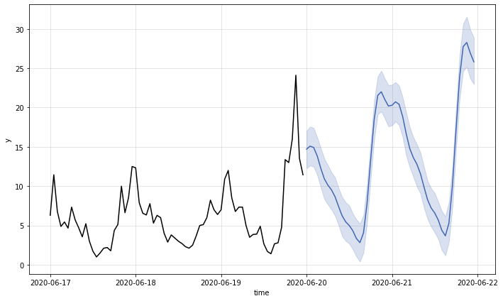
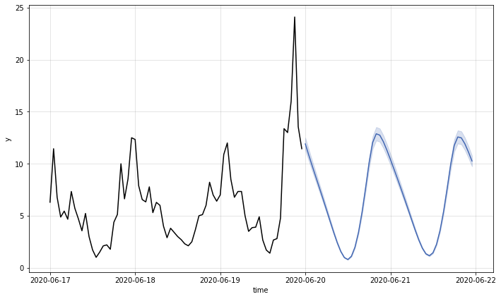
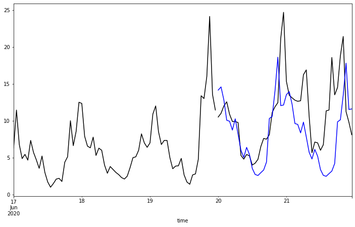

[](https://colab.research.google.com/drive/1lAqt91m88srcPWLSabbN9Tdbxw1y2I2n?usp=sharing)



前一章節介紹了各種處理時序資料的方法，有視覺化呈現資料、時序資料分解......等，經過處理後的資料可以讓我們更進一步的運用，擁有過去的資料後，會想要預知未來，因此本章節將會判斷時序資料的特性以及使用多種預測模型找出資料的的模式，藉此預測未來。

## 章節目標

- 時序資料特性的判斷：平穩性
- 學習各種預測模型並進行比較
- 使用時序資料進行訓練與預測

## 套件安裝與引用

在本章節中，我們將會使用到 pandas, matplotlib, numpy, statsmodels, warnings 等套件，這些套件由於在我們使用的開發平台 Colab 上皆已預先安裝好，因此不需要再另行安裝。然而，我們還會另外使用兩個 Colab 並未預先安裝好的套件：kats 和 pmdarima，需使用下列的方式自行安裝：

```python
!pip install --upgrade pip
!pip install kats==0.1 ax-platform==0.2.3 statsmodels==0.12.2
!pip install pmdarima
```

待安裝完畢後，即可使用下列的語法先行引入相關的套件，完成本章節的準備工作：

```python
import warnings
import numpy as np
import pandas as pd
import pmdarima as pm
import statsmodels.api as sm
import matplotlib.pyplot as plt
import os, zipfile

from dateutil import parser as datetime_parser
from statsmodels.tsa.arima.model import ARIMA
from statsmodels.tsa.statespace.sarimax import SARIMAX
from statsmodels.tsa.stattools import adfuller, kpss
from kats.consts import TimeSeriesData, TimeSeriesIterator
from kats.detectors.outlier import OutlierDetector
from kats.models.prophet import ProphetModel, ProphetParams
from kats.models.lstm import LSTMModel, LSTMParams
from kats.models.holtwinters import HoltWintersParams, HoltWintersModel
```

## 讀取資料

本章節的探討主題為時序資料的資料預測，因此我們將分別以民生公共物聯網資料平台上的空品、水位和氣象資料進行資料讀取的演示，接著再使用空品資料進行更進一步的探究。其中，每一類別的資料處理都將使用其中一個測站長期以來觀測到的資料作為資料集，而在 dataframe 的時間欄位名稱則為設為 timestamp，由於時間欄位的數值具有唯一性，因此我們也將使用此欄位作為 dataframe 的索引 (index)。

### 空品資料

由於我們這次要使用的是長時間的歷史資料，因此我們不直接使用 pyCIOT 套件的讀取資料功能，而直接從民生公共物聯網資料平台的歷史資料庫下載「中研院校園空品微型感測器」的歷史資料，並存入 Air 資料夾中。

同時，由於所下載的資料是 zip 壓縮檔案的格式，我們需要先逐一將其解壓縮，產生每日資料的壓縮檔案，接著再將每日資料的壓縮檔案解壓縮，存入 CSV_Air 資料夾中。

```python
!mkdir Air CSV_Air
!wget -O Air/2018.zip -q "https://history.colife.org.tw/?r=/download&path=L%2Bepuuawo%2BWTgeizqi%2FkuK3noJTpmaJf5qCh5ZyS56m65ZOB5b6u5Z6L5oSf5ris5ZmoLzIwMTguemlw"
!wget -O Air/2019.zip -q "https://history.colife.org.tw/?r=/download&path=L%2Bepuuawo%2BWTgeizqi%2FkuK3noJTpmaJf5qCh5ZyS56m65ZOB5b6u5Z6L5oSf5ris5ZmoLzIwMTkuemlw"
!wget -O Air/2020.zip -q "https://history.colife.org.tw/?r=/download&path=L%2Bepuuawo%2BWTgeizqi%2FkuK3noJTpmaJf5qCh5ZyS56m65ZOB5b6u5Z6L5oSf5ris5ZmoLzIwMjAuemlw"
!wget -O Air/2021.zip -q "https://history.colife.org.tw/?r=/download&path=L%2Bepuuawo%2BWTgeizqi%2FkuK3noJTpmaJf5qCh5ZyS56m65ZOB5b6u5Z6L5oSf5ris5ZmoLzIwMjEuemlw"

#開始進行解壓縮
folder = 'Air'
extension_zip = '.zip'
extension_csv = '.csv'

for subfolder in os.listdir(folder):
    path = f'{folder}/{subfolder}'
    if path.endswith(extension_zip):
      print(path)
      zip_ref = zipfile.ZipFile(path)
      zip_ref.extractall(folder)
      zip_ref.close()

for subfolder in os.listdir(folder):
    path = f'{folder}/{subfolder}'
    if os.path.isdir(path):
        for item in os.listdir(path):
            if item.endswith(extension_zip):
                file_name = f'{path}/{item}'
                print(file_name)
                zip_ref = zipfile.ZipFile(file_name)
                zip_ref.extractall(path)
                zip_ref.close()

        for item in os.listdir(path):
          path2 = f'{path}/{item}'
          if os.path.isdir(path2):
            for it in os.listdir(path2):
              if it.endswith(extension_zip):
                file_name = f'{path2}/{it}'
                print(file_name)
                zip_ref = zipfile.ZipFile(file_name)
                zip_ref.extractall('CSV_Air') # decide path
                zip_ref.close()
          elif item.endswith(extension_csv):
            os.rename(path2, f'CSV_Air/{item}')
```

現在 CSV_Air 資料夾中即有每日所有感測器資料的 csv 格式檔案，為了將單一測站 (例如代碼為 `74DA38C7D2AC` 的測站) 的資料過濾出來，我們需要讀取每個 csv 檔案，並將檔案中該測站的資料存入名叫 air 的 dataframe 中。最後我們將所有下載的資料與解壓縮後產生的資料移除，以節省雲端的儲存空間。

```python
folder = 'CSV_Air'
extension_csv = '.csv'
id = '74DA38C7D2AC'

air = pd.DataFrame()
for item in os.listdir(folder):
  file_name = f'{folder}/{item}'
  df = pd.read_csv(file_name)
  if 'pm25' in list(df.columns):
    df.rename({'pm25':'PM25'}, axis=1, inplace=True)
  filtered = df.query(f'device_id==@id')
  air = pd.concat([air, filtered], ignore_index=True)
air.dropna(subset=['timestamp'], inplace=True)

for i, row in air.iterrows():
  aware = datetime_parser.parse(str(row['timestamp']))
  naive = aware.replace(tzinfo=None)
  air.at[i, 'timestamp'] = naive
air.set_index('timestamp', inplace=True)

!rm -rf Air CSV_Air
```

最後，我們重新整理該測站的資料，將不需要用到的欄位資訊刪除，並且依照時間進行排序如下：

```python
air.drop(columns=['device_id', 'SiteName'], inplace=True)
air.sort_values(by='timestamp', inplace=True)
air.info()
print(air.info())
```

```
<class 'pandas.core.frame.DataFrame'>
DatetimeIndex: 195305 entries, 2018-08-01 00:00:05 to 2021-12-31 23:54:46
Data columns (total 1 columns):
 \#   Column  Non-Null Count   Dtype 
---  ------  --------------   ----- 
 0   PM25    195305 non-null  object
dtypes: object(1)
memory usage: 3.0+ MB
                     PM25
timestamp                
2018-08-01 00:00:05  20.0
2018-08-01 00:30:18  17.0
2018-08-01 01:12:34  18.0
2018-08-01 01:18:36  21.0
2018-08-01 01:30:44  22.0
```

### 水位資料

和空品資料的範例一樣，由於我們這次要使用的是長時間的歷史資料，因此我們不直接使用 pyCIOT 套件的讀取資料功能，而直接從民生公共物聯網資料平台的歷史資料庫下載「水利署地下水位站」的歷史資料，並存入 Water 資料夾中。

同時，由於所下載的資料是 zip 壓縮檔案的格式，我們需要先逐一將其解壓縮，產生每日資料的壓縮檔案，接著再將每日資料的壓縮檔案解壓縮，存入 CSV_Water 資料夾中。

```python
!mkdir Water CSV_Water
!wget -O Water/2018.zip "https://history.colife.org.tw/?r=/download&path=L%2BawtOizh%2Ba6kC%2FmsLTliKnnvbJf5rKz5bed5rC05L2N56uZLzIwMTguemlw"
!wget -O Water/2019.zip "https://history.colife.org.tw/?r=/download&path=L%2BawtOizh%2Ba6kC%2FmsLTliKnnvbJf5rKz5bed5rC05L2N56uZLzIwMTkuemlw"
!wget -O Water/2020.zip "https://history.colife.org.tw/?r=/download&path=L%2BawtOizh%2Ba6kC%2FmsLTliKnnvbJf5rKz5bed5rC05L2N56uZLzIwMjAuemlw"
!wget -O Water/2021.zip "https://history.colife.org.tw/?r=/download&path=L%2BawtOizh%2Ba6kC%2FmsLTliKnnvbJf5rKz5bed5rC05L2N56uZLzIwMjEuemlw"

#開始進行解壓縮
folder = 'Water'
extension_zip = '.zip'
extension_csv = '.csv'

for subfolder in os.listdir(folder):
    path = f'{folder}/{subfolder}'
    if path.endswith(extension_zip):
      print(path)
      zip_ref = zipfile.ZipFile(path)
      zip_ref.extractall(folder)
      zip_ref.close()
for subfolder in os.listdir(folder):
    path = f'{folder}/{subfolder}'
    if os.path.isdir(path):
        for item in os.listdir(path):
            if item.endswith(extension_zip):
                file_name = f'{path}/{item}'
                print(file_name)
                zip_ref = zipfile.ZipFile(file_name)
                zip_ref.extractall(path)
                zip_ref.close()

        for item in os.listdir(path):
          path2 = f'{path}/{item}'
          if os.path.isdir(path2):
            for it in os.listdir(path2):
              if it.endswith(extension_zip) and not it.endswith('QC.zip'):
                file_name = f'{path2}/{it}'
                print(file_name)
                zip_ref = zipfile.ZipFile(file_name)
                zip_ref.extractall('CSV_Water') # decide path
                zip_ref.close()
          elif item.endswith(extension_csv):
            os.rename(path2, f'CSV_Water/{item}')
```

現在 CSV_Water 資料夾中即有每日所有感測器資料的 csv 格式檔案，為了將單一測站 (例如代碼為 `338c9c1c-57d8-41d7-9af2-731fb86e632c` 的測站) 的資料過濾出來，我們需要讀取每個 csv 檔案，並將檔案中該測站的資料存入名叫 water 的 dataframe 中。最後我們將所有下載的資料與解壓縮後產生的資料移除，以節省雲端的儲存空間。

```python
folder = 'CSV_Water'
extension_csv = '.csv'
id = '338c9c1c-57d8-41d7-9af2-731fb86e632c'

water = pd.DataFrame()
for item in os.listdir(folder):
  file_name = f'{folder}/{item}'
  df = pd.read_csv(file_name)
  if 'pm25' in list(df.columns):
    df.rename({'pm25':'PM25'}, axis=1, inplace=True)
  filtered = df.query(f'station_id==@id')
  water = pd.concat([water, filtered], ignore_index=True)
water.dropna(subset=['timestamp'], inplace=True)

for i, row in water.iterrows():
  aware = datetime_parser.parse(str(row['timestamp']))
  naive = aware.replace(tzinfo=None)
  water.at[i, 'timestamp'] = naive
water.set_index('timestamp', inplace=True)

!rm -rf Water CSV_Water
```

最後，我們重新整理該測站的資料，將不需要用到的欄位資訊刪除，並且依照時間進行排序如下：

```python
water.drop(columns=['station_id', 'ciOrgname', 'ciCategory', 'Organize_Name', 'CategoryInfos_Name', 'PQ_name', 'PQ_fullname', 'PQ_description', 'PQ_unit', 'PQ_id'], inplace=True)
water.sort_values(by='timestamp', inplace=True)
water.info()
print(water.head())
```

```
<class 'pandas.core.frame.DataFrame'>
DatetimeIndex: 213466 entries, 2018-01-01 00:20:00 to 2021-12-07 11:00:00
Data columns (total 1 columns):
 \#   Column  Non-Null Count   Dtype  
---  ------  --------------   -----  
 0   value   213465 non-null  float64
dtypes: float64(1)
memory usage: 3.3 MB
                         value
timestamp                     
2018-01-01 00:20:00  49.130000
2018-01-01 00:25:00  49.139999
2018-01-01 00:30:00  49.130001
2018-01-01 00:35:00  49.130001
2018-01-01 00:40:00  49.130001
```

### 氣象資料

我們從民生公共物聯網資料平台的歷史資料庫下載「中央氣象局自動氣象站」的歷史資料，並存入 Weather 資料夾中。

同時，由於所下載的資料是 zip 壓縮檔案的格式，我們需要先逐一將其解壓縮，產生每日資料的壓縮檔案，接著再將每日資料的壓縮檔案解壓縮，存入 CSV_Weather 資料夾中。

```python
!mkdir Weather CSV_Weather
!wget -O Weather/2019.zip "https://history.colife.org.tw/?r=/download&path=L%2Bawo%2BixoS%2FkuK3lpK7msKPosaHlsYBf6Ieq5YuV5rCj6LGh56uZLzIwMTkuemlw"
!wget -O Weather/2020.zip "https://history.colife.org.tw/?r=/download&path=L%2Bawo%2BixoS%2FkuK3lpK7msKPosaHlsYBf6Ieq5YuV5rCj6LGh56uZLzIwMjAuemlw"
!wget -O Weather/2021.zip "https://history.colife.org.tw/?r=/download&path=L%2Bawo%2BixoS%2FkuK3lpK7msKPosaHlsYBf6Ieq5YuV5rCj6LGh56uZLzIwMjEuemlw"

#開始進行解壓縮
folder = 'Weather'
extension_zip = '.zip'
extension_csv = '.csv'

for subfolder in os.listdir(folder):
    path = f'{folder}/{subfolder}'
    if path.endswith(extension_zip):
      print(path)
      zip_ref = zipfile.ZipFile(path)
      zip_ref.extractall(folder)
      zip_ref.close()

for subfolder in os.listdir(folder):
    path = f'{folder}/{subfolder}'
    if os.path.isdir(path):
        for item in os.listdir(path):
            if item.endswith(extension_zip):
                file_name = f'{path}/{item}'
                print(file_name)
                zip_ref = zipfile.ZipFile(file_name)
                zip_ref.extractall(path)
                zip_ref.close()

        for item in os.listdir(path):
          path2 = f'{path}/{item}'
          if os.path.isdir(path2):
            for it in os.listdir(path2):
              if it.endswith(extension_zip):
                file_name = f'{path2}/{it}'
                print(file_name)
                zip_ref = zipfile.ZipFile(file_name)
                zip_ref.extractall('CSV_Weather') # decide path
                zip_ref.close()
          elif item.endswith(extension_csv):
            os.rename(path2, f'CSV_Weather/{item}')
```

現在 CSV_Weather 資料夾中即有每日所有感測器資料的 csv 格式檔案，為了將單一測站 (例如代碼為 `C0U750` 的測站) 的資料過濾出來，我們需要讀取每個 csv 檔案，並將檔案中該測站的資料存入名叫 weather 的 dataframe 中。最後我們將所有下載的資料與解壓縮後產生的資料移除，以節省雲端的儲存空間。

```python
folder = 'CSV_Weather'
extension_csv = '.csv'
id = 'C0U750'

weather = pd.DataFrame()
for item in os.listdir(folder):
  file_name = f'{folder}/{item}'
  df = pd.read_csv(file_name)
  if 'pm25' in list(df.columns):
    df.rename({'pm25':'PM25'}, axis=1, inplace=True)
  filtered = df.query(f'station_id==@id')
  weather = pd.concat([weather, filtered], ignore_index=True)
weather.rename({'obsTime':'timestamp'}, axis=1, inplace=True)
weather.dropna(subset=['timestamp'], inplace=True)

for i, row in weather.iterrows():
  aware = datetime_parser.parse(str(row['timestamp']))
  naive = aware.replace(tzinfo=None)
  weather.at[i, 'timestamp'] = naive
weather.set_index('timestamp', inplace=True)

!rm -rf Weather CSV_Weather
```

最後，我們重新整理該測站的資料，將不需要用到的欄位資訊刪除，並且依照時間進行排序如下：

```python
weather.drop(columns=['station_id'], inplace=True)
weather.sort_values(by='timestamp', inplace=True)
weather.info()
print(weather.head())
```

```
<class 'pandas.core.frame.DataFrame'>
DatetimeIndex: 27093 entries, 2019-01-01 00:00:00 to 2021-12-31 23:00:00
Data columns (total 15 columns):
 \#   Column  Non-Null Count  Dtype  
---  ------  --------------  -----  
 0   ELEV    27093 non-null  float64
 1   WDIR    27089 non-null  float64
 2   WDSD    27089 non-null  float64
 3   TEMP    27093 non-null  float64
 4   HUMD    27089 non-null  float64
 5   PRES    27093 non-null  float64
 6   SUN     13714 non-null  float64
 7   H_24R   27089 non-null  float64
 8   H_FX    27089 non-null  float64
 9   H_XD    27089 non-null  object 
 10  H_FXT   23364 non-null  object 
 11  D_TX    27074 non-null  object 
 12  D_TXT   7574 non-null   object 
 13  D_TN    27074 non-null  object 
 14  D_TNT   17 non-null     object 
dtypes: float64(9), object(6)
memory usage: 3.3+ MB
                      ELEV  WDIR  WDSD  TEMP  HUMD   PRES   SUN  H_24R  H_FX  \
timestamp                                                                      
2019-01-01 00:00:00  398.0  35.0   5.8  13.4  0.99  981.1 -99.0   18.5 -99.0   
2019-01-01 01:00:00  398.0  31.0   5.7  14.1  0.99  981.0 -99.0    0.5  10.8   
2019-01-01 02:00:00  398.0  35.0   5.3  13.9  0.99  980.7 -99.0    1.0 -99.0   
2019-01-01 03:00:00  398.0  32.0   5.7  13.8  0.99  980.2 -99.0    1.5 -99.0   
2019-01-01 04:00:00  398.0  37.0   6.9  13.8  0.99  980.0 -99.0    2.0  12.0   

                     H_XD H_FXT  D_TX D_TXT  D_TN D_TNT  
timestamp                                                
2019-01-01 00:00:00 -99.0 -99.0  14.5   NaN  13.4   NaN  
2019-01-01 01:00:00  35.0   NaN  14.1   NaN  13.5   NaN  
2019-01-01 02:00:00 -99.0 -99.0  14.1   NaN  13.5   NaN  
2019-01-01 03:00:00 -99.0 -99.0  14.1   NaN  13.5   NaN  
2019-01-01 04:00:00  39.0   NaN  14.1   NaN  13.5   NaN
```

以上我們已經成功示範空品資料 (air)、水位資料 (water) 和氣象資料 (weather) 的讀取範例，在接下來的探討中，我們將以空品資料示範初步的時間序列資料處理，相同的方法也可以輕易改成使用水位資料或氣象資料而得到類似的結果，大家可以自行嘗試看看。

## 資料預處理 (Preprocess)

我們首先依照章節 4.1 所介紹的方法對資料進行重新採樣，將資料分別取每小時平均 (air_hour)、每天平均 (air_day) 和每月平均 (air_month)。

```python
air_hour = air.resample('H').mean()
air_day = air.resample('D').mean()
air_month = air.resample('M').mean()
```

接著我們依照章節 4.1 所介紹的離群值偵測方法，將 air_hour 資料中的離群值移除，並將移除後的缺失資料，使用 Forward fill 方法填回。

```python
air_ts = TimeSeriesData(air_hour.reset_index(), time_col_name='timestamp')

# 移除離群值
outlierDetection = OutlierDetector(air_ts, 'additive')
outlierDetection.detector()
outliers_removed = outlierDetection.remover(interpolate=False)

air_hour_df = outliers_removed.to_dataframe()
air_hour_df.rename(columns={'time': 'timestamp', 'y_0': 'PM25'}, inplace=True)
air_hour_df.set_index('timestamp', inplace=True)
air_hour = air_hour_df
air_hour = air_hour.resample('H').mean()

# 用 Forward 方法填回缺失值
air_hour.ffill(inplace=True)
```

## 平穩性 (Stationary) 檢查

在進行資料預測的探究前，我們先針對資料的[平穩性 (stationary)](https://www.itl.nist.gov/div898/handbook/pmc/section4/pmc442.htm) 進行檢查。我們先挑選想要進行檢測的時間區段（例如 2020-06-10 ~ 2020-06-17），並將這個區段的資料存入 data 變數。

```python
data = air_hour.loc['2020-06-10':'2020-06-17']
```

接著我們計算這些資料的平均數 (mean) 與變異數 (var)，並且進行繪圖。

```python
nmp = data.PM25.to_numpy()
size = np.size(nmp)

nmp_mean = np.zeros(size)
nmp_var = np.zeros(size)
for i in range(size):
  nmp_mean[i] = nmp[:i+1].mean()
  nmp_var[i] = nmp[:i+1].var()

y1 = nmp_mean[:]
y2 = nmp_var[:]
y3 = nmp
x = np.arange(size)
plt.plot(x, y1, label='mean')
plt.plot(x, y2, label='var')
plt.legend()
plt.show()
```


從圖中可以發現平均數的變化不大，但是變異數的變化卻很大。我們稱這樣的資料具備較差的平穩性；相反地，若是具備平穩性的資料，其平均數與變異數的變化不會與時間的推移有關。

換句話說，如果資料分布隨著時間有一定的趨勢變化，那它就沒有平穩性；如果資料的分佈不會因為時間推移，平均數與變異數也維持固定，那它就有平穩性 (stationary)。平穩性的資料有利於尋找適合的的模型 (model) 並預測未來的數值。

若要檢查資料是否具有平穩性，至少有下列兩種常見的方法：

1. Augmented Dickey Fuller (ADF) test：使用 [unit root test](https://en.wikipedia.org/wiki/Unit_root_test)，如果 *p-value* < 0.05，則資料具有平穩性。
2. Kwiatkowski-Phillips-Schmidt-Shin (KPSS) test：與 ADF test 相反，如果 *p-value* < 0.05，則資料不具有平穩性 (non-stationary)。

```python
# ADF Test
result = adfuller(data.PM25.values, autolag='AIC')
print(f'ADF Statistic: {result[0]}')
print(f'p-value: {result[1]}')
for key, value in result[4].items():
    print('Critial Values:')
    print(f'   {key}, {value}')

# KPSS Test
result = kpss(data.PM25.values, regression='c')
print('\nKPSS Statistic: %f' % result[0])
print('p-value: %f' % result[1])
for key, value in result[3].items():
    print('Critial Values:')
    print(f'   {key}, {value}')
```

```
ADF Statistic: -2.7026194088541704
p-value: 0.07358609270498144
Critial Values:
   1%, -3.4654311561944873
Critial Values:
   5%, -2.8769570530458792
Critial Values:
   10%, -2.574988319755886

KPSS Statistic: 0.620177
p-value: 0.020802
Critial Values:
   10%, 0.347
Critial Values:
   5%, 0.463
Critial Values:
   2.5%, 0.574
Critial Values:
   1%, 0.739
```

若以我們使用的範例資料為例，經過 ADF 檢測得到的 *p-value* 為 0.073，因此該資料並沒有平穩性。為了達到平穩性，我們接下來將資料進行差分，也就是將第 i 筆資料減第 i-1 筆資料，並使用得到的結果再次進行檢測。

在 dataframe 的資料格式上我們可以直接使用 data.diff() 來將資料差分 ，並將經過差分後的資料命名為 data_diff。

```python
data_diff = data.diff()
data_diff
```

```
                         PM25
timestamp	
2020-06-10 00:00:00	NaN
2020-06-10 01:00:00	-14.700000
2020-06-10 02:00:00	-8.100000
2020-06-10 03:00:00	0.200000
2020-06-10 04:00:00	-1.900000
...	...
2020-06-17 19:00:00	0.750000
2020-06-17 20:00:00	4.875000
2020-06-17 21:00:00	-3.375000
2020-06-17 22:00:00	1.930556
2020-06-17 23:00:00	3.944444
```

我們可以看到第一筆資料為 *Nan*，這是因為第一筆資料無法減去前一筆資料，所以我們要將第一筆資料捨棄。

```python
data_diff = data_diff[1:]
data_diff
```

```
                         PM25
timestamp	
2020-06-10 01:00:00	-14.700000
2020-06-10 02:00:00	-8.100000
2020-06-10 03:00:00	0.200000
2020-06-10 04:00:00	-1.900000
2020-06-10 05:00:00	-1.300000
...	...
2020-06-17 19:00:00	0.750000
2020-06-17 20:00:00	4.875000
2020-06-17 21:00:00	-3.375000
2020-06-17 22:00:00	1.930556
2020-06-17 23:00:00	3.944444
```

接著我們將資料繪圖來觀察經過差分後資料的平均數與變異數隨時間變化的關係。

```python
nmp = data_diff.PM25.to_numpy()
size = np.size(nmp)

nmp_mean = np.zeros(size)
nmp_var = np.zeros(size)
for i in range(size):
  nmp_mean[i] = nmp[:i+1].mean()
  nmp_var[i] = nmp[:i+1].var()

y1 = nmp_mean[:]
y2 = nmp_var[:]
y3 = nmp
x = np.arange(size)
plt.plot(x, y1, label='mean')
plt.plot(x, y2, label='var')
plt.legend()
plt.show()
```


從以上的結果我們發現平均數的變化依然不大，而變異數的變化則變小了。我們接著重複上述的平穩性檢測步驟：

```python
# PM25
# ADF Test
result = adfuller(data_diff.PM25.values, autolag='AIC')
print(f'ADF Statistic: {result[0]}')
print(f'p-value: {result[1]}')
for key, value in result[4].items():
    print('Critial Values:')
    print(f'   {key}, {value}')

# KPSS Test
result = kpss(data_diff.PM25.values, regression='c')
print('\nKPSS Statistic: %f' % result[0])
print('p-value: %f' % result[1])
for key, value in result[3].items():
    print('Critial Values:')
    print(f'   {key}, {value}')
```

```
ADF Statistic: -13.350457196046884
p-value: 5.682260865619701e-25
Critial Values:
   1%, -3.4654311561944873
Critial Values:
   5%, -2.8769570530458792
Critial Values:
   10%, -2.574988319755886

KPSS Statistic: 0.114105
p-value: 0.100000
Critial Values:
   10%, 0.347
Critial Values:
   5%, 0.463
Critial Values:
   2.5%, 0.574
Critial Values:
   1%, 0.739
```

經過檢測後得到 ADF test 的 *p-value* 為 5.68e-25，由此可知經過一次差分後的資料便具有平穩性，這個結果會在本章節後續的預測模型使用到。

## 資料預測(Data forecast)

經過前一部分的預處理後，這邊我們將會示範使用不同的預測模型來對時序資料進行預測，我們將依次使用 [ARIMA](https://otexts.com/fpp2/arima.html)、[SARIMAX](https://www.statsmodels.org/stable/examples/notebooks/generated/statespace_sarimax_stata.html)、[auto_arima](https://alkaline-ml.com/pmdarima/modules/generated/pmdarima.arima.auto_arima.html)、[Prophet](https://facebook.github.io/prophet/)、[LSTM](https://en.wikipedia.org/wiki/Long_short-term_memory) 與 [Holt-Winter](https://otexts.com/fpp2/holt-winters.html) 模型。

### ARIMA

ARIMA 模型其實是 ARMA 模型的擴展版本，因此我們先介紹先介紹 ARMA 模型，並將 ARMA 模型拆成兩部分，分別是:

1. 自迴歸模型 (AR, autogressive model)：使用一個參數 *p*，並以前 *p* 個歷史值做線性組合來預測當下的數值。
2. 移動平均模型 (MA, moving average model)：使用一個參數 *q*，並以前 *q* 個使用 AR 模型的預測誤差進行線性組合，以預測當下的數值。

而 ARIMA 模型比 ARMA 模型還多使用一個參數 *d*，還記得前面的平穩性檢查嗎？如果資料不具有平穩性就要做差分，而參數 *d* 就代表需要做差分的次數。

以下我們使用空品資料進行演練。首先，我們將資料製圖以選擇要使用的資料片段：

```python
air_hour.loc['2020-06-01':'2020-06-30']['PM25'].plot(figsize=(12, 8))
```


我們選擇一段想要使用的資料，並將資料分為兩部分：

1. 訓練資料 (train data)：用來訓練模型，找出最適合模型的參數。
2. 測試資料 (test data)：當得到訓練模型後，可用於評估該模型在資料預測上的準確度。

在我們接下來的範例中，我們設定測試資料的長度為 48 小時 (`train_len=-48`)，訓練資料則為扣除最後 48 小時的全部資料。

```python
data_arima = air_hour.loc['2020-06-17':'2020-06-21']
train_len = -48
train = data_arima.iloc[:train_len]
test = data_arima.iloc[train_len:]
```

我們首先判斷這段資料是具有平穩性，並以差分的次數決定 *d* 參數的數值

```python
# Run Dicky-Fuller test
result = adfuller(train)

# Print test statistic
print('The test stastics:', result[0])

# Print p-value
print("The p-value:",result[1])
```

```
The test stastics: -3.1129543556288826
The p-value: 0.025609243615341074
```

由於 *p-value* 已經比 0.05 小，因此我們不需要進行差分（亦即 *d*=0）即可繼續探討 ARIMA模型中的參數 *p* 和參數 *q*，而比較簡單的方法就是將可能的 *p*、*q* 組合分別帶入模型後，再從中判斷模型的好壞。

我們可以使用 [AIC](https://en.wikipedia.org/wiki/Akaike_information_criterion) 或 [BIC](https://en.wikipedia.org/wiki/Bayesian_information_criterion) 方法，來判斷模型跟訓練資料是否擬合，一般來說，其判斷出來的數值越小代表模型的效果越好。例如，我們先將 *p* 和 *q* 的範圍限制在 0~2 之間，這樣總共有 9 種可能的組合，再分別查看其 AIC 與 BIC 的數值，並以數值最小的 *p* 和 *q* 組合，作為這兩個參數的決定值。

```python
warnings.filterwarnings('ignore')
order_aic_bic =[]

# Loop over p values from 0-2
for p in range(3):
    # Loop over q values from 0-2
    for q in range(3):
      
        try:
            # create and fit ARMA(p,q) model
            model = sm.tsa.statespace.SARIMAX(train['PM25'], order=(p, 0, q))
            results = model.fit()
            
            # Print order and results
            order_aic_bic.append((p, q, results.aic, results.bic))            
        except:
            print(p, q, None, None)
            
# Make DataFrame of model order and AIC/BIC scores
order_df = pd.DataFrame(order_aic_bic, columns=['p', 'q', 'aic','bic'])

# lets sort them by AIC and BIC

# Sort by AIC
print("Sorted by AIC ")
# print("\n")
print(order_df.sort_values('aic').reset_index(drop=True))

# Sort by BIC
print("Sorted by BIC ")
# print("\n")
print(order_df.sort_values('bic').reset_index(drop=True))
```

```
Sorted by AIC 
   p  q         aic         bic
0  1  0  349.493661  354.046993
1  1  1  351.245734  358.075732
2  2  0  351.299268  358.129267
3  1  2  352.357930  361.464594
4  2  1  353.015921  362.122586
5  2  2  353.063243  364.446574
6  0  2  402.213407  409.043405
7  0  1  427.433962  431.987294
8  0  0  493.148188  495.424854
Sorted by BIC 
   p  q         aic         bic
0  1  0  349.493661  354.046993
1  1  1  351.245734  358.075732
2  2  0  351.299268  358.129267
3  1  2  352.357930  361.464594
4  2  1  353.015921  362.122586
5  2  2  353.063243  364.446574
6  0  2  402.213407  409.043405
7  0  1  427.433962  431.987294
8  0  0  493.148188  495.424854
```

我們可以發現當 (*p*,*q*) = (1,0) 時，AIC 和 BIC 的值最小，代表這是最好的模型組態，因此我們決定 *p*、*d*、*q* 這三個參數分別設為 1, 0, 0 後就可以正式開始訓練模型。

```python
# Instantiate model object
model = ARIMA(train, order=(1,0,0))

# Fit model
results = model.fit()
print(results.summary())
results.plot_diagnostics(figsize=(10, 10))
```

```
                               SARIMAX Results
==============================================================================
Dep. Variable:                   PM25   No. Observations:                   72
Model:                 ARIMA(1, 0, 0)   Log Likelihood                -168.853
Date:                Fri, 26 Aug 2022   AIC                            343.706
Time:                        05:01:13   BIC                            350.536
Sample:                    06-17-2020   HQIC                           346.425
                         - 06-19-2020
Covariance Type:                  opg
==============================================================================
                 coef    std err          z      P>|z|      [0.025      0.975]
------------------------------------------------------------------------------
const          6.3774      1.959      3.255      0.001       2.537      10.218
ar.L1          0.7792      0.047     16.584      0.000       0.687       0.871
sigma2         6.2934      0.746      8.438      0.000       4.832       7.755
===================================================================================
Ljung-Box (L1) (Q):                   0.08   Jarque-Bera (JB):                76.49
Prob(Q):                              0.77   Prob(JB):                         0.00
Heteroskedasticity (H):               2.30   Skew:                             1.44
Prob(H) (two-sided):                  0.05   Kurtosis:                         7.15
===================================================================================

```


接著我們使用測試資料進行預測，並評估其預測的效果，從圖形化的資料呈現中，我們可以發現資料預測結果的曲線太過平滑，和實際上的數值差異很大。事實上，若觀察整體資料的變化趨勢，會發現資料本身存在有規律的起伏，而 ARIMA 只能預測出資料的趨勢，若要準確的預測資料的數值，其結果仍有極大的差距。

```python
data_arima['forecast'] = results.predict(start=24*5-48, end=24*5)
data_arima[['PM25', 'forecast']].plot(figsize=(12, 8))
```


### SARIMAX

```python
data_sarimax = air_hour.loc['2020-06-17':'2020-06-21']
train_len = -48
train = data_sarimax.iloc[:train_len]
test = data_sarimax.iloc[train_len:]
```

我們接著介紹 SARIMAX 模型。SARIMAX 模型共有七個參數，分別是 *p*, *d*, *q*, *P*, *D*, *Q*, *s*；這些參數可以分為兩組：第一組為 *order=(p, d, q)* 這三個參數跟 ARIMA 模型的參數一樣；另一組是 *seasonal_order=(P, D, Q, s)*，也就是週期性的 AR 模型參數、週期性的差分次數、週期性的MA模型參數，最後再加上一個週期性長度的參數。

| 參數 | 說明 |
| --- | --- |
| p | AR 模型參數 |
| d | 達到平穩性所需要的差分次數 |
| q | MA 模型參數 |
| P | 週期性的 AR 模型參數 |
| D | 週期上達到平穩性所需要的差分次數 |
| Q | 週期性的 MA 模型參數 |
| s | 週期長度 |

由於從先前的觀察可以發現，這些資料大致上約 24 個小時會有一個週期性的變化，因此我們讓 *s*=24，並用下列的指令進行模型建立。

```python
# Instantiate model object
model = SARIMAX(train, order=(1,0,0), seasonal_order=(0, 1, 0, 24))

# Fit model
results = model.fit()
print(results.summary())
results.plot_diagnostics(figsize=(10, 10))
```

```
                                     SARIMAX Results
==========================================================================================
Dep. Variable:                               PM25   No. Observations:                   72
Model:             SARIMAX(1, 0, 0)x(0, 1, 0, 24)   Log Likelihood                -121.463
Date:                            Fri, 26 Aug 2022   AIC                            246.926
Time:                                    05:01:26   BIC                            250.669
Sample:                                06-17-2020   HQIC                           248.341
                                     - 06-19-2020
Covariance Type:                              opg
==============================================================================
                 coef    std err          z      P>|z|      [0.025      0.975]
------------------------------------------------------------------------------
ar.L1          0.6683      0.069      9.698      0.000       0.533       0.803
sigma2         9.1224      1.426      6.399      0.000       6.328      11.917
===================================================================================
Ljung-Box (L1) (Q):                   0.11   Jarque-Bera (JB):                 5.70
Prob(Q):                              0.75   Prob(JB):                         0.06
Heteroskedasticity (H):               2.03   Skew:                             0.42
Prob(H) (two-sided):                  0.17   Kurtosis:                         4.46
===================================================================================

```


接下來我們使用測試資料進行資料預測，並將預測結果用視覺化方式呈現，可以發現相較於 ARIMA 模型＃，SARIMA 模型的預測結果雖然仍有待加強，但已比 ARIMA 模型進步許多。

```python
# 總共有五天的資料，要預測最後兩天的部分，因此預測的起始小時為 24*5-48，結束小時為 24*5
data_sarimax['forecast'] = results.predict(start=24*5-48, end=24*5)
data_sarimax[['PM25', 'forecast']].plot(figsize=(12, 8))
```


### auto_arima

我們使用 [pmdarima](https://pypi.org/project/pmdarima/) 這個 Python 套件，這個套件類似 R 語言中的 auto.arima 模型，可以自動尋找最合適的 ARIMA 模型參數，增加使用者在使用 ARIMA 模型時的方便性。目前 pmdarima 套件中的 pmdarima.ARIMA 物件，其實便同時包含了 ARMA, ARIMA 和 SARIMAX 這三種模型，而使用 pmdarima.auto_arima 方法時，只要提供參數 *p*, *q*, *P*, *Q* 的範圍，便能在指定的範圍內尋找出最適合的參數組合。

我們接下來實作 pmdarima.auto_arima 的使用方法，先把資料集切分為訓練資料與預測資料：

```python
data_autoarima = air_hour.loc['2020-06-17':'2020-06-21']
train_len = -48
train = data_autoarima.iloc[:train_len]
test = data_autoarima.iloc[train_len:]
```

針對 *p*, *q*, *P*, *Q* 這四個參數，我們分別用 start 和 max 來指定對應的範圍，同時設定週期性參數 *seasonal* 為 *True*，並且設定週期變數 *m* 為 24 小時。接著我們便可以直接執行得到最佳的模型參數組合和模型擬合結果。

```python
results = pm.auto_arima(train,start_p=0, d=0, start_q=0, max_p=5, max_d=5, max_q=5, start_P=0, D=1, start_Q=0, max_P=5, max_D=5, max_Q=5, m=24, seasonal=True, error_action='warn', trace = True, supress_warnings=True, stepwise = True, random_state=20, n_fits = 20)
print(results.summary())
```

```
Performing stepwise search to minimize aic
 ARIMA(0,0,0)(0,1,0)[24] intercept   : AIC=268.023, Time=0.04 sec
 ARIMA(1,0,0)(1,1,0)[24] intercept   : AIC=247.639, Time=0.85 sec
 ARIMA(0,0,1)(0,1,1)[24] intercept   : AIC=250.711, Time=0.79 sec
 ARIMA(0,0,0)(0,1,0)[24]             : AIC=271.305, Time=0.04 sec
 ARIMA(1,0,0)(0,1,0)[24] intercept   : AIC=247.106, Time=0.09 sec
 ARIMA(1,0,0)(0,1,1)[24] intercept   : AIC=247.668, Time=0.45 sec
 ARIMA(1,0,0)(1,1,1)[24] intercept   : AIC=inf, Time=2.63 sec
 ARIMA(2,0,0)(0,1,0)[24] intercept   : AIC=249.013, Time=0.15 sec
 ARIMA(1,0,1)(0,1,0)[24] intercept   : AIC=248.924, Time=0.21 sec
 ARIMA(0,0,1)(0,1,0)[24] intercept   : AIC=250.901, Time=0.11 sec
 ARIMA(2,0,1)(0,1,0)[24] intercept   : AIC=250.579, Time=0.30 sec
 ARIMA(1,0,0)(0,1,0)[24]             : AIC=246.926, Time=0.06 sec
 ARIMA(1,0,0)(1,1,0)[24]             : AIC=247.866, Time=0.28 sec
 ARIMA(1,0,0)(0,1,1)[24]             : AIC=247.933, Time=0.31 sec
 ARIMA(1,0,0)(1,1,1)[24]             : AIC=inf, Time=2.35 sec
 ARIMA(2,0,0)(0,1,0)[24]             : AIC=248.910, Time=0.08 sec
 ARIMA(1,0,1)(0,1,0)[24]             : AIC=248.893, Time=0.09 sec
 ARIMA(0,0,1)(0,1,0)[24]             : AIC=252.779, Time=0.08 sec
 ARIMA(2,0,1)(0,1,0)[24]             : AIC=250.561, Time=0.17 sec

Best model:  ARIMA(1,0,0)(0,1,0)[24]
Total fit time: 9.122 seconds
                                     SARIMAX Results
==========================================================================================
Dep. Variable:                                  y   No. Observations:                   72
Model:             SARIMAX(1, 0, 0)x(0, 1, 0, 24)   Log Likelihood                -121.463
Date:                            Fri, 26 Aug 2022   AIC                            246.926
Time:                                    05:01:37   BIC                            250.669
Sample:                                06-17-2020   HQIC                           248.341
                                     - 06-19-2020
Covariance Type:                              opg
==============================================================================
                 coef    std err          z      P>|z|      [0.025      0.975]
------------------------------------------------------------------------------
ar.L1          0.6683      0.069      9.698      0.000       0.533       0.803
sigma2         9.1224      1.426      6.399      0.000       6.328      11.917
===================================================================================
Ljung-Box (L1) (Q):                   0.11   Jarque-Bera (JB):                 5.70
Prob(Q):                              0.75   Prob(JB):                         0.06
Heteroskedasticity (H):               2.03   Skew:                             0.42
Prob(H) (two-sided):                  0.17   Kurtosis:                         4.46
===================================================================================
```

最後我們使用尋找到的最佳模型進行資料預測，並且將預測結果與測試資料用疊圖的方式繪製在同一張圖上，由於本次所找到最佳模型即為剛剛介紹 SARIMAX 時的最佳模型參數組合，因此兩者的預測結果也大致相同。

```python
results.predict(n_periods=10)
```

```
2020-06-20 00:00:00    10.371336
2020-06-20 01:00:00    13.142043
2020-06-20 02:00:00    13.505843
2020-06-20 03:00:00     9.506395
2020-06-20 04:00:00     7.450378
2020-06-20 05:00:00     7.782850
2020-06-20 06:00:00     7.633757
2020-06-20 07:00:00     5.200781
2020-06-20 08:00:00     3.634188
2020-06-20 09:00:00     3.946824
Freq: H, dtype: float64
```

```python
data_autoarima['forecast']= pd.DataFrame(results.predict(n_periods=48), index=test.index)
data_autoarima[['PM25', 'forecast']].plot(figsize=(12, 8))
```


### Prophet

我們接下來使用 kats 套件中提供的 [Prophet](https://facebook.github.io/prophet/) 模型進行資料預測，這個模型是由 Facebook 的資料科學團隊提出，擅長針對週期性強的時間序列資料進行預測，並且可以容忍缺失資料 (missing data)、資料偏移 (shift) 以及偏離值 (outlier)。

我們首先把資料集切分為訓練資料與預測資料，並用折線圖的方式呈現訓練資料的變化狀況。

```python
data_prophet = air_hour.loc['2020-06-17':'2020-06-21']
train_len = -48
train = data_prophet.iloc[:train_len]
test = data_prophet.iloc[train_len:]

trainData = TimeSeriesData(train.reset_index(), time_col_name='timestamp')
trainData.plot(cols=["PM25"])
```


我們接著使用 ProphetParams 設定 Prophet 模型的參數，並將訓練資料與參數用於初始化設定 ProphetModel，接著我們使用 fit 方法建立模型，並用 predict 方法進行資料預測，便能得到最後預測的結果。

```python
# Specify parameters
params = ProphetParams(seasonality_mode="multiplicative")

# Create a model instance
m = ProphetModel(trainData, params)

# Fit mode
m.fit()

# Forecast
fcst = m.predict(steps=48, freq="H")
data_prophet['forecast'] = fcst[['time','fcst']].set_index('time')
fcst
```

```
                 time	    fcst	fcst_lower fcst_upper
0	2020-06-20 00:00:00	14.705192	12.268361	17.042476
1	2020-06-20 01:00:00	15.089580	12.625568	17.573396
2	2020-06-20 02:00:00	14.921077	12.459802	17.411335
3	2020-06-20 03:00:00	13.846131	11.444988	16.200284
4	2020-06-20 04:00:00	12.278140	9.863531	14.858334
5	2020-06-20 05:00:00	10.934739	8.372450	13.501025
6	2020-06-20 06:00:00	10.126712	7.654647	12.658054
7	2020-06-20 07:00:00	9.535067	7.034313	11.762639
8	2020-06-20 08:00:00	8.661877	6.255147	11.132732
9	2020-06-20 09:00:00	7.424133	5.055052	9.770750
10	2020-06-20 10:00:00	6.229786	3.640543	8.625856
11	2020-06-20 11:00:00	5.464764	3.039011	7.939283
12	2020-06-20 12:00:00	4.998005	2.692023	7.550191
13	2020-06-20 13:00:00	4.334771	1.961382	6.506875
14	2020-06-20 14:00:00	3.349172	1.059836	5.768178
15	2020-06-20 15:00:00	2.819902	0.399350	5.226658
16	2020-06-20 16:00:00	4.060070	1.556264	6.322976
17	2020-06-20 17:00:00	7.792830	5.331987	10.237182
18	2020-06-20 18:00:00	13.257767	10.873149	15.542380
19	2020-06-20 19:00:00	18.466805	15.895210	20.874602
20	2020-06-20 20:00:00	21.535994	19.150397	23.960260
21	2020-06-20 21:00:00	22.005943	19.509141	24.691836
22	2020-06-20 22:00:00	21.014449	18.610361	23.661906
23	2020-06-20 23:00:00	20.191905	17.600568	22.868388
24	2020-06-21 00:00:00	20.286952	17.734177	22.905280
25	2020-06-21 01:00:00	20.728067	18.235829	23.235212
26	2020-06-21 02:00:00	20.411124	17.755181	22.777073
27	2020-06-21 03:00:00	18.863739	16.261775	21.315573
28	2020-06-21 04:00:00	16.661351	13.905466	19.374726
29	2020-06-21 05:00:00	14.781150	12.401465	17.499478
30	2020-06-21 06:00:00	13.637436	11.206142	16.239831
31	2020-06-21 07:00:00	12.793609	9.940829	15.319559
32	2020-06-21 08:00:00	11.580455	9.059603	14.261605
33	2020-06-21 09:00:00	9.891025	7.230943	12.471543
34	2020-06-21 10:00:00	8.271552	5.840853	10.677227
35	2020-06-21 11:00:00	7.231671	4.829449	9.733231
36	2020-06-21 12:00:00	6.592515	4.108251	9.107216
37	2020-06-21 13:00:00	5.699548	3.288052	8.019402
38	2020-06-21 14:00:00	4.389985	1.848621	6.825121
39	2020-06-21 15:00:00	3.685033	1.196467	6.150064
40	2020-06-21 16:00:00	5.289956	2.907623	8.012851
41	2020-06-21 17:00:00	10.124029	7.397842	12.676256
42	2020-06-21 18:00:00	17.174959	14.670539	19.856592
43	2020-06-21 19:00:00	23.856724	21.102924	26.712359
44	2020-06-21 20:00:00	27.746195	24.636118	30.673178
45	2020-06-21 21:00:00	28.276321	25.175013	31.543197
46	2020-06-21 22:00:00	26.932054	23.690073	29.882014
47	2020-06-21 23:00:00	25.811943	22.960132	28.912079
```

```python
data_prophet
```

```
          timestamp		  PM25	forecast
2020-06-17 00:00:00	6.300000	NaN
2020-06-17 01:00:00	11.444444	NaN
2020-06-17 02:00:00	6.777778	NaN
2020-06-17 03:00:00	4.875000	NaN
2020-06-17 04:00:00	5.444444	NaN
...	...	...
2020-06-21 19:00:00	18.777778	23.856724
2020-06-21 20:00:00	21.400000	27.746195
2020-06-21 21:00:00	11.222222	28.276321
2020-06-21 22:00:00	9.800000	26.932054
2020-06-21 23:00:00	8.100000	25.811943
```

我們接著使用 ProphetModel 內建的繪圖方法，將訓練資料 (黑線) 與預測結果 (藍線) 繪製出來。

```python
m.plot()
```



為了更容易觀察預測結果的正確性，我們使用另一種繪圖的方式，將訓練資料 (黑線)、測試資料 (黑線) 與預測結果 (藍線) 同時繪製出來，藍色曲線與同時間的黑色曲線在變化趨勢與數值區間皆十分相似，整體來說預測結果已可算是差強人意。

```python
fig, ax = plt.subplots(figsize=(12, 7))

train.plot(ax=ax, label='train', color='black')
test.plot(ax=ax, color='black')
fcst.plot(x='time', y='fcst', ax=ax, color='blue')

ax.fill_between(test.index, fcst['fcst_lower'], fcst['fcst_upper'], alpha=0.1)
ax.get_legend().remove()
```


### LSTM

接下來，我們介紹使用 LSTM (long short-term memory) 模型進行資料預測。LSTM 模型是一種適合使用在連續資料的預測模型，因為它會對不同時間的資料產生不同的長短期記憶，並藉此預測出最後的結果。目前在 kats 套件中就有提供 LSTM 模型，因此我們可以直接用類似使用 Prophet 模型的語法進行操作。

我們首先把資料集切分為訓練資料與預測資料，並用繪圖的方式查看訓練資料的變化狀況。

```python
data_lstm = air_hour.loc['2020-06-17':'2020-06-21']
train_len = -48
train = data_lstm.iloc[:train_len]
test = data_lstm.iloc[train_len:]

trainData = TimeSeriesData(train.reset_index(), time_col_name='timestamp')
trainData.plot(cols=["PM25"])
```


接著我們依序選擇 LSTM 模型的各項參數，分別是訓練次數 (num_epochs)、一次讀入的資料時間長度 (time_window)、還有跟長短期記憶比較相關的神經網路層數 (hidden_size)，然後便可以直接進行模型訓練與資料預測。

```python
params = LSTMParams(
    hidden_size=10, # number of hidden layers
    time_window=24,
    num_epochs=30
)
m = LSTMModel(trainData, params)
m.fit()

fcst = m.predict(steps=48, freq="H")
data_lstm['forecast'] = fcst[['time', 'fcst']].set_index('time')
fcst
```

```
                 time	    fcst	fcst_lower	fcst_upper
0	2020-06-20 00:00:00	11.905971	11.310672	12.501269
1	2020-06-20 01:00:00	10.804338	10.264121	11.344554
2	2020-06-20 02:00:00	9.740741	9.253704	10.227778
3	2020-06-20 03:00:00	8.696406	8.261586	9.131226
4	2020-06-20 04:00:00	7.656923	7.274077	8.039769
5	2020-06-20 05:00:00	6.608442	6.278019	6.938864
6	2020-06-20 06:00:00	5.543790	5.266600	5.820979
7	2020-06-20 07:00:00	4.469023	4.245572	4.692474
8	2020-06-20 08:00:00	3.408312	3.237897	3.578728
9	2020-06-20 09:00:00	2.411980	2.291381	2.532578
10	2020-06-20 10:00:00	1.564808	1.486567	1.643048
11	2020-06-20 11:00:00	0.982147	0.933040	1.031255
12	2020-06-20 12:00:00	0.792612	0.752981	0.832242
13	2020-06-20 13:00:00	1.105420	1.050149	1.160691
14	2020-06-20 14:00:00	1.979013	1.880062	2.077964
15	2020-06-20 15:00:00	3.408440	3.238018	3.578862
16	2020-06-20 16:00:00	5.337892	5.070997	5.604786
17	2020-06-20 17:00:00	7.659332	7.276365	8.042299
18	2020-06-20 18:00:00	10.104147	9.598940	10.609355
19	2020-06-20 19:00:00	12.047168	11.444809	12.649526
20	2020-06-20 20:00:00	12.880240	12.236228	13.524252
21	2020-06-20 21:00:00	12.748750	12.111312	13.386187
22	2020-06-20 22:00:00	12.128366	11.521947	12.734784
23	2020-06-20 23:00:00	11.311866	10.746273	11.877459
24	2020-06-21 00:00:00	10.419082	9.898128	10.940036
25	2020-06-21 01:00:00	9.494399	9.019679	9.969119
26	2020-06-21 02:00:00	8.551890	8.124296	8.979485
27	2020-06-21 03:00:00	7.592260	7.212647	7.971873
28	2020-06-21 04:00:00	6.613075	6.282421	6.943729
29	2020-06-21 05:00:00	5.614669	5.333936	5.895402
30	2020-06-21 06:00:00	4.605963	4.375664	4.836261
31	2020-06-21 07:00:00	3.611552	3.430974	3.792129
32	2020-06-21 08:00:00	2.679572	2.545593	2.813550
33	2020-06-21 09:00:00	1.887442	1.793070	1.981814
34	2020-06-21 10:00:00	1.340268	1.273255	1.407282
35	2020-06-21 11:00:00	1.156494	1.098669	1.214318
36	2020-06-21 12:00:00	1.440240	1.368228	1.512252
37	2020-06-21 13:00:00	2.251431	2.138859	2.364002
38	2020-06-21 14:00:00	3.592712	3.413076	3.772347
39	2020-06-21 15:00:00	5.415959	5.145161	5.686757
40	2020-06-21 16:00:00	7.613187	7.232528	7.993847
41	2020-06-21 17:00:00	9.918564	9.422636	10.414493
42	2020-06-21 18:00:00	11.755348	11.167580	12.343115
43	2020-06-21 19:00:00	12.576593	11.947764	13.205423
44	2020-06-21 20:00:00	12.489052	11.864599	13.113504
45	2020-06-21 21:00:00	11.915885	11.320090	12.511679
46	2020-06-21 22:00:00	11.133274	10.576610	11.689938
47	2020-06-21 23:00:00	10.264495	9.751270	10.777719
```

我們一樣使用 LSTMModel 內建的繪圖方法，將訓練資料 (黑線) 與預測結果 (藍線) 繪製出來。

```python
m.plot()
```



為了觀察預測結果的正確性，我們也使用另一種繪圖的方式，將訓練資料 (黑線)、測試資料 (黑線) 與預測結果 (藍線) 同時繪製出來，從圖中可以觀察到藍色曲線與同時間的黑色曲線在變化趨勢上大致一致，但整體來說資料預測的結果 (藍線) 則比實際測試資料  (黑線) 的數值略低一些。

```python
fig, ax = plt.subplots(figsize=(12, 7))

train.plot(ax=ax, label='train', color='black')
test.plot(ax=ax, color='black')
fcst.plot(x='time', y='fcst', ax=ax, color='blue')

ax.fill_between(test.index, fcst['fcst_lower'], fcst['fcst_upper'], alpha=0.1)
ax.get_legend().remove()
```


### Holt-Winter

我們也使用 kats 套件提供的 Holt-Winter 模型，這是一種利用移動平均的概念，分配歷史資料的權重，以進行資料預測的方法。我們一樣先把資料集切分為訓練資料與預測資料，並用繪圖的方式查看訓練資料的變化狀況。

```python
data_hw = air_hour.loc['2020-06-17':'2020-06-21']
train_len = -48
train = data_hw.iloc[:train_len]
test = data_hw.iloc[train_len:]

trainData = TimeSeriesData(train.reset_index(), time_col_name='timestamp')
trainData.plot(cols=["PM25"])
```


接著我們需要設定 Holt-Winter 模型的參數，分別是設定使用加法或乘法來分解時序資料 (以下範例使用乘法 mul)，以及週期性的長度 (以下範例設為 24 小時)，然後便可以進行模型訓練與資料預測。

```python
warnings.simplefilter(action='ignore')

# Specify parameters
params = HoltWintersParams(
            trend="mul",
            seasonal="mul",
            seasonal_periods=24,
        )

# Create a model instance
m = HoltWintersModel(
    data=trainData, 
    params=params)

# Fit mode
m.fit()

# Forecast
fcst = m.predict(steps=48, freq='H')
data_hw['forecast'] = fcst[['time', 'fcst']].set_index('time')
fcst
```

```
                   time	    fcst
72	2020-06-20 00:00:00	14.140232
73	2020-06-20 01:00:00	14.571588
74	2020-06-20 02:00:00	12.797056
75	2020-06-20 03:00:00	10.061594
76	2020-06-20 04:00:00	9.927476
77	2020-06-20 05:00:00	8.732691
78	2020-06-20 06:00:00	10.257460
79	2020-06-20 07:00:00	8.169070
80	2020-06-20 08:00:00	6.005400
81	2020-06-20 09:00:00	5.038056
82	2020-06-20 10:00:00	6.391835
83	2020-06-20 11:00:00	5.435677
84	2020-06-20 12:00:00	3.536135
85	2020-06-20 13:00:00	2.725477
86	2020-06-20 14:00:00	2.588198
87	2020-06-20 15:00:00	2.967987
88	2020-06-20 16:00:00	3.329448
89	2020-06-20 17:00:00	4.409821
90	2020-06-20 18:00:00	10.295263
91	2020-06-20 19:00:00	10.587033
92	2020-06-20 20:00:00	14.061718
93	2020-06-20 21:00:00	18.597275
94	2020-06-20 22:00:00	12.040684
95	2020-06-20 23:00:00	12.124081
96	2020-06-21 00:00:00	13.522973
97	2020-06-21 01:00:00	13.935499
98	2020-06-21 02:00:00	12.238431
99	2020-06-21 03:00:00	9.622379
100	2020-06-21 04:00:00	9.494116
101	2020-06-21 05:00:00	8.351486
102	2020-06-21 06:00:00	9.809694
103	2020-06-21 07:00:00	7.812468
104	2020-06-21 08:00:00	5.743248
105	2020-06-21 09:00:00	4.818132
106	2020-06-21 10:00:00	6.112815
107	2020-06-21 11:00:00	5.198396
108	2020-06-21 12:00:00	3.381773
109	2020-06-21 13:00:00	2.606503
110	2020-06-21 14:00:00	2.475216
111	2020-06-21 15:00:00	2.838426
112	2020-06-21 16:00:00	3.184109
113	2020-06-21 17:00:00	4.217320
114	2020-06-21 18:00:00	9.845847
115	2020-06-21 19:00:00	10.124881
116	2020-06-21 20:00:00	13.447887
117	2020-06-21 21:00:00	17.785455
118	2020-06-21 22:00:00	11.515076
119	2020-06-21 23:00:00	11.594832
```

我們一樣使用 HoltWintersModel 內建的繪圖方法，將訓練資料 (黑線) 與預測結果 (藍線) 繪製出來。

```python
m.plot()
```


為了觀察預測結果的正確性，我們也使用另一種繪圖的方式，將訓練資料 (黑線)、測試資料 (黑線) 與預測結果 (藍線) 同時繪製出來，從圖中可以觀察到藍色曲線與同時間的黑色曲線在變化趨勢與數值區間皆大致一致，但整體來說資料預測的結果 (藍線) 對於上升坡段的反應略慢於測試資料 (黑線)。

```python
fig, ax = plt.subplots(figsize=(12, 7))

train.plot(ax=ax, label='train', color='black')
test.plot(ax=ax, color='black')
fcst.plot(x='time', y='fcst', ax=ax, color='blue')

# ax.fill_between(test.index, fcst['fcst_lower'], fcst['fcst_upper'], alpha=0.1)
ax.get_legend().remove()
```



### 綜合比較

最後，為了方便觀察與比較起見，我們將剛剛介紹的六種預測模型的預測結果，同時繪製在下方的圖中（註：要先跑過上面所有預測模型的程式碼才看得到六張圖），可以清楚地觀察與比較六種模型在不同時間區間與曲線變化特性下的預測準確度，方便使用者決定最終的模型選擇，以及未來的可能應用。

```python
fig, axes = plt.subplots(nrows=3, ncols=2, figsize=(12, 8))

data_arima[['PM25', 'forecast']].plot(ax=axes[0, 0], title='ARIMA')
data_sarimax[['PM25', 'forecast']].plot(ax=axes[1, 0], title='SARIMAX')
data_autoarima[['PM25', 'forecast']].plot(ax=axes[2, 0], title='auto_arima')
data_prophet[['PM25', 'forecast']].plot(ax=axes[0, 1], title='Prophet')
data_lstm[['PM25', 'forecast']].plot(ax=axes[1, 1], title='LSTM')
data_hw[['PM25', 'forecast']].plot(ax=axes[2, 1], title='Holt-Winter')

fig.tight_layout(pad=1, w_pad=2, h_pad=5)
```


## 參考資料

- 民生公共物聯網歷史資料 ([https://history.colife.org.tw/](https://history.colife.org.tw/#/))
- Rob J Hyndman and George Athanasopoulos, Forecasting: Principles and Practice, 3rd edition ([https://otexts.com/fpp3/](https://otexts.com/fpp3/))
- Stationarity, NIST Engineering Statistics Handbook ([https://www.itl.nist.gov/div898/handbook/pmc/section4/pmc442.htm](https://www.itl.nist.gov/div898/handbook/pmc/section4/pmc442.htm))
- Unit root test - Wikipedia ([https://en.wikipedia.org/wiki/Unit_root_test](https://en.wikipedia.org/wiki/Unit_root_test))
- Akaike information criterion (AIC) - Wikipedia ([https://en.wikipedia.org/wiki/Akaike_information_criterion](https://en.wikipedia.org/wiki/Akaike_information_criterion))
- Bayesian information criterion (BIC) - Wikipedia ([https://en.wikipedia.org/wiki/Bayesian_information_criterion](https://en.wikipedia.org/wiki/Bayesian_information_criterion))
- ARIMA models ([https://otexts.com/fpp2/arima.html](https://otexts.com/fpp2/arima.html))
- SARIMAX: Introduction ([https://www.statsmodels.org/stable/examples/notebooks/generated/statespace_sarimax_stata.html](https://www.statsmodels.org/stable/examples/notebooks/generated/statespace_sarimax_stata.html))
- Prophet: Forecasting at scale ([https://facebook.github.io/prophet/](https://facebook.github.io/prophet/))
- Long short-term memory (LSTM) – Wikipedia ([https://en.wikipedia.org/wiki/Long_short-term_memory](https://en.wikipedia.org/wiki/Long_short-term_memory))
- Time Series Forecasting with ARIMA Models In Python [Part 1] | by Youssef Hosni | May, 2022 | Towards AI ([https://pub.towardsai.net/time-series-forecasting-with-arima-models-in-python-part-1-c2940a7dbc48?gi=264dc7630363](https://pub.towardsai.net/time-series-forecasting-with-arima-models-in-python-part-1-c2940a7dbc48?gi=264dc7630363))
- Time Series Forecasting with ARIMA Models In Python [Part 2] | by Youssef Hosni | May, 2022 | Towards AI ([https://pub.towardsai.net/time-series-forecasting-with-arima-models-in-python-part-2-91a30d10efb0](https://pub.towardsai.net/time-series-forecasting-with-arima-models-in-python-part-2-91a30d10efb0))
- Kats: a Generalizable Framework to Analyze Time Series Data in Python | by Khuyen Tran | Towards Data Science ([https://towardsdatascience.com/kats-a-generalizable-framework-to-analyze-time-series-data-in-python-3c8d21efe057](https://towardsdatascience.com/kats-a-generalizable-framework-to-analyze-time-series-data-in-python-3c8d21efe057))
- Kats - Time Series Forecasting By Facebook | by Himanshu Sharma | MLearning.ai | Medium ([https://medium.com/mlearning-ai/kats-time-series-forecasting-by-facebook-a2741794d814](https://medium.com/mlearning-ai/kats-time-series-forecasting-by-facebook-a2741794d814))
