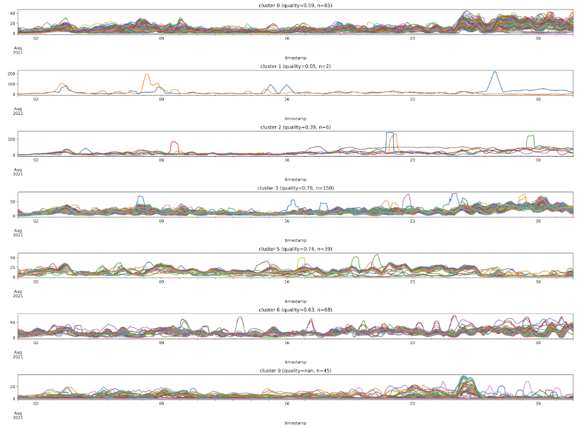

[](https://colab.research.google.com/drive/1n01pJ_3HlUN3iOru3G1E9onkUlSfu-Z6?usp=sharing)



Cluster analysis is a commonly used data processing method in data science, and its primary purpose is to find similar clusters in the data. After cluster analysis, data with similar attributes are clustered together for ease of use, and researchers can perform deeper analysis and processing on data with similar characteristics. In Civil IoT Taiwan, since the data of each sensor is time series data, to properly group a large number of sensors for more in-depth data analysis, we introduce standard feature extraction methods and for clustering time series data.

## Goal

- Learn to use Fast Fourier Transform (FFT) and Wavelet Transform to extract features of time series data
- Use unsupervised learning method to cluster time series data

## Package Installation and Importing

In this article, we will use the pandas, matplotlib, numpy, and pywt packages, which are pre-installed on our development platform, Google Colab, and do not need to be installed manually. However, we will also use one additional package that Colab does not have pre-installed, tslearn, which need to be installed by :

```python
!pip install --upgrade pip
!pip install tslearn
```

After the installation is complete, we can use the following syntax to import the relevant packages to complete the preparations in this article.

```python
import numpy as np
import pandas as pd
import pywt
import os, zipfile
import matplotlib.pyplot as plt

from datetime import datetime, timedelta
from numpy.fft import fft, ifft
from pywt import cwt
from tslearn.clustering import TimeSeriesKMeans
```

## Data Access and Preprocessing

Since we want to use long-term historical data in this article, we do not directly use the data access methods of the pyCIOT package, but directly download the 2021 data archive of “Academia Sinica - Micro Air Quality Sensors” in 2021 from the historical database of the Civil IoT Taiwan Data Service Platform and store in the `Air` folder.

```python
!mkdir Air CSV_Air
!wget -O Air/2021.zip -q "https://history.colife.org.tw/?r=/download&path=L%2Bepuuawo%2BWTgeizqi%2FkuK3noJTpmaJf5qCh5ZyS56m65ZOB5b6u5Z6L5oSf5ris5ZmoLzIwMjEuemlw"
!unzip Air/2021.zip -d Air
```

At the same time, since the downloaded data is in the format of a zip compressed file, we need to decompress it to generate a number of compressed daily file, and then decompress the compressed daily files in 2021/08 and store the content of the decompressed csv files in the `air_month` dataframe.

```python
folder = 'Air/2021/202108'
extension_zip = 'zip'
extension_csv = 'csv'

for item in os.listdir(folder):
  if item.endswith(extension_zip):
    file_name = f'{folder}/{item}'
    zip_ref = zipfile.ZipFile(file_name)
    zip_ref.extractall(folder)
    zip_ref.close()

air_month = pd.DataFrame()
for item in os.listdir(folder):
  if item.endswith(extension_csv):
    file_name = f'{folder}/{item}'
    df = pd.read_csv(file_name, parse_dates=['timestamp'])
    air_month = air_month.append(df)
air_month.set_index('timestamp', inplace=True)
air_month.sort_values(by='timestamp', inplace=True)
```

At present, the format of `air_month` does not meet our needs. It needs to be sorted into a data format with site data as columns and time data as columns. Thus, we first find out the number of distinct sites in the data, and store the site information in a sequence.

```python
id_list = air_month['device_id'].to_numpy()
id_uniques = np.unique(id_list)
id_uniques
```

```
array(['08BEAC07D3E2', '08BEAC09FF12', '08BEAC09FF22', ...,
       '74DA38F7C648', '74DA38F7C64A', '74DA38F7C64C'], dtype=object)
```

Then we save the data of each site as a column and put them all in the `air` dataframe. Finally, we delete all downloaded data and unpacked data to save cloud storage space.

```python
air = pd.DataFrame()
for i in range(len(id_uniques)):
    # print('device_id=="' + id_uniques[i] + '"')
    query = air_month.query('device_id=="' + id_uniques[i] + '"')
    query.sort_values(by='timestamp', inplace=True)
    query_mean = query.resample('H').mean()
    query_mean.rename(columns={'PM25': id_uniques[i]}, inplace=True)
    air = pd.concat([air, query_mean], axis=1)

!rm -rf Air
```

We can quickly view the contents of `air` using the following syntax.

```python
air.info()
print(air.head())
```

```
<class 'pandas.core.frame.DataFrame'>
DatetimeIndex: 745 entries, 2021-08-01 00:00:00 to 2021-09-01 00:00:00
Freq: H
Columns: 1142 entries, 08BEAC07D3E2 to 74DA38F7C64C
dtypes: float64(1142)
memory usage: 6.5 MB
                     08BEAC07D3E2  08BEAC09FF12  08BEAC09FF22  08BEAC09FF2A  \
timestamp                                                                     
2021-08-01 00:00:00      2.272727      1.250000     16.818182     12.100000   
2021-08-01 01:00:00      1.909091      1.285714     13.181818     14.545455   
2021-08-01 02:00:00      2.000000      1.125000     12.727273     16.600000   
2021-08-01 03:00:00      2.083333      3.000000     11.800000     12.090909   
2021-08-01 04:00:00      2.000000      2.600000     10.090909      8.545455   

                     08BEAC09FF34  08BEAC09FF38  08BEAC09FF42  08BEAC09FF44  \
timestamp                                                                     
2021-08-01 00:00:00      2.727273      0.000000      1.181818           NaN   
2021-08-01 01:00:00      2.000000      0.545455      0.909091           NaN   
2021-08-01 02:00:00      4.090909      1.583333      0.636364           NaN   
2021-08-01 03:00:00      0.545455      1.454545      1.181818           NaN   
2021-08-01 04:00:00      1.363636      1.363636      2.454545           NaN   

                     08BEAC09FF46  08BEAC09FF48  ...  74DA38F7C62A  \
timestamp                                        ...                 
2021-08-01 00:00:00      2.636364      2.545455  ...      6.777778   
2021-08-01 01:00:00      1.636364      2.272727  ...      7.800000   
2021-08-01 02:00:00      1.400000      3.100000  ...      7.300000   
2021-08-01 03:00:00      2.181818      4.000000  ...     12.000000   
2021-08-01 04:00:00      1.909091      2.100000  ...      9.000000   

                     74DA38F7C630  74DA38F7C632  74DA38F7C634  74DA38F7C63C  \
timestamp                                                                     
2021-08-01 00:00:00      9.800000     13.200000           5.0      6.200000   
2021-08-01 01:00:00     13.000000     15.700000           5.2      6.800000   
2021-08-01 02:00:00     12.800000     19.300000           5.0      7.300000   
2021-08-01 03:00:00      8.444444     15.200000           5.1      6.777778   
2021-08-01 04:00:00      6.500000     10.222222           4.9      6.100000   

                     74DA38F7C63E  74DA38F7C640  74DA38F7C648  74DA38F7C64A  \
timestamp                                                                     
2021-08-01 00:00:00           NaN      7.500000      5.000000      9.000000   
2021-08-01 01:00:00           NaN     10.200000      4.900000      6.600000   
2021-08-01 02:00:00           NaN     10.500000      3.666667      7.600000   
2021-08-01 03:00:00           NaN      8.500000      8.400000      8.000000   
2021-08-01 04:00:00           NaN      5.571429      6.200000      5.666667   

                     74DA38F7C64C  
timestamp                          
2021-08-01 00:00:00      7.600000  
2021-08-01 01:00:00      7.700000  
2021-08-01 02:00:00      7.888889  
2021-08-01 03:00:00      6.400000  
2021-08-01 04:00:00      5.000000  
```

Next, we delete the part of the data that has missing values (the value is Nan) and draw the data into a graph to observe the data distribution.

```python
air = air[:-1]
air_clean = air.dropna(1, how='any')
air_clean.plot(figsize=(20, 15), legend=None)
```


Since the instantaneous value of the sensor in the original data is prone to sudden and dramatic changes due to environmental changes, we use a moving average method to average the sensing values every ten times so that the processed data can be smoother and more stable. It can also better reflect the overall trend around the sensor and facilitate the following cluster analysis.

```python
air_clean = air_clean.rolling(window=10, min_periods=1).mean()
air_clean.plot(figsize=(20, 15), legend=None)
```


## Data Clustering

Since the current data representation in the dataframe is to put each station's data in a separate column, and each row stores the sensor values of all stations at a specific time point, this format is more suitable for time-series data processing and analysis. Still, it is not ideal for data grouping. Therefore, we need to exchange the columns and columns of the data first; that is, we need to transpose the existing data before proceeding to the data grouping.

Data clustering is a prevalent method in data science. Among many data clustering methods, we choose the KMeans method (`TimeSeriesKMeans`) provided by the tslearn package. In machine learning, this type of method is classified as an "unsupervised learning" method because, in the process of clustering, there is no specific standard to organize the data into a particular cluster, but only the similarity between the data is used to determine the clustering. Thus, it is beneficial for finding outliers or performing predictions.

The operation of the KMeans clustering method is roughly divided into the following steps:

1. Determine the value of *k*, that is, the final number of clusters;
2. Randomly select *k* records as the center points of the initial k clusters (also called "cluster heads");
3. Calculate the distance from each record to each cluster head according to the distance formula, and select the nearest cluster head to attribute the record to this group;
4. Recalculate its new cluster head for each cluster, and repeat the above steps until the cluster heads of *k* clusters no longer change.

We first set *k=10*, and use `TimeSeriesKMeans` to divide the data into 10 clusters (0~9) as follows:

```python
air_transpose = air_clean.transpose()
model = TimeSeriesKMeans(n_clusters=10, metric="dtw", max_iter=5) # n_cluster:分群數量, max_iter: 分群的步驟最多重複幾次
pre = model.fit(air_transpose)
pre.labels_
```

```
array([3, 3, 6, 3, 3, 3, 3, 6, 9, 6, 3, 6, 3, 3, 3, 3, 3, 1, 3, 3, 6, 3,
3, 3, 3, 6, 6, 6, 6, 3, 3, 3, 3, 3, 3, 3, 3, 3, 6, 3, 9, 3, 3, 3,
3, 3, 6, 3, 2, 6, 3, 2, 3, 3, 3, 6, 9, 3, 3, 3, 3, 6, 6, 3, 3, 3,
6, 6, 3, 3, 3, 3, 3, 6, 3, 6, 3, 3, 3, 3, 3, 6, 6, 3, 3, 3, 6, 3,
3, 3, 6, 3, 3, 3, 3, 3, 3, 6, 9, 6, 7, 3, 2, 3, 6, 3, 3, 3, 6, 3,
3, 3, 3, 6, 3, 3, 3, 6, 3, 6, 6, 3, 6, 3, 3, 3, 3, 6, 3, 3, 3, 3,
3, 3, 3, 3, 3, 3, 3, 0, 3, 6, 3, 3, 3, 0, 6, 0, 6, 3, 0, 3, 3, 3,
6, 6, 6, 6, 3, 3, 6, 3, 3, 9, 6, 3, 6, 3, 6, 6, 3, 2, 3, 3, 3, 6,
9, 6, 6, 3, 3, 6, 3, 0, 3, 3, 6, 6, 6, 3, 0, 0, 6, 3, 6, 6, 6, 3,
6, 6, 3, 0, 3, 3, 0, 3, 3, 6, 3, 6, 6, 6, 3, 0, 3, 0, 0, 0, 9, 0,
0, 0, 0, 0, 0, 0, 0, 0, 0, 9, 9, 9, 9, 0, 0, 0, 9, 9, 0, 0, 0, 4,
9, 9, 9, 9, 0, 0, 0, 0, 0, 0, 0, 9, 0, 9, 0, 0, 0, 9, 9, 0, 9, 0,
0, 0, 5, 0, 0, 0, 0, 9, 9, 0, 1, 0, 9, 2, 9, 9, 0, 0, 5, 0, 9, 0,
9, 0, 0, 0, 3, 0, 0, 0, 0, 0, 3, 2, 3, 3, 0, 3, 0, 0, 0, 6, 3, 0,
8, 9, 3, 9, 9, 0, 5, 0, 3, 0, 9, 9, 5, 5, 5, 3, 5, 9, 3, 0, 0, 3,
0, 0, 0, 3, 5, 5, 3, 0, 5, 6, 5, 5, 5, 0, 9, 0, 6, 6, 6, 3, 0, 3,
5, 5, 9, 6, 3, 0, 0, 0, 0, 3, 5, 0, 5, 5, 0, 3, 3, 9, 5, 5, 9, 5,
9, 9, 9, 9, 5, 5, 5, 5, 5, 5, 9, 5, 5, 5, 5, 5, 5, 5, 5, 5, 9, 5,
5, 5])
```

The result of clustering is that a small number of sensors may form a cluster by themselves due to the particularity of the data. These sensors can be regarded as deviated stations with no value for further analysis. Therefore, our next step is first to count whether each separated cluster has only one internal sensor and discard the cluster. For example, in this example, we will discard clusters with only one sensor in them, as follows:

```python
# build helper df to map metrics to their cluster labels
df_cluster = pd.DataFrame(list(zip(air_clean.columns, pre.labels_)), columns=['metric', 'cluster'])

# make some helper dictionaries and lists
cluster_metrics_dict = df_cluster.groupby(['cluster'])['metric'].apply(lambda x: [x for x in x]).to_dict()
cluster_len_dict = df_cluster['cluster'].value_counts().to_dict()
clusters_dropped = [cluster for cluster in cluster_len_dict if cluster_len_dict[cluster]==1]
clusters_final = [cluster for cluster in cluster_len_dict if cluster_len_dict[cluster]>1]
clusters_final.sort()

clusters_dropped
```

```
[7, 4, 8]
```

Finally, we display the remaining clusters graphically, and it can be found that the data in each cluster show a very high degree of similarity. In contrast, the data in different clusters show apparent differences. To quantify data similarity in clusters, we define a new variable `quality`. The value of this variable is equal to the average value of the correlation between each internal data and other data, and the lower the `quality` value, the more similar the internal data of this cluster.

```python
fig, axes = plt.subplots(nrows=len(clusters_final), ncols=1, figsize=(20, 15), dpi=500)
# legend = axes.legend(loc="upper left", bbox_to_anchor=(1.02, 0, 0.07, 1))
for idx, cluster_number in enumerate(clusters_final):
  x_corr = air_clean[cluster_metrics_dict[cluster_number]].corr().abs().values
  x_corr_mean = round(x_corr[np.triu_indices(x_corr.shape[0],1)].mean(),2)
  plot_title = f'cluster {cluster_number} (quality={x_corr_mean}, n={cluster_len_dict[cluster_number]})'
  air_clean[cluster_metrics_dict[cluster_number]].plot(ax=axes[idx], title=plot_title)
  axes[idx].get_legend().remove()

fig.tight_layout()
plt.show()
```



So far, we have demonstrated how to use air quality sensor data to cluster the data based on the characteristic information in the data. However, since the original data may contain noise interference, it will also affect the clustering results. To reduce noise interference in raw data, we introduce two commonly used advanced methods: Fourier transform, and wavelet transform. These two methods can extract advanced time series data features, so they can more effectively improve the effectiveness of clustering.

### Fast Fourier Transform

Fourier transform is a commonly used signal analysis method, which can convert the original data from the time domain to the frequency domain, which is convenient for further feature extraction and data analysis. It is commonly used in engineering and mathematics and in studying sound and time series data. Since the standard Fourier transform involves complicated mathematical operations, it is complex and time-consuming to implement. Therefore, a fast Fourier transform method to discretize the original data was developed later, which can significantly reduce the computational complexity of the Fourier transform and is especially suitable for large amounts of data. Therefore, in our next topic, we will use the Fast Fourier Transform method to extract the data features required for data grouping.

We first observe the temporal variation of a single station (''`08BEAC07D3E2`'') by plotting.

```python
air_clean['08BEAC07D3E2'].plot()
```


Then we use the fast Fourier transform tool `fft` in the NumPy package to convert the station's data input and observe the data distribution after conversion to the frequency domain by drawing.

```python
X = fft(air_clean['08BEAC07D3E2'])
N = len(X)
n = np.arange(N)
# get the sampling rate
sr = 1 / (60*60)
T = N/sr
freq = n/T 

# Get the one-sided specturm
n_oneside = N//2
# get the one side frequency
f_oneside = freq[:n_oneside]

plt.figure(figsize = (12, 6))
plt.plot(f_oneside, np.abs(X[:n_oneside]), 'b')
plt.xlabel('Freq (Hz)')
plt.ylabel('FFT Amplitude |X(freq)|')
plt.show()
```


Then we extend the same transform step to all sensors and store the fast Fourier transform results for all sensors in the `air_fft` variable.

```python
air_fft = pd.DataFrame()
col_names = list(air_clean.columns)
for name in col_names:
  X = fft(air_clean[name])
  N = len(X)
  n = np.arange(N)
  # get the sampling rate
  sr = 1 / (60*60)
  T = N/sr
  freq = n/T 

  # Get the one-sided specturm
  n_oneside = N//2
  # get the one side frequency
  f_oneside = freq[:n_oneside]
  air_fft[name] = np.abs(X[:n_oneside])
print(air_fft.head())
```

```
08BEAC07D3E2  08BEAC09FF22  08BEAC09FF2A  08BEAC09FF42  08BEAC09FF48  \
0  12019.941563  11255.762431  13241.408211  12111.740447  11798.584351   
1   3275.369377   2640.372699   1501.672853   3096.493565   3103.006928   
2   1109.613670   1201.362571    257.659947   1085.384353   1128.373457   
3   2415.899146   1631.128345    888.838822   2281.597031   2301.936400   
4   1130.973327    446.032078    411.940722   1206.512460   1042.054041   

   08BEAC09FF66  08BEAC09FF80  08BEAC09FF82  08BEAC09FF8C  08BEAC09FF9C  ...  \
0  12441.845754  11874.390693  12259.096742   3553.255916  13531.649701  ...   
1   3262.357287   2999.042917   1459.720167   1109.764942    646.846038  ...   
2   1075.877632   1005.445596    478.569869    368.572815   1163.425916  ...   
3   2448.646527   2318.870954    956.029693    272.486798    553.409732  ...   
4   1087.461354   1172.755489    437.920193    471.824176    703.557830  ...   

   74DA38F7C504  74DA38F7C514  74DA38F7C524  74DA38F7C554  74DA38F7C5BA  \
0  11502.841221  10589.689400  11220.068048  10120.220198  11117.146124   
1   2064.762890   1407.105290   1938.647888   1126.088084   2422.787262   
2   2163.528535   1669.014077   2054.586664   1759.326882   1782.523300   
3   1564.407983   1157.759192   1253.849261   1244.799149   1519.477057   
4   1484.232397   1177.909914   1318.704021   1106.349846   1373.167639   

   74DA38F7C5BC  74DA38F7C5E0  74DA38F7C60C  74DA38F7C62A  74DA38F7C648  
0  11243.094213     26.858333   9408.414826  11228.246949   8931.871618  
1   2097.343959     15.020106   1667.485473   1687.251179   1395.239491  
2   1806.524987     10.659603   1585.987276   1851.628868   1527.925427  
3   1521.392873      6.021244   1217.547879   1240.173667   1022.239794  
4   1393.469185      3.361938   1161.975844   1350.756178   1051.434944  

[5 rows x 398 columns]
```

Then we use the same method to divide the sensor data transformed into the frequency domain into 10 clusters using `TimeSeriesKMeans`, and delete the clusters with only a single sensor after clustering. In this example, there will be 9 clusters left, and we print the cluster code to which each sensor belongs.

```python
fft_transpose = air_fft.transpose()
model = TimeSeriesKMeans(n_clusters=10, metric="dtw", max_iter=5)
pre = model.fit(fft_transpose)

# build helper df to map metrics to their cluster labels
df_cluster = pd.DataFrame(list(zip(air_fft.columns, pre.labels_)), columns=['metric', 'cluster'])

# make some helper dictionaries and lists
cluster_metrics_dict = df_cluster.groupby(['cluster'])['metric'].apply(lambda x: [x for x in x]).to_dict()
cluster_len_dict = df_cluster['cluster'].value_counts().to_dict()
clusters_dropped = [cluster for cluster in cluster_len_dict if cluster_len_dict[cluster]==1]
clusters_final = [cluster for cluster in cluster_len_dict if cluster_len_dict[cluster]>1]
clusters_final.sort()

print(df_cluster.head(10))
```

```
         metric  cluster
0  08BEAC07D3E2        7
1  08BEAC09FF22        3
2  08BEAC09FF2A        0
3  08BEAC09FF42        7
4  08BEAC09FF48        7
5  08BEAC09FF66        7
6  08BEAC09FF80        7
7  08BEAC09FF82        0
8  08BEAC09FF8C        2
9  08BEAC09FF9C        8
```

Finally, we plot the sensor data for the nine clusters individually. It can be found that the data of sensors in each cluster are very similar in the frequency domain, and the frequency domain difference of sensors in different clusters is also more significant than that of sensors in the same cluster.

```python
fig, axes = plt.subplots(nrows=len(clusters_final), ncols=1, figsize=(20, 15), dpi=500)
for idx, cluster_number in enumerate(clusters_final):
  x_corr = air_fft[cluster_metrics_dict[cluster_number]].corr().abs().values
  x_corr_mean = round(x_corr[np.triu_indices(x_corr.shape[0],1)].mean(),2)
  plot_title = f'cluster {cluster_number} (quality={x_corr_mean}, n={cluster_len_dict[cluster_number]})'
  air_fft[cluster_metrics_dict[cluster_number]].plot(ax=axes[idx], title=plot_title)
  axes[idx].get_legend().remove()

fig.tight_layout()
plt.show()
```


### Wavelet Transform

Besides Fourier transform, wavelet transform is another commonly used method to convert raw data from the time domain to the frequency domain. The wavelet transform can provide more observation angles for frequency domain data than the Fourier transform. Therefore, recently, wavelet transform has been widely used in the analysis of video, audio, time series, and other related data and has achieved good results.

We use the pywt package for wavelet transform data processing. Since the wavelet transform will use the mother wavelet to extract the features in the time series data, we first use the following syntax to check the name of the mother wavelet that can be used.

```python
wavlist = pywt.wavelist(kind="continuous")
print(wavlist)
```

```
['cgau1', 'cgau2', 'cgau3', 'cgau4', 'cgau5', 'cgau6', 'cgau7', 'cgau8', 'cmor', 'fbsp', 'gaus1', 'gaus2', 'gaus3', 'gaus4', 'gaus5', 'gaus6', 'gaus7', 'gaus8', 'mexh', 'morl', 'shan']
```

Unlike the Fourier transform, which can only see changes in frequency, the wavelet transform can scale a finite mother wavelet to extract features from a data segment. When choosing the mother wavelet, you can draw it and observe it before deciding. If we take the *morl* mother wavelet as an example, we can use the following syntax to construct the graph.

```python
wav = pywt.ContinuousWavelet("morl")
scale = 1

int_psi, x = pywt.integrate_wavelet(wav, precision=10)
int_psi /= np.abs(int_psi).max()
wav_filter = int_psi[::-1]

nt = len(wav_filter)
t = np.linspace(-nt // 2, nt // 2, nt)
plt.plot(t, wav_filter.real)
plt.ylim([-1, 1])
plt.xlabel("time (samples)")
```


We first set the parameters of the wavelet transform and the mother wavelet as *morl*. For the selected sensor, we set the zoom range of the morl wavelet to 1~31 times and carried out wavelet transformation and plotting.

```python
F = 1  #Samples per hour
hours = 744
nos = np.int(F*hours)  #No of samples in 31 days

x = air_clean['08BEAC09FF2A']
scales = np.arange(1, 31, 1)
coef, freqs = cwt(x, scales, 'morl')

# scalogram
plt.figure(figsize=(15, 10))
plt.imshow(abs(coef), extent=[0, 744, 30, 1], interpolation='bilinear', cmap='viridis',
           aspect='auto', vmax=abs(coef).max(), vmin=abs(coef).min())
plt.gca().invert_yaxis()
plt.yticks(np.arange(1, 31, 1))
plt.xticks(np.arange(0, nos/F, nos/(20*F)))
plt.ylabel("scales")
plt.xlabel("hour")
plt.colorbar()
plt.show()
```


In general, we can find that the larger the scale in the picture, the more yellow-green the color, indicating that the extracted features are closer to the mother wavelet and vice versa. The characteristics of these comparison results will be used for subsequent data grouping.

However, after wavelet transform, each site's data are transformed into two-dimensional feature values. Before starting to group the data, we need to splice the fields of the original two-dimensional data into one dimension and store it in the `air_cwt` variable.

```python
air_cwt = pd.DataFrame()
scales = np.arange(28, 31, 2)
col_names = list(air_clean.columns)
for name in col_names:
  coef, freqs = cwt(air_clean[name], scales, 'morl')
  air_cwt[name] = np.abs(coef.reshape(coef.shape[0]*coef.shape[1]))

print(air_cwt.head())
```

```
08BEAC07D3E2  08BEAC09FF22  08BEAC09FF2A  08BEAC09FF42  08BEAC09FF48  \
0      0.778745      6.336664      2.137342      1.849035      0.778745   
1      0.929951      8.348031      2.977576      1.829540      0.958915   
2      1.190476     11.476048      3.223773      1.832544      1.292037   
3      1.227021     12.890554      4.488244      1.634717      1.338655   
4      1.252126     14.103178      5.715656      1.430744      1.376562   

   08BEAC09FF66  08BEAC09FF80  08BEAC09FF82  08BEAC09FF8C  08BEAC09FF9C  ...  \
0      0.555941      0.334225      8.110581      2.287378      0.409913  ...   
1      0.596532      0.201897      8.774271      1.706411      0.311242  ...   
2      0.771641      0.294242      8.327808      1.018296      2.754100  ...   
3      0.713931      0.065011      8.669036      0.249029      3.278048  ...   
4      0.670639      0.193083      8.795376      0.624988      3.628597  ...   

   74DA38F7C504  74DA38F7C514  74DA38F7C524  74DA38F7C554  74DA38F7C5BA  \
0      1.875873      1.090635      0.284901      1.111999      1.049112   
1      0.643478      1.446061      0.420701      0.974641      0.478931   
2      1.101801      2.404254      1.389941      1.190141      0.511454   
3      2.370436      2.510728      1.927692      0.703424      1.054164   
4      3.563873      2.387982      2.463458      0.098485      1.448078   

   74DA38F7C5BC  74DA38F7C5E0  74DA38F7C60C  74DA38F7C62A  74DA38F7C648  
0      1.107551      0.000918      0.080841      0.859855      0.415574  
1      0.245802      0.005389      1.053260      1.762642      0.190458  
2      1.162331      0.009754      2.667145      3.210326      0.516525  
3      1.993138      0.014496      3.669712      3.889207      0.666492  
4      2.672666      0.020433      4.482730      4.311888      0.677992  

[5 rows x 398 columns]
```

Due to the process of converting two-dimensional data into one-dimensional data, the number of characteristic values in each data will increase, significantly increasing the complexity of subsequent data calculations. Therefore, we only take the top 100 characteristic values to represent each sensor and apply the KMeans method for data grouping.

Since wavelet transform can obtain more subtle data features, we preset 20 clusters in the data clustering process (readers can test different cluster number settings by themselves and observe what will happen to the results). In addition, we will also check whether there are small clusters with only a single sensor in the grouping results and remove them to prevent a few sensors with special conditions from affecting the overall data grouping results.

```python
air_cwt_less = air_cwt.iloc[:, 0:101]

cwt_transpose = air_cwt_less.transpose()
model = TimeSeriesKMeans(n_clusters=20, metric="dtw", max_iter=10, verbose=1, n_jobs=-1)
pre = model.fit(cwt_transpose)

# build helper df to map metrics to their cluster labels
df_cluster = pd.DataFrame(list(zip(air_cwt.columns, pre.labels_)), columns=['metric', 'cluster'])

# make some helper dictionaries and lists
cluster_metrics_dict = df_cluster.groupby(['cluster'])['metric'].apply(lambda x: [x for x in x]).to_dict()
cluster_len_dict = df_cluster['cluster'].value_counts().to_dict()
clusters_dropped = [cluster for cluster in cluster_len_dict if cluster_len_dict[cluster]==1]
clusters_final = [cluster for cluster in cluster_len_dict if cluster_len_dict[cluster]>1]
clusters_final.sort()

print(df_cluster.head(10))
```

```
metric  cluster
0  08BEAC07D3E2        7
1  08BEAC09FF22        3
2  08BEAC09FF2A        6
3  08BEAC09FF42       10
4  08BEAC09FF48        7
5  08BEAC09FF66        7
6  08BEAC09FF80        7
7  08BEAC09FF82        6
8  08BEAC09FF8C       15
9  08BEAC09FF9C       19
```

In our example, after the above procedure, there are 14 clusters left at the end. We draw the sensor raw data in each cluster one by one, and we can find that the consistency of the sensor data in the same cluster is more obvious. At the same time , the differences between the different clusters are more detailed and clear than when using the raw data or the Fourier transform before.

```python
fig, axes = plt.subplots(nrows=len(clusters_final), ncols=1, figsize=(20, 15), dpi=500)
# legend = axes.legend(loc="upper left", bbox_to_anchor=(1.02, 0, 0.07, 1))
for idx, cluster_number in enumerate(clusters_final):
  x_corr = air_cwt[cluster_metrics_dict[cluster_number]].corr().abs().values
  x_corr_mean = round(x_corr[np.triu_indices(x_corr.shape[0],1)].mean(),2)
  plot_title = f'cluster {cluster_number} (quality={x_corr_mean}, n={cluster_len_dict[cluster_number]})'
  air_cwt[cluster_metrics_dict[cluster_number]].plot(ax=axes[idx], title=plot_title)
  axes[idx].get_legend().remove()

fig.tight_layout()
plt.show()
```


## References

- Civil IoT Taiwan: Historical Data ([https://history.colife.org.tw/](https://history.colife.org.tw/#/))
- Time Series Clustering — Deriving Trends and Archetypes from Sequential Data | by Denyse | Towards Data Science ([https://towardsdatascience.com/how-to-apply-k-means-clustering-to-time-series-data-28d04a8f7da3](https://towardsdatascience.com/how-to-apply-k-means-clustering-to-time-series-data-28d04a8f7da3))
- How to Apply K-means Clustering to Time Series Data | by Alexandra Amidon | Towards Data Science ([https://towardsdatascience.com/how-to-apply-k-means-clustering-to-time-series-data-28d04a8f7da3](https://towardsdatascience.com/how-to-apply-k-means-clustering-to-time-series-data-28d04a8f7da3))
- Understanding K-means Clustering: Hands-On with SciKit-Learn | by Carla Martins | May, 2022 | Towards AI ([https://pub.towardsai.net/understanding-k-means-clustering-hands-on-with-scikit-learn-b522c0698c81](https://pub.towardsai.net/understanding-k-means-clustering-hands-on-with-scikit-learn-b522c0698c81))
- Fast Fourier Transform. How to implement the Fast Fourier… | by Cory Maklin | Towards Data Science ([https://towardsdatascience.com/fast-fourier-transform-937926e591cb](https://towardsdatascience.com/fast-fourier-transform-937926e591cb))
- PyWavelets/pywt: PyWavelets - Wavelet Transforms in Python ([https://github.com/PyWavelets/pywt](https://github.com/PyWavelets/pywt))
