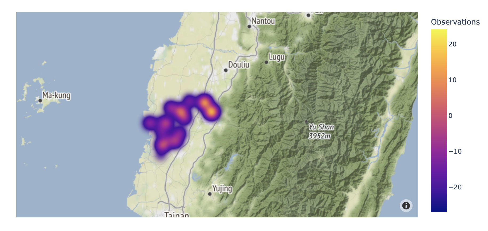
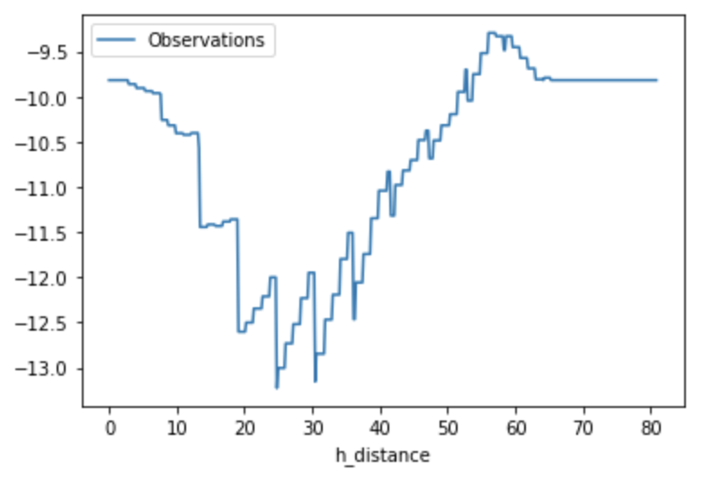

[](https://colab.research.google.com/drive/1dZ26qA1BLee7AMaoBk0lcWvB3PAOLKV-?usp=sharing)



Environmental microsensors scattered throughout our surroundings play a crucial role in gathering information. This data aids us in making informed decisions and taking appropriate actions. A key aspect of this process involves understanding the spatial relationships between sensor stations when analyzing their data. These station locations can reveal geometric patterns or form spatial clusters. Moreover, by considering the location of these stations and the differences in their readings, we can estimate values for areas without stations. This approach allows us to develop a more comprehensive overview of value distribution. This detailed distribution helps us investigate how these values relate to various environmental factors. In this section, we'll utilize data from flooding sensors and groundwater table observation stations across different counties, provided by the Water Resources Agency (MOEA), to conduct some basic spatial analyses.

## Voronoi diagram

Initially, we need to figure out the specific area each monitoring station covers and whether the data from these stations accurately reflect the conditions of their respective areas. To do this, we can use something called a Voronoi Diagram. Imagine drawing lines halfway between each pair of nearby stations and then extending these lines until they form a shape like a polygon. Each station sits at the center of one of these polygons, and the data it collects represents what's happening inside that polygon. We'll try this out by creating Voronoi Diagrams using data from flood sensors in Chiayi City and Chiayi County. This will give us a basic idea of how far the influence of each flood sensor reaches.

```python
import matplotlib.pyplot as plt
import seaborn as sns
import pandas as pd
import numpy as np
import urllib.request
import ssl
import json
#install geopython libraries
!apt install gdal-bin python-gdal python3-gdal
#install python3-rtree - Geopandas requirement
!apt install python3-rtree 
#install geopandas
!pip install geopandas
#install pykrige
!pip install pykrige
#install elevation
!pip install elevation
#install affine rasterio
!pip install affine rasterio

#install descartes - Geopandas requirement
!pip install descartes
import geopandas as gpd
!pip install pyCIOT
import pyCIOT.data as CIoT
```

```python
# downlaod the county boundary shpfile from open database
!wget -O "shp.zip" -q "https://data.moi.gov.tw/MoiOD/System/DownloadFile.aspx?DATA=72874C55-884D-4CEA-B7D6-F60B0BE85AB0"
!unzip shp.zip -d shp
```

```python
# # get flood sensors' data by pyCIOT
wa = CIoT.Water().get_data(src="FLOODING:WRA")
wa2 = CIoT.Water().get_data(src="FLOODING:WRA2")

flood_list = wa + wa2

county = gpd.read_file('/content/shp/COUNTY_MOI_1090820.shp')
basemap = county.loc[county['COUNTYNAME'].isin(["嘉義縣","嘉義市"])]

flood_df = pd.DataFrame([],columns = ['name',  'Observations','lon', 'lat'])
for i in flood_list:
    #print(i['data'][0])
    if len(i['data'])>0:
        df = pd.DataFrame([[i['properties']['stationName'],i['data'][0]['values'][0]['value'],i['location']['longitude'],i['location']['latitude']]],columns = ['name',  'Observations','lon', 'lat'])
    else :
        df = pd.DataFrame([[i['properties']['stationName'],-999,-999,-999]],columns = ['name',  'Observations','lon', 'lat'])
    flood_df = pd.concat([flood_df,df])
    #print(df)

result_df = flood_df.drop_duplicates(subset=['name'], keep='first')
station=result_df.sort_values(by=['lon', 'lat'])
station = station[station.lon!=-999]
station.reset_index(inplace=True, drop=True)
gdf_flood = gpd.GeoDataFrame(
    station, geometry=gpd.points_from_xy(station.lon, station.lat),crs="EPSG:4326")

station=result_df.sort_values(by=['lon', 'lat'])
station = station[station.lon!=-999]
station.reset_index(inplace=True, drop=True)
gdf_flood = gpd.GeoDataFrame(
    station, geometry=gpd.points_from_xy(station.lon, station.lat),crs="EPSG:4326")

basemap = basemap.set_crs(4326,allow_override=True)
intersected_data = gpd.overlay(gdf_flood, basemap, how='intersection') 

```

```python
from scipy.spatial import Voronoi, voronoi_plot_2d
fig, ax = plt.subplots(figsize=(6, 10))
inputp = intersected_data[['lon','lat']]
basemap.plot(ax=ax, facecolor='none', edgecolor='purple');
vor = Voronoi(inputp)
voronoi_plot_2d(vor,ax = ax,show_vertices=False,)
plt.show()
```


In addition, we can map out the areas covered by each station using a technique called Delaunay Triangulation. This involves picking one station as a central point and then connecting it to the two nearest stations, forming a triangular area. If we treat this triangular area as if it has uniform conditions, we can estimate conditions in this area using the average data from its three corner stations.

In summary, these two methods – Voronoi Diagrams and Delaunay Triangulation – help us visualize the layout of these sensors and the geographical patterns they create.

```python
from scipy.spatial import Delaunay, delaunay_plot_2d
import numpy as np
fig, ax = plt.subplots(figsize=(6, 10))
#input should be array
inputp = np.array(inputp)
tri = Delaunay(inputp)
basemap.plot(ax=ax, facecolor='none', edgecolor='purple');
delaunay_plot_2d(tri,ax=ax)
plt.show()
```


## Convex hull

The Convex Hull algorithm is designed to pick out stations that are on the outer edges of a group of stations. It creates the smallest possible polygon that includes all the points. This way, we can identify the main area where these stations are clustered and perform further calculations. To use the Convex Hull algorithm, we first sort the stations by their x coordinates. If two stations have the same x coordinate, then we sort them by their y coordinates. This sorting helps us find the outermost points that will form the edges of our polygon. (There are also other methods that use similar ideas.) This algorithm is useful for determining the effective monitoring areas of stations. For instance, it allows us to analyze the coverage area of flooding sensors by looking at their placement in Chiayi City and Chiayi County.

```python
from scipy.spatial import ConvexHull, convex_hull_plot_2d
fig, ax = plt.subplots(figsize=(6, 10))
hull = ConvexHull(inputp)
basemap.plot(ax=ax, facecolor='none', edgecolor='purple');
convex_hull_plot_2d(hull,ax=ax)
plt.tight_layout()
```


## Clustering

The closer the monitoring stations are to each other, the more they share similar environmental influences. By using the K-means algorithm, we can group these stations into clusters. This helps us understand how sensor data from the Civil IoT Taiwan Data Platform is related to the environment around them.

When we use K-means clustering, we first decide on the number of groups, or 'clusters', we want to create (let's call this number 'n'). The algorithm then picks 'n' starting points at random, which act as the centers of these clusters. It looks for stations nearest to each center, considering the straight-line distance from the stations to these central points.

K-means clustering groups the stations based on these distances and calculates an average for each cluster. It repeatedly adjusts the positions of the centers and regroups the stations to ensure that each station is as close as possible to the center of its cluster. The process ends when the stations can't get any closer to the centers, indicating that the best grouping has been achieved.

```python
# get the groundwater station data through pyCIOT
count = 733
num = 0
water_level = pd.DataFrame([])
while(num<=count):
    url_level = "https://sta.ci.taiwan.gov.tw/STA_WaterResource_v2/v1.0/Datastreams?$skip="+str(num)+"&$filter=%28%28Thing%2Fproperties%2Fauthority_type+eq+%27%E6%B0%B4%E5%88%A9%E7%BD%B2%27%29+and+substringof%28%27Datastream_Category_type%3D%E5%9C%B0%E4%B8%8B%E6%B0%B4%E4%BD%8D%E7%AB%99%27%2CDatastreams%2Fdescription%29%29&$expand=Thing,Thing%28%24expand%3DLocations%29,Observations%28%24top%3D1%3B%24orderby%3DphenomenonTime+desc%3B%24top%3D1%29&$count=true"
    ssl._create_default_https_context = ssl._create_unverified_context
    r_l = urllib.request.urlopen(url_level)
    string_l = r_l.read().decode('utf-8')

    jf_level = json.loads(string_l)

    station = pd.DataFrame(jf_level['value']).filter(items=['Thing','observedArea','Observations'])
    station['lat']=station['observedArea']
    for i in range(len(station)):
        station['Thing'][i] = station['Thing'][i]['properties']['stationName']

        if pd.isnull(station['observedArea'][i]):
            station['lat'][i]=-1
            station['observedArea'][i]=-1
        else:
            station['lat'][i]=station['lat'][i]['coordinates'][1]
            station['observedArea'][i]=station['observedArea'][i]['coordinates'][0]

        if len(station['Observations'][i])!=0:
            station['Observations'][i] = station['Observations'][i][0]['result']
        else:
            station['Observations'][i] = -1
    station = station.rename(columns={"Thing": "name", 'observedArea': 'lon'})
    if num ==0 :
        water_level = station
    else:
        water_level = pd.concat([water_level, station])
    num+=100
    
result_df = water_level.drop_duplicates(subset=['name'], keep='first')
station=result_df.sort_values(by=['lon', 'lat'])
station.reset_index(inplace=True, drop=True)
station = station[station.lon!=-1]
gdf_level = gpd.GeoDataFrame(
    station, geometry=gpd.points_from_xy(station.lon, station.lat),crs="EPSG:4326")
```

```python
# intersect with county boundary 
basemap = county.loc[county['COUNTYNAME'].isin(["雲林縣"])]
basemap = basemap.set_crs(4326,allow_override=True)
intersected_data = gpd.overlay(gdf_level, basemap, how='intersection') 
```

```python
from sklearn.cluster import KMeans
from scipy.spatial import ConvexHull
import folium
clusterp = intersected_data[["name","lon", 'lat', 'Observations']]

# 1. identify the clusters by kmeans
#1.1 pre-processing
X = clusterp.iloc[:, 1:3].values
# ddecide the number groups by elbow method
wcss = []
for i in range(1, 11):
    kmeans = KMeans(n_clusters = i, init = 'k-means++', random_state = 42)
    kmeans.fit(X)
    wcss.append(kmeans.inertia_)
plt.plot(range(1, 11), wcss)
plt.title('The Elbow Method')
plt.xlabel('Number of clusters')
plt.ylabel('WCSS')
plt.show()
```


```python
# 1.2 applying K-Means model 
kmeans = KMeans(n_clusters = 3, init = 'k-means++', random_state = 42)
y_kmeans = kmeans.fit_predict(X)
# 1.3 map data back to df
clusterp['cluster'] = y_kmeans+1 # to step up to group 1 to 4
```

```python
# 2. display the result on maps
m = folium.Map(location=[clusterp['lat'].mean(), clusterp['lon'].mean()],
               tiles='CartoDB positron',
               zoom_start=7)
# create the layer by kmeans
layer1 = folium.FeatureGroup(name= '<u><b>group1</b></u>',show= True)
m.add_child(layer1)
layer2 = folium.FeatureGroup(name= '<u><b>group2</b></u>',show= True)
m.add_child(layer2)
layer3 = folium.FeatureGroup(name= '<u><b>group3</b></u>',show= True)
m.add_child(layer3)
layer4 = folium.FeatureGroup(name= '<u><b>group4</b></u>',show= True)
m.add_child(layer4)

# create symbology
my_symbol_css_class= """ <style>
.fa-g1:before {
    font-family: Arial; 
    font-weight: bold;
    font-size: 12px;
    color: black;
    background-color:white;
    border-radius: 10px; 
    white-space: pre;
    content: ' g1 ';
    }
.fa-g2:before {
    font-family: Arial; 
    font-weight: bold;
    font-size: 12px;
    color: black;
    background-color:white;
    border-radius: 10px; 
    white-space: pre;
    content: ' g2 ';
    }
.fa-g3:before {
    font-family: Arial; 
    font-weight: bold;
    font-size: 12px;
    color: black;
    background-color:white;
    border-radius: 10px; 
    white-space: pre;
    content: ' g3 ';
    }
.fa-g4:before {
    font-family: Arial; 
    font-weight: bold;
    font-size: 12px;
    color: black;
    background-color:white;
    border-radius: 10px; 
    white-space: pre;
    content: ' g4 ';
    }
.fa-g1bad:before {
    font-family: Arial; 
    font-weight: bold;
    font-size: 12px;
    color: white;
    background-color:red;
    border-radius: 10px; 
    white-space: pre;
    content: ' g1 ';
    }
.fa-g2bad:before {
    font-family: Arial; 
    font-weight: bold;
    font-size: 12px;
    color: white;
    background-color:red;
    border-radius: 10px; 
    white-space: pre;
    content: ' g2 ';
    }
.fa-g3bad:before {
    font-family: Arial; 
    font-weight: bold;
    font-size: 12px;
    color: white;
    background-color:red;
    border-radius: 10px; 
    white-space: pre;
    content: ' g3 ';
    }
.fa-g4bad:before {
    font-family: Arial; 
    font-weight: bold;
    font-size: 12px;
    color: white;
    background-color:red;
    border-radius: 10px; 
    white-space: pre;
    content: ' g4 ';
    }
</style>
"""
# add the symbology code to the map      
m.get_root().html.add_child(folium.Element(my_symbol_css_class))

for index, row in clusterp.iterrows():
    if row['cluster'] == 1:
        color='black'
        fa_symbol = 'fa-g1'
        lay = layer1
    elif row['cluster'] == 2:
        color='purple'
        fa_symbol = 'fa-g2'
        lay = layer2
    elif row['cluster'] == 3:
        color='orange'
        fa_symbol = 'fa-g3'
        lay = layer3
    elif row['cluster'] == 4:
        color='blue'
        fa_symbol = 'fa-g4'
        lay = layer4
        
    folium.Marker(
        location=[row['lat'], row['lon']],
        title = row['name']+ 'group:{}'.format(str(row["cluster"])),
        popup = row['name']+ 'group:{},value:{}'.format(str(row["cluster"]),str(row['Observations'])),
        icon= folium.Icon(color=color, icon=fa_symbol, prefix='fa')).add_to(lay)
```

```python
# display the result on maps
layer_list = [layer1,layer2,layer3,layer4]
color_list = ['black','purple','orange','blue']
for g in clusterp['cluster'].unique():
    latlon_cut =clusterp[clusterp['cluster']==g].iloc[:, 1:3]
    hull = ConvexHull(latlon_cut.values)
    Lat = latlon_cut.values[hull.vertices,0]
    Long = latlon_cut.values[hull.vertices,1] 
    cluster = pd.DataFrame({'lat':Lat,'lon':Long })       
    area = list(zip(cluster['lat'],cluster['lon']))

    list_index = g-1 
    lay_cluster = layer_list[list_index ] 
    folium.Polygon(locations=area,
        color=color_list[list_index],
        weight=2,
        fill=True,
        fill_opacity=0.1,
        opacity=0.8).add_to(lay_cluster) 
            
folium.LayerControl(collapsed=False,position= 'bottomright').add_to(m)
print(m)
m.save('River_clustering.html')
```


## Kernel density

The idea of **density** is like measuring how crowded things are in a specific space. We usually calculate it using the formula `d = N/A`, where `d` stands for density, `N` is the number of things we're looking at (like events or objects), and `A` is the size of the area we're considering. But there's a catch: this formula can be tricky because the size of the area can skew our results. For example, the same number of things in a small town versus a big city will give us different densities, making it hard to accurately measure how clustered or spread out these things are.

To get around this problem, we use something called **kernel density**. Imagine each thing we're observing as the center of a circle, and we then look at everything within a certain distance (radius) of that center. Instead of just counting each thing once, we add up the values of everything within that radius. This approach lets us standardize the "area" part in our density formula, leading to a more uniform way of measuring how things are distributed. This helps us get a better picture of how tightly or loosely clustered things are in an area.


```python
basemap = county.loc[county['COUNTYNAME'].isin(["嘉義縣","嘉義市"])]
basemap = basemap.set_crs(4326,allow_override=True)
gdf = gpd.overlay(gdf_level, basemap, how='intersection') 
# selecting the polygon's geometry field to filter out points that 
# are not overlaid
```

```python
import plotly.express as px
fig = px.density_mapbox(gdf, lat='lat', lon='lon', z='Observations', radius=25,
                        center=dict(lat=23.5, lon=120.5), zoom=8,
                        mapbox_style="stamen-terrain")
fig.show()
```



## Spatial interpolation

Using microsensors in our environment is a bit like doing a detailed survey of an area. This helps us guess how things like population are spread out. However, we can't cover every inch of the Earth with these sensors, so we end up with some places having lots of data and others with very little. This is where spatial interpolation comes in. It's a fancy way of using statistics to fill in the gaps in areas where we don't have data, giving us a better overall picture.

Before we dive into spatial interpolation, we need to understand two types of models: deterministic and stochastic. In a deterministic model, we use known patterns to guess missing information. For example, in Taiwan, house numbers are organized with odd and even numbers on opposite sides of the street. So, if you know the numbers of the houses before and after a certain house, you can figure out that missing number. If house 6 is before and house 10 is after, then the missing house is likely number 8.

On the other hand, a stochastic model acknowledges that the world is complex and full of uncertainty. Instead of relying on set patterns, it uses probability and various factors to make educated guesses, accepting that these predictions might not always be spot on.

### Inverse Distance Weighting

To simplify, **Inverse Distance Weighting (IDW)** is like making an educated guess about a certain area based on the information we have from nearby locations. Imagine you know how much it rained in several nearby towns. If two towns are 100 meters apart and the difference in rainfall is 10 units, you'd guess that for every 10 meters closer you get to one town, the rainfall changes by 1 unit. IDW takes this idea but adjusts it because things in nature don't always change evenly (like rain might not decrease in a straight line as you move away from a cloud). So, IDW uses a special calculation that gives more importance to what's happening closer to the point we're interested in.

```python
import numpy as np
import matplotlib.pyplot as plt
from scipy.interpolate import Rbf

def distance_matrix(x0, y0, x1, y1):
    obs = np.vstack((x0, y0)).T
    interp = np.vstack((x1, y1)).T
    
    # build distance matrix
    d0 = np.subtract.outer(obs[:,0], interp[:,0])
    d1 = np.subtract.outer(obs[:,1], interp[:,1])
    print(d0.dtype,d1.dtype)
    
    return np.hypot(d0, d1)

def simple_idw(x, y, z, xi, yi, pows):
    dist = distance_matrix(x,y, xi,yi)

    # the IDW weight is 1 / distance
    weights = 1.0 / dist

    # weight is 1
    weights /= weights.sum(axis=0)

    # set the Z value
    zi = np.dot(weights.T, z)
    return zi

fig, ax = plt.subplots(figsize=(6, 4))
ax.set_aspect('equal')
pows = 2
nx, ny = 100, 100
xmin, xmax = 119.8, 121.2
ymin, ymax = 23, 24
interpolatep = gdf[["lon", 'lat', 'Observations']]
x = interpolatep['lon']
y = interpolatep['lat']
z = interpolatep['Observations']
x = x.astype("float64")
y = y.astype("float64")
z = z.astype("float64")
xi = np.linspace(xmin,xmax, nx)
yi = np.linspace(ymin, ymax, ny)
xi, yi = np.meshgrid(xi, yi)
xi, yi = xi.flatten(), yi.flatten()

# 計算 IDW
grid = simple_idw(x,y,z,xi,yi,pows)
grid = grid.reshape((ny, nx))
grid = grid.astype("float64")

plt.imshow(grid, extent=(xmin, xmax, ymin, ymax))

basemap.plot(ax=ax, facecolor='none', edgecolor='lightgray');
ax.scatter(x, y, marker=".", color='orange', s=z,label="input point")
plt.colorbar()
plt.xlim(xmin, xmax)
plt.ylim(ymin, ymax)

plt.title('IDW')

plt.show()
```


### Kriging

**Kriging** is another method, somewhat like IDW, but it's more sophisticated. It starts by creating a semi-variogram, which is a fancy way of mapping how values (like temperature, for example) change over distance. Kriging then divides the area into zones based on this map. When estimating an unknown point, Kriging considers the specific characteristics of each zone, making its guesses more tailored to local variations.

```python
# set the data extend and resolution
import numpy as np
resolution = 0.1  # cell size in meters
gridx = np.arange(119.8, 121.2, resolution)
gridy = np.arange(23, 24, resolution)
```

```python
# set the raster to polygon 
import itertools
from shapely.geometry import Polygon

def pixel2poly(x, y, z, resolution):
    """
    x: x coords of cell
    y: y coords of cell
    z: matrix of values for each (x,y)
    resolution: spatial resolution of each cell
    """
    polygons = []
    values = []
    half_res = resolution / 2
    for i, j  in itertools.product(range(len(x)), range(len(y))):
        minx, maxx = x[i] - half_res, x[i] + half_res
        miny, maxy = y[j] - half_res, y[j] + half_res
        polygons.append(Polygon([(minx, miny), (minx, maxy), (maxx, maxy), (maxx, miny)]))
        if isinstance(z, (int, float)):
            values.append(z)
        else:
            values.append(z[j, i])
    return polygons, values
```

```python
# calculate ithe pykrige package
from pykrige.ok import OrdinaryKriging
krig = OrdinaryKriging(x=gdf["lon"], y=gdf["lat"], z=gdf['Observations'], variogram_model="spherical", pseudo_inv=True)
z, ss = krig.execute("grid", gridx, gridy)
plt.imshow(z);
```


```python
# dispaly by plotly
import plotly.express as px
polygons, values = pixel2poly(gridx, gridy, z, resolution)
water_model = (gpd.GeoDataFrame({"water_modelled": values}, geometry=polygons, crs="EPSG:4326")
                 .to_crs("EPSG:4326")
                 )

fig = px.choropleth_mapbox(water_model, geojson=water_model.geometry, locations=water_model.index,
                           color="water_modelled", color_continuous_scale="RdYlGn_r", opacity=0.5,
                           center={"lat": 24, "lon": 121}, zoom=6,
                           mapbox_style="carto-positron")
fig.update_layout(margin=dict(l=0, r=0, t=30, b=10))
fig.update_traces(marker_line_width=0)
```


### Nearest neighbor Interpolation

**Nearest Neighbor Interpolation** is much simpler. To find out something about a specific place, like how much rain fell there, you just look at the nearest weather station and use its data. This method works on the idea that places close to each other are likely to be more similar. It's commonly used in things like enlarging photos, where you want to fill in new pixels based on the ones nearby.

```python
from scipy.interpolate import NearestNDInterpolator
import matplotlib.pyplot as plt

fig, ax = plt.subplots(figsize=(6, 4))

interpolatep = gdf[["lon", 'lat', 'Observations']]
xd = interpolatep['lon']
yd = interpolatep['lat']
zd = interpolatep['Observations']
xd = xd.astype("float64")
yd = yd.astype("float64")
zd = zd.astype("float64")

X = np.linspace(min(xd), max(xd))
Y = np.linspace(min(yd), max(yd))
X, Y = np.meshgrid(X, Y)  # 2D grid for interpolation
interp = NearestNDInterpolator(list(zip(xd, yd)), zd)
Z = interp(X, Y)
im = ax.pcolormesh(X, Y, Z, shading='auto')
basemap.plot(ax=ax, facecolor='none', edgecolor='gray');
sns.scatterplot(x='lon', y='lat', data=interpolatep,label="input point")
plt.legend()
plt.colorbar(im)
plt.xlim(xmin, xmax)
plt.ylim(ymin, ymax)
plt.show()
```


## Contour

Once we have interpolated data (like rainfall or temperature) across a region, we can visualize it using **contours**. Think of it like drawing elevation lines on a map, but instead of showing height, they show things like temperature or pollution levels. Lines closer together mean rapid changes, just like steep hills on a topographic map.

```python
from osgeo import gdal
import numpy as np
import matplotlib 
import matplotlib.pyplot as plt
import elevation 
fig, ax = plt.subplots(figsize=(6, 10))

X = np.linspace(xmin, xmax)
Y = np.linspace(ymin, ymax)
krig = OrdinaryKriging(x=interpolatep['lon'], y=interpolatep['lat'], z=interpolatep['Observations'], variogram_model="spherical")
z, ss = krig.execute("grid", X, Y)

im = ax.contourf(z, cmap = "viridis", 
            levels = list(range(-30, 30, 10)),extent=(xmin, xmax, ymin, ymax))
basemap.plot(ax=ax, facecolor='none', edgecolor='black');
plt.title("Elevation Contours Taiwan")

plt.show()
```


### Profile

Lastly, there's **geographical profiling**, which is another way to analyze this kind of data. Imagine drawing a straight line between two points and then looking at how values change along that line. It's useful for understanding how things like air pollution (like PM2.5 particles) might change from one side of a road to the other.

```python
def export_kde_raster(Z, XX, YY, min_x, max_x, min_y, max_y, proj, filename):
    '''Export and save a kernel density raster.'''

    xres = (max_x - min_x) / len(XX)
    yres = (max_y - min_y) / len(YY)

    transform = Affine.translation(min_x - xres / 2, min_y - yres / 2) * Affine.scale(xres, yres)

    with rasterio.open(
            filename,
            mode = "w",
            driver = "GTiff",
            height = Z.shape[0],
            width = Z.shape[1],
            count = 1,
            dtype = Z.dtype,
            crs = proj,
            transform = transform,
    ) as new_dataset:
            new_dataset.write(Z, 1)
```

```python
from pykrige.ok import OrdinaryKriging
from affine import Affine
import rasterio
import math
start_cor = [119.9,23.2]
end_cor = [120.1,23.9]
npoints=100
X = np.linspace(xmin, xmax, npoints)
Y = np.linspace(ymin, ymax, npoints)
interpolatep = gdf[["lon", 'lat', 'Observations']]
xd = interpolatep['lon']
yd = interpolatep['lat']
zd = interpolatep['Observations']
xd = xd.astype("float64")
yd = yd.astype("float64")
zd = zd.astype("float64")

krig = OrdinaryKriging(x=xd, y=yd, z=zd, variogram_model="spherical")
zr, ss = krig.execute("grid", X, Y)

export_kde_raster(Z = zr, XX = X, YY = Y,
                  min_x = xmin, max_x = xmax, min_y = ymin, max_y = ymax,
                  proj = 4326, filename = "kriging_result.tif")
kriging = rasterio.open("kriging_result.tif",mode='r')

dist = math.sqrt((end_cor[0]-start_cor[0])**2+(end_cor[1]-start_cor[1])**2)*111
npoints=500
lat = np.linspace(start_cor[1], end_cor[1],npoints)
lon = np.linspace(start_cor[0], end_cor[0],npoints)
distarray = np.linspace(0, dist,npoints)
np.append(distarray, dist)
df = pd.DataFrame({'Latitude': lat, 'Longtitude':lon,'h_distance':distarray})

df['Observations']=0
gdf_pcs = gpd.GeoDataFrame(df, geometry = gpd.points_from_xy(df.Longtitude, df.Latitude))
gdf_pcs.crs = {'init':'epsg:4326'}

for index, row in gdf_pcs.iterrows():
    rows, cols = kriging.index(row['geometry'].x,row['geometry'].y)
    kri_data = kriging.read(1)    
    df['Observations'].loc[index] = kri_data[rows, cols]
profile = df[['h_distance','Observations']]
profile.plot(x='h_distance',y='Observations')

kriging.close()
```



## References

- Geopandas [https://ithelp.ithome.com.tw/articles/10202336](https://ithelp.ithome.com.tw/articles/10202336)
- scipy.spatial  ([https://docs.scipy.org/doc/scipy/reference/spatial.html](https://docs.scipy.org/doc/scipy/reference/spatial.html))
- scipy.interpolate  ([https://docs.scipy.org/doc/scipy/reference/interpolate.html](https://docs.scipy.org/doc/scipy/reference/interpolate.html))
- pykrige  ([https://geostat-framework.readthedocs.io/projects/pykrige/en/stable/api.html#krigging-algorithms](https://geostat-framework.readthedocs.io/projects/pykrige/en/stable/api.html#krigging-algorithms))
