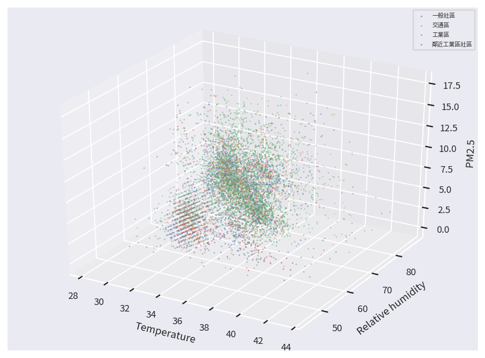
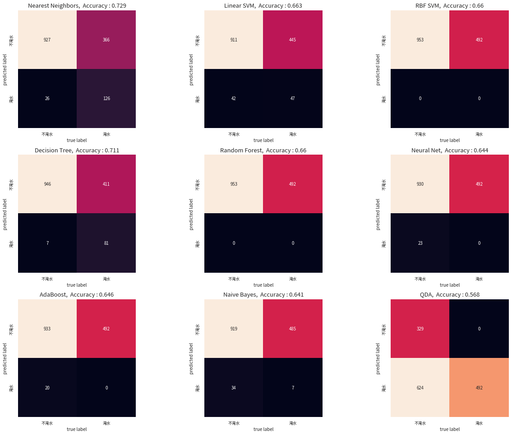

[](https://colab.research.google.com/drive/14xfpf7Nv_1uadSeJh3vC61HL7r4z6KT8?usp=sharing)



## 基本介紹

我們在之前的章節中，已經介紹民生公共物聯網豐富的開放資料內容，同時介紹從時間維度與空間維度的角度出發，進行各種不同的資料分析與處理，在這個章節中，我們將進一步初探機器學習的應用，介紹兩個經典的機器學習問題，分別是分類問題 (Classification) 與分群問題 (Clustering)。

### 分類問題 (Classification)

分類問題是機器學習理論中的一個經典問題，若用比較數學的方式來描述這個問題，我們可以假設有一組已經分類好的數據 `X`，以及每一筆資料在分類之後所得到的標籤集合 `Y`，而分類問題就是希望能透過這組分類好的數據與標籤，建構一個有效的分類器 (Classifier)，可以將尚未分類的數據 `X’`，並找到其中每一筆資料相對應的標籤 `Y’`。

因此，分類問題的重點，就是要構造一個有效的分類器 (Classifier)，為了達到這個目的，我們會先建立一個模型，利用已經標籤好 (labeled) 的數據進行訓練，並且讓這個模型盡可能地貼近與適應 (fit) 這些數據分佈狀態，完成訓練後，我們再利用此模型作為分類器，用來推測未知數據的標籤。

這個建立分類器的過程，在機器學習中被稱為監督式學習 (supervised learning)，而常見的分類器模型有 *[Nearest Neighbors](https://en.wikipedia.org/wiki/K-nearest_neighbors_algorithm)*、*[SVM Classifier](https://en.wikipedia.org/wiki/Support-vector_machine)*、*[Decision Tree](https://en.wikipedia.org/wiki/Decision_tree)*、*[Random Forest](https://en.wikipedia.org/wiki/Random_forest) *****等，在我們稍後的文章中，我們並不會針對每一種模型進行深入的講解，只會把這些模型直接拿來當作工具使用，對於這些模型有興趣的讀者，可以參考相關資源，自行再做更深入的探究。

### 分群問題 (Clustering)

分群問題和分類問題非常相似，主要差異在於分類問題是用已知的標籤數據資料推論未知的數據資料，而分群問題則是完全「無中生有」，在沒有事先標籤的情況下，根據數據的特徵自動將它們歸類出不同的群組。

若以比較數學的方式來描述這個問題，我們可以假設有一組完全沒有標記的數據 `X`，而分類問題就是希望能透過某種演算法，將 `X` 的資料區分為 `k` 個群組，其中每一個群組內的資料彼此相似度大，而不同群組的資料彼此相異度大。

因此，分群問題的演算法主要就是根據數據的特性，不斷地判斷資料間的相似與相異度，並且讓相似的資料群聚在一起，讓相異的資料在分佈中彼此互斥，而常見的分群演算法有 [K-Means](https://en.wikipedia.org/wiki/K-means_clustering)、[DBSCAN](https://en.wikipedia.org/wiki/DBSCAN)、[Hierarchical Clustering](https://en.wikipedia.org/wiki/Hierarchical_clustering)、[BIRCH](https://en.wikipedia.org/wiki/BIRCH) ******等，我們一樣不會針對每一種演算法進行深入的講解，只會把這些演算直接拿來當工具使用，對於這些模型有興趣的讀者，可以參考相關資源，自行再做更深入的探究。

## 套件安裝與引用

在本章節中，我們除了使用 pyCIOT 套件獲取相關的民生公共物聯網開放資料外，將會使用到 pandas, numpy, matplotlib, json, os, glob, math, seaborn, warnings, tqdm, datetime,  geopy, scipy 等套件，這些套件由於在我們使用的開發平台 Colab 上皆已預先安裝好，因此不需要再另行安裝。然而，我們還會另外使用兩個 Colab 上並未預先安裝好的套件：fastdtw 和 sklearn，以及為了讓輸出的圖形美觀而使用 TaipeiSansTCBeta-Regular 字型，需使用下列的方式進行安裝：

```python
# 安裝 fastdtw 套件，用於快速動態時間扭曲。
!pip3 install fastdtw --quiet
# 安裝 scikit-learn 套件，用於機器學習。
!pip3 install scikit-learn --quiet
# 安裝 pyCIOT 套件。
!pip3 install pyCIOT --quiet
# 從 Google Drive 下載 TaipeiSansTCBeta-Regular.ttf 字型檔案。
!wget -q -O TaipeiSansTCBeta-Regular.ttf https://drive.google.com/uc?id=1eGAsTN1HBpJAkeVM57_C7ccp7hbgSz3_&export=download
```

待安裝完畢後，即可使用下列的語法先行引入相關的套件模組，完成本章節的準備工作：

```python
# 引入 pyCIOT 模組中的 data 模組。
from pyCIOT.data import *
# 引入常用的模組。
import json, os, glob, math
import numpy as np
import pandas as pd
import matplotlib as mpl
import matplotlib.pyplot as plt
# 引入字型管理相關模組，用於設定圖表字型。
from matplotlib.font_manager import fontManager
from tqdm import tqdm_notebook as tqdm
# 引入日期時間相關模組。
from datetime import datetime, timedelta

# 引入 seaborn 資料視覺化套件，並設定字型大小。
import seaborn as sns
sns.set(font_scale=0.8)
# 新增字型，並設定 matplotlib 的預設字型。
fontManager.addfont('TaipeiSansTCBeta-Regular.ttf')
mpl.rc('font', family='Taipei Sans TC Beta')

# 隱藏警告訊息。
import warnings
warnings.simplefilter(action='ignore')

# 引入距離計算模組及 fastdtw 套件。
import geopy.distance
from scipy.spatial.distance import euclidean
from fastdtw import fastdtw

# 引入 scikit-learn 相關模組，用於機器學習。
import sklearn
from sklearn.metrics import accuracy_score, confusion_matrix
from sklearn.neural_network import MLPClassifier
from sklearn.neighbors import KNeighborsClassifier
from sklearn.svm import SVC
from sklearn.gaussian_process.kernels import RBF
from sklearn.tree import DecisionTreeClassifier
from sklearn.ensemble import RandomForestClassifier, AdaBoostClassifier
from sklearn.naive_bayes import GaussianNB
from sklearn.discriminant_analysis import QuadraticDiscriminantAnalysis
from sklearn.cluster import KMeans

```

安裝與引入所需模組完畢後，我們接下來依照民生公共物聯網的空氣品質資料與水資源資料兩個案例解析，介紹資料分類與分群。

## 案例一：空品資料的場所型態分類

在這個案例中，我們使用民生公共物聯網資料平台中，環保署智慧城鄉空品微型感測器 (‘`OBS:EPA_IoT`’) 的資料，進行資料分類的示範。

我們首先使用 pyCIOT 所提供的 `Air().get_data()` 方法，下載取得所有環保署智慧城鄉空品微型感測器的最近一筆感測資料。注意，由於內容數量龐大，因此這個步驟可能需要等待較長的時間。

```python
# 定義資料來源為環保署智慧城鄉空品微型感測器 (OBS:EPA_IoT)。
Source = 'OBS:EPA_IoT'
# 從 Air() 中獲取資料。
Data = Air().get_data(src=Source)
# 過濾 Data 資料，只保留 data 長度為 3 且 properties 中有 'areaType' 的資料點。。
Data = [datapoint for datapoint in Data if len(datapoint['data']) == 3 and 'areaType' in datapoint['properties'].keys()]
# 輸出過濾後的第一筆資料，以 JSON 格式顯示，且縮排為 4。
print(json.dumps(Data[0], indent=4, ensure_ascii=False))
```

```
{
    "name": "智慧城鄉空品微型感測器-10287974676",
    "description": "智慧城鄉空品微型感測器-10287974676",
    "properties": {
        "city": "新北市",
        "areaType": "社區",
        "isMobile": "false",
        "township": "鶯歌區",
        "authority": "行政院環境保護署",
        "isDisplay": "true",
        "isOutdoor": "true",
        "stationID": "10287974676",
        "locationId": "TW040203A0507221",
        "Description": "廣域SAQ-210",
        "areaDescription": "鶯歌區"
    },
    "data": [
        {
            "name": "Relative humidity",
            "description": "相對溼度",
            "timestamp": "2022-08-05T06:51:29.000Z",
            "value": 70.77
        },
        {
            "name": "Temperature",
            "description": "溫度",
            "timestamp": "2022-08-05T06:51:29.000Z",
            "value": 33.78
        },
        {
            "name": "PM2.5",
            "description": "細懸浮微粒 PM2.5",
            "timestamp": "2022-08-05T06:51:29.000Z",
            "value": 9.09
        }
    ],
    "location": {
        "latitude": 24.9507,
        "longitude": 121.3408416,
        "address": null
    }
}
```

我們可以發現每一個感測器的資料中，都同時有溫度、相對濕度、細懸浮微粒濃度等感測資料，同時也記載了感測器的基本資訊，例如所在城市、所在鄉鎮、機器編號、位置編號、場所型態等。在我們這個範例中，我們將以「場所型態」為標籤資料，並搭配感測資料（溫度、相對濕度、細懸浮微粒濃度）進行分類器的訓練。我們首先觀察目前「場所型態」的內容狀態。

```python
# 從 Data 資料集中取得所有不重複的 'areaType' 標籤。
Label = list(dict.fromkeys([datapoint['properties']['areaType'] for datapoint in Data if datapoint['properties']['areaType']]))
# 初始化一個計數器，用於計算每個 'areaType' 的出現次數。
count = dict.fromkeys(Label, 0)
# 迴圈遍歷 Data 資料集，計算每個 'areaType' 的出現次數。
for datapoint in Data:
    count[datapoint['properties']['areaType']] += 1
# 輸出資料清理前的記錄總數。
print("Before data cleaning, There are {} records.".format(len(Data)))
# 以 JSON 格式輸出每個 'areaType' 的計數結果，且縮排為 4。
print(json.dumps(count, indent=4, ensure_ascii=False))
```

```
Before data cleaning, There are 8620 records.
{
    "社區": 223,
    "交通": 190,
    "一般社區": 2021,
    "工業": 12,
    "測站比對": 66,
    "工業區": 3333,
    "交通區": 683,
    "鄰近工業區社區": 948,
    "輔助區": 165,
    "特殊區(民眾陳情熱區)": 143,
    "特殊區(敏感族群聚集區)": 200,
    "特殊區(測站比對)": 32,
    "輔助區(無測站區)": 4,
    "工業感測": 196,
    "特殊感測": 4,
    "輔助感測": 295,
    "交通感測": 102,
    "機動感測": 2,
    "社區感測": 1
}
```

### 資料清理

由於目前資料中共有 8620 筆資料散佈在 19 種場所型態中，為了符合資料的意義，我們首先將類似的場所型態進行合併，同時也為了讓分類器的示範能更順利，我們只專注在一般社區、交通區、工業區、鄰近工業區社區等四大場所型態。因此，我們用下列的程式進行資料的重新整理：

```python
# 迴圈遍歷 Data 資料集，對 'areaType' 進行資料清理和重新命名。
for datapoint in Data:
    if datapoint['properties']['areaType'] == '社區':
        datapoint['properties']['areaType'] = '一般社區'
    elif datapoint['properties']['areaType'] == '社區感測':
        datapoint['properties']['areaType'] = '一般社區'
    elif datapoint['properties']['areaType'] == '交通':
        datapoint['properties']['areaType'] = '交通區'
    elif datapoint['properties']['areaType'] == '交通感測':
        datapoint['properties']['areaType'] = '交通區'
    elif datapoint['properties']['areaType'] == '工業':
        datapoint['properties']['areaType'] = '工業區'
    elif datapoint['properties']['areaType'] == '工業感測':
        datapoint['properties']['areaType'] = '工業區'
    # 若 'areaType' 不在指定的四種類別中，則設為 None。
    if not datapoint['properties']['areaType'] in ['一般社區', '交通區', '工業區', '鄰近工業區社區']:
        datapoint['properties']['areaType'] = None
# 過濾資料，去除 'areaType' 為 None 的資料點。
Data = [datapoint for datapoint in Data if datapoint['properties']['areaType'] != None]
# 定義我們希望計數的標籤。
Label = ['一般社區', '交通區', '工業區', '鄰近工業區社區']
# 初始化一個計數器，用於計算每個 'areaType' 的出現次數。
count = dict.fromkeys(Label, 0)
# 迴圈遍歷 Data 資料集，計算每個 'areaType' 的出現次數。
for datapoint in Data:
    count[datapoint['properties']['areaType']] += 1
# 輸出資料清理後的記錄數量。
print("After data cleaning, There are {} records.".format(len(Data)))
# 以 JSON 格式顯示每個 'areaType' 的計數結果，且縮排為 4。
print(json.dumps(count, indent=4, ensure_ascii=False))
```

```
After data cleaning, There are 7709 records.
{
    "一般社區": 2245,
    "交通區": 975,
    "工業區": 3541,
    "鄰近工業區社區": 948
}
```

經過資料清理後，總共剩下 7709 筆資料，並且散佈在四大類的場所型態中。針對這些資料，我們接著考慮每筆資料的溫度、相對濕度、細懸浮微粒濃度感測值，並用不同的顏色代表不同場所型態的資料，繪製成一張三維的資料分佈圖。

```python
# 初始化存放資料的列表。
DataX, DataY = [], []
# 迴圈遍歷 Data 資料集，從每一個資料點中提取特徵和標籤。
for datapoint in Data:
    TmpX = [None]*3  # 初始化暫存特徵列表。
    TmpY = None  # 初始化暫存標籤值。
    for rawdata_array in datapoint['data']:
        # 提取資料點名稱為 'Temperature' 的值。
        if(rawdata_array['name'] == 'Temperature'):
            TmpX[0] = rawdata_array['values'][0].get('value')
        # 提取資料點名稱為 'Relative humidity' 的值。
        if(rawdata_array['name'] == 'Relative humidity'):
            TmpX[1] = rawdata_array['values'][0].get('value')
        # 提取資料點名稱為 'PM2.5' 的值。
        if(rawdata_array['name'] == 'PM2.5'):
            TmpX[2] = rawdata_array['values'][0].get('value')
    # 將 'areaType' 轉換為整數索引。
    TmpY = Label.index(datapoint['properties']['areaType'])
    # 將暫存的特徵和標籤加入至 DataX 和 DataY 列表。
    DataX.append(TmpX)
    DataY.append(TmpY)

# 將 DataX 和 DataY 列表資料轉換為 Numpy 陣列。
DataX_Numpy = np.array(DataX)
DataY_Numpy = np.array(DataY)
# 設定圖例字體大小。
plt.rc('legend',fontsize="xx-small")
# 創建一個 8x6 大小，150 dpi 的圖形。
fig = plt.figure(figsize=(8, 6), dpi=150)
ax = fig.add_subplot(projection='3d')
# 迴圈遍歷每一種標籤，並在 3D 空間中繪製對應的資料點。
for i in range(len(Label)):
    ax.scatter(DataX_Numpy[DataY_Numpy==i][:,0],DataX_Numpy[DataY_Numpy==i][:,1],DataX_Numpy[DataY_Numpy==i][:,2], s=0.1, label=Label[i])
# 顯示圖例。
ax.legend() 
# 設定 X 軸標籤為 Temperatur， y 軸標籤為 Relative humidity， z 軸標籤為 PM2.5。
ax.set_xlabel('Temperature')
ax.set_ylabel('Relative humidity')
ax.set_zlabel('PM2.5')
# 顯示圖形。
plt.show()
```


從資料分布圖中，我們可以發現絕大多數的資料都群聚在某一個特定的空間內，但仍有少數的資料零散地分布在很外圍的地方，這些遠離群體的資料我們稱為離群值 (Outlier)，對於資料分類或資料分群而言，離群值很容易導致我們的模型或演算法走向極端化，因而失去其通用性，因此我們需要先將這些資料予以移除。

### 移除離群值

移除離群值的方法，不外乎運用一些資料的統計特徵，可以依據不同的應用情境需求自行定義。在我們的範例中，我們定義如果一筆資料在其中一種感測資料的數值，距離平均值超過兩個標準差以上，該筆資料便歸類為離群值。我們將這些離群值的資料移除後，照例繪製一張三維空間的分佈圖觀察其分布狀況。

```python
def Outlier_Filter(arr, k):
    Boolean_Arr =  np.ones(arr.shape[0], dtype=bool)
    for i in range(arr.shape[1]):
        Boolean_Arr = Boolean_Arr & (abs(arr[:,i] - np.mean(arr[:,i])) <  k*np.std(arr[:,i]))
    return Boolean_Arr

OutlierFilter = Outlier_Filter(DataX_Numpy, 2)
DataX_Numpy = DataX_Numpy[OutlierFilter]
DataY_Numpy = DataY_Numpy[OutlierFilter]
print("After removing Outliers, there are {} records left.".format(DataX_Numpy.shape[0]))
plt.rc('legend',fontsize="xx-small")
fig = plt.figure(figsize=(8, 6), dpi=150)
ax = fig.add_subplot(projection='3d')
for i in range(len(Label)):
    ax.scatter(DataX_Numpy[DataY_Numpy==i][:,0],DataX_Numpy[DataY_Numpy==i][:,1],DataX_Numpy[DataY_Numpy==i][:,2], s=0.1, label=Label[i])
ax.legend()
ax.set_xlabel('Temperature')
ax.set_ylabel('Relative humidity')
ax.set_zlabel('PM2.5')
plt.show()
```

```
After removing Outliers, there are 7161 records left.
```



從最後呈現的結果中，我們共移除了 7709 - 7161 = 548 筆離群值資料，而最後留下的資料在三維空間的分佈也較為集中，不再有偏移在外圍的狀況發生。為了更容易觀察，我們以每次挑選兩個維度的方式，分別繪製三張資料在不同維度間的分佈狀況。

```python
plt.rc('legend',fontsize="large")
fig, axes = plt.subplots(1,3,figsize=(24, 6))
for i in range(DataX_Numpy.shape[1]):
    for j in range(len(Label)):
        axes[i].scatter(DataX_Numpy[DataY_Numpy==j][:,i%3],DataX_Numpy[DataY_Numpy==j][:,(i+1)%3], s=1, label=Label[j])
        axes[i].legend(loc=2)
        Axis_label = ['Temperature', 'Relative humidity', 'PM2.5']
        axes[i].set_xlabel(Axis_label[i%3])
        axes[i].set_ylabel(Axis_label[(i+1)%3])
plt.tight_layout()
```


從這三張圖中，我們已可發現不同顏色（場所型態）的資料隱約中似乎存在某種關係，雖然用肉眼很難直接敘明，但接下來我們將帶入分類模型來建構專屬的分類器。

### 區別訓練資料與測試資料

在進入分類器的模型訓練前，我們還有一個步驟需要處理，那就是拆分數據，將現有的資料集分為訓練資料和測試資料。顧名思義，訓練資料將被用於調校分類器的模型，而測試資料則是用來測試所建構出來的分類器，在處理新資料時的效果。我們使用下列的範例程式，將資料集按照 4:1 的比例，切割成訓練資料與測試資料。

```python
indices = np.random.permutation(DataX_Numpy.shape[0])
Train_idx, Test_idx = indices[:int(DataX_Numpy.shape[0]*0.8)], indices[80:(DataX_Numpy.shape[0] - int(DataX_Numpy.shape[0]*0.8))]
TrainX, TestX = DataX_Numpy[Train_idx,:], DataX_Numpy[Test_idx,:]
TrainY, TestY = DataY_Numpy[Train_idx], DataY_Numpy[Test_idx]
```

### 使用 Sklearn 預建模型

我們直接使用 Scikit learn (sklearn) 這個 Python 套件所提供的分類器模型來進行訓練與測試，在系列的程式範例中，我們總共使用 Nearest neighbors, Linear SVM, RBF SVM, Decision Tree, Random Forest, Neural Net, Adaboost, Naive Bayes, QDA 共計九種模型，我們依次帶入訓練資料進行調校後，接著帶入測試資料進行預測，並且將測試資料與預測結果中的標籤內容進行比對，並用混淆矩陣 (confusion matrix) 的方式，呈現不同標籤組合的分類結果。

```python
classifier_names = [
    "Nearest Neighbors",
    "Linear SVM",
    "RBF SVM",
    "Decision Tree",
    "Random Forest",
    "Neural Net",
    "AdaBoost",
    "Naive Bayes",
    "QDA",
]

classifiers = [
    KNeighborsClassifier(3),
    SVC(kernel="linear", C=0.025),
    SVC(gamma=2, C=1),
    DecisionTreeClassifier(max_depth=5),
    RandomForestClassifier(max_depth=5, n_estimators=10, max_features=1),
    MLPClassifier(alpha=1, max_iter=1000),
    AdaBoostClassifier(),
    GaussianNB(),
    QuadraticDiscriminantAnalysis(),
]

fig, axes = plt.subplots(3,3,figsize=(18, 13.5))
for i, model in enumerate(classifiers):
    model.fit(TrainX, TrainY)
    Result = model.predict(TestX)
    mat = confusion_matrix(TestY, Result)
    sns.heatmap(mat.T, square=True, annot=True, fmt='d', cbar=False,
                xticklabels=Label, yticklabels=Label, ax = axes[i//3][i%3])
    axes[i//3][i%3].set_title("{},  Accuracy : {}".format(classifier_names[i], round(accuracy_score(Result, TestY), 3)), fontweight="bold", size=13)
    axes[i//3][i%3].set_xlabel('true label', fontsize = 10.0)
    axes[i//3][i%3].set_ylabel('predicted label', fontsize = 10.0)
plt.tight_layout()
```


在這九種分類模型的分類結果中，我們發現 RBF SVM 可以達到將近 7成的分類成功率，事實上，這只是我們使用原始資料尚未進行更進一步處理分析的結果，讀者們若對於分類器有興趣，可以參考相關資源，進行更深入的探究，將能更加提升分類器對不同種類資料的分類能力。

## 案例二：空品資料的分群

在這個案例中，我們使用民生公共物聯網開放資料中的環保署國家空品測站的感測資料，並且透過歷史資料的分析，利用資料分群的方式，將這些空品測站依照感測資料的變化趨勢關係予以分群，讓每一群的測站具有類似的感測資料變化趨勢。

### 資料下載與前處理

我們使用下列的程式碼，從民生公共物聯網開放資料平台的[歷史資料庫](https://history.colife.org.tw/)中下載 2021 年環保署國家空品測站的所有感測資料，並將下載回來的壓縮檔解開後，置於 `/content` 的目錄下。

```python
!wget -O 'EPA_OD_2021.zip' -q "https://history.colife.org.tw/?r=/download&path=L%2Bepuuawo%2BWTgeizqi%2FnkrDkv53nvbJf5ZyL5a6256m65ZOB5ris56uZL0VQQV9PRF8yMDIxLnppcA%3D%3D"
!unzip -q 'EPA_OD_2021.zip' && rm 'EPA_OD_2021.zip' 
!unzip -q '/content/EPA_OD_2021/EPA_OD_202112.zip' -d '/content'
!rm -rf '/content/EPA_OD_2021'
```

我們先選用 2021 年 12月的資料，先把不需要的欄位 `Pollutant`、`SiteId`、`Status`、`SO2_AVG` 刪除，並且將感測資料的數值資料型態改為浮點數，以利後續的處理。

```python
Dataframe = pd.read_csv("/content/EPA_OD_202112.csv", parse_dates=['PublishTime'])
Dataframe = Dataframe.drop(columns=["Pollutant", "SiteId", "Status", "SO2_AVG"])
Numerical_ColumnNames = list(Dataframe.columns.values)
for ColumnName in ['SiteName', 'County', 'PublishTime']:
    Numerical_ColumnNames.remove(ColumnName)
for Numerical_ColumnName in Numerical_ColumnNames:
    Dataframe[Numerical_ColumnName] = pd.to_numeric(Dataframe[Numerical_ColumnName], errors='coerce').astype('float64')
Dataframe = Dataframe.dropna()
Dataframe.head()
```


由於一個月的資料量十分龐大，為了精簡範例程式的執行時間，我們抽取其中 2021-12-13 至 2021-12-17 共計五天的資料 (`FiveDay_Dataframe`) 作為接下來的範例，並且把 `Country` 與 `SiteName` 兩個欄位合併，同時根據合併後的欄位和資料發佈時間進行排序。

```python
FiveDay_Dataframe = Dataframe.loc[(Dataframe['PublishTime'] <= '2021-12-17 23:00:00') & (Dataframe['PublishTime'] >= '2021-12-13 00:00:00')]
FiveDay_Dataframe['CountyAndSiteName'] = FiveDay_Dataframe['County'] + FiveDay_Dataframe['SiteName']
FiveDay_Dataframe = FiveDay_Dataframe.drop(columns=["County", "SiteName"])
FiveDay_Dataframe = FiveDay_Dataframe.sort_values(by=['CountyAndSiteName','PublishTime'])
FiveDay_Dataframe = FiveDay_Dataframe.set_index(keys = ['CountyAndSiteName'])
FiveDay_Dataframe
```


### 動態時間校正 (Dynamic Time Warping, DTW)

接下來，我們必須判斷兩個測站之間的「相似度」，並且將其量化成一個數字。最基本的相似度量測方式，是直接將兩測站的資料，按照感測時間對齊後，計算兩兩之間空氣汙染物質感測數據的差距；但是，若考量測站資料具備時間序列的特性，空氣污染在各個測站間可能發生的順序不一，影響的時間長度亦不一定相同，需要更有彈性的推估兩個測站之間的相似度，因此我們先扣除掉資料中的風向、感測時間、經緯度等資訊後，選用動態時間校正 (DTW) 方法進行相似度量測，若兩個測站資料的 DTW 距離越小，代表兩者的相似度越高。

```python
Site_TimeSeriesData = dict()
for Site in np.unique(FiveDay_Dataframe.index.values):
    tmp = FiveDay_Dataframe[FiveDay_Dataframe.index == Site]
    tmp = tmp.groupby(['CountyAndSiteName', 'PublishTime'], as_index=False).mean()
    tmp = tmp.loc[:,~tmp.columns.isin(['CountyAndSiteName', 'PublishTime'])]
    Site_TimeSeriesData[Site] = tmp.to_numpy()

DictKeys = Site_TimeSeriesData.keys()
Sites_DTW = dict()
for i, key1 in enumerate(DictKeys):
    for j, key2 in enumerate(DictKeys):
        if i >= j: 
            continue
        else:
						# 計算扣除風向、感測時間、經度、緯度後資料的 DTW 距離
            Sites_DTW[str(key1)+" "+str(key2)] = fastdtw(Site_TimeSeriesData[key1][:,:-4], Site_TimeSeriesData[key2][:,:-4], dist=euclidean)[0]
Sites_DTW_keys = np.array(list(Sites_DTW.keys()))
Site_DTW_Numpy = np.array([[value] for _, value in Sites_DTW.items()])
```

我們將所有測站兩兩間的 DTW 距離畫在數線上，可以得到下方的圖形；其中 DTW 距離從小到大皆有，若要進一步處理，便需要開始使用分群演算法來分析。

```python
fig = plt.figure(figsize=(4, 3), dpi=150)
ax = fig.add_subplot(1,1,1)
ax.scatter(Site_DTW_Numpy[:,0], [1]*len(Sites_DTW.items()), s=0.05)
ax.get_yaxis().set_visible(False)
```


### 使用 K-Mean 分群演算法

我們使用 sklearn 套件中的 K-Means 模組來進行資料分群，由於分群演算法需事先設定最後要產生的群組數目，我們先設定為 3。我們使用下列的程式碼進行分群，並將結果依照資料所歸屬的群組組別 (Y 軸) 以及與其他資料的 DTW 相似度值 (X 軸) 繪製出來。

```python
from sklearn.cluster import KMeans

model = KMeans(n_clusters=3, random_state=0).fit([[value] for _, value in Sites_DTW.items()])
Result = model.labels_
for i in np.unique(Result):
    print("Number of Cluster{} : {}".format(i,len(Result[Result==i])))

# 將結果繪圖呈現
fig = plt.figure(figsize=(4, 3), dpi=150)
ax = fig.add_subplot(1,1,1)
for i in np.unique(Result):
    ax.scatter(Site_DTW_Numpy[Result==i][:,0],[i]*len(Site_DTW_Numpy[Result==i]), s=0.05)
ax.get_yaxis().set_visible(False)
```

```
Number of Cluster0 : 1165
Number of Cluster1 : 994
Number of Cluster2 : 542
```


從分群結果中，我們可以看到 K-Means 演算法將原始資料分為三個群組，分別有 1165、994、542 筆資料，為了更進一步了解這三個群組的成因，我們繼續追查每個群組形成的可能原因。

### 探究資料分群與地理位置的關係

我們首先假設空氣品質的變化具有地域性，因此探究資料分群的結果，是否和空品測站的地理位置有關。我們首先擷取測站的 GPS 經緯度座標，並換算出兩倆地理位置的實體距離，接著按照資料分群的結果，把不同群組的實體距離進行簡單的統計分析，並繪製在下方圖片中。

```python
Dist_for_Clusters = [None]*len(np.unique(Result))
for i in np.unique(Result):
    Dist_for_Cluster = []
    Cluster = Sites_DTW_keys[Result==i]
    for Sites in Cluster:
        Site1, Site2 = Sites.split(' ')
        # 獲取兩個測站的經緯度座標
        coord1 = Site_TimeSeriesData[Site1][0,-1], Site_TimeSeriesData[Site1][0,-2]
        coord2 = Site_TimeSeriesData[Site2][0,-1], Site_TimeSeriesData[Site2][0,-2]
        # 計算兩個測站的實體位置距離
        Dist_for_Cluster.append(geopy.distance.geodesic(coord1, coord2).km)
    Dist_for_Cluster = np.array(Dist_for_Cluster)
    Dist_for_Clusters[i] = Dist_for_Cluster
Dist_for_Clusters = np.array(Dist_for_Clusters)
# for Dist_for_Cluster in Dist_for_Clusters:
#     print(np.mean(Dist_for_Cluster))

fig = plt.figure(figsize=(4, 3), dpi=150)
ax = fig.add_subplot(1,1,1)
for i in np.unique(Result):
    gtMean = Dist_for_Clusters[i][Dist_for_Clusters[i]>np.mean(Dist_for_Clusters[i])]
    ltMean = Dist_for_Clusters[i][Dist_for_Clusters[i]<np.mean(Dist_for_Clusters[i])]
    print("Mean Distance between Sites for Cluster{} : {}".format(i, np.mean(Dist_for_Clusters[i])))
    print("In Cluster{} there are {:.2%} less than mean, and {:.2%} greater than mean.\n".format(i, len(ltMean)/len(Dist_for_Clusters[i]), len(gtMean)/len(Dist_for_Clusters[i])))
    ax.scatter(gtMean, [i]*len(gtMean), s=0.05, color="orange")
    ax.scatter(ltMean, [i]*len(ltMean), s=0.05, color="pink")
    ax.axvline(np.mean(Dist_for_Clusters[i]), ymin = 0.45*i, ymax = 0.45*i+0.1, color = "red", linewidth=0.5)
ax.get_yaxis().set_visible(False)
```

```
Mean Distance between Sites for Cluster0 : 84.34126465234523
In Cluster0 there are 60.09% less than mean, and 39.91% greater than mean.

Mean Distance between Sites for Cluster1 : 180.26230465399215
In Cluster1 there are 54.53% less than mean, and 45.47% greater than mean.

Mean Distance between Sites for Cluster2 : 234.89206124762546
In Cluster2 there are 39.48% less than mean, and 60.52% greater than mean.
```


從分析的結果中，我們可以發現對於 DTW 數值較高（時間序列相似度較低）的群組，其測站間的距離平均值亦較高，反之則距離平均值較低，由此可知測站資料的相似度確實與地理位置的差異有關，也應證了我們的假設，確認了空氣污染物的擴散確實會受到地理位置距離的影響。

### 探究資料分群與風場風向的關係

我們接著假設空氣品質的變化受到環境風場的影響，因此探究資料分群的結果，是否和空品測站所在地的風向有關。我們首先擷取測站的 GPS 經緯度座標，並換算出兩倆地理位置的方位角關係，接著按照資料分群的結果，根據地理位置方位角與現場風向計算兩者的相關性，並將所獲得的數值進行簡單的統計分析，再繪製於下圖。

```python
def get_bearing(lat1, long1, lat2, long2):
    dLon = (long2 - long1)
    x = math.cos(math.radians(lat2)) * math.sin(math.radians(dLon))
    y = math.cos(math.radians(lat1)) * math.sin(math.radians(lat2)) - math.sin(math.radians(lat1)) * math.cos(math.radians(lat2)) * math.cos(math.radians(dLon))
    brng = np.arctan2(x,y)
    brng = np.degrees(brng)
    return brng

def Check_Wind_Dirc(brng, wind_dirc):
    if brng > 180:
        return ((brng < wind_dirc + 45) and (brng > wind_dirc - 45)) or ((brng - 180 < wind_dirc + 45) and (brng - 180 > wind_dirc - 45))
    else:
        return ((brng < wind_dirc + 45) and (brng > wind_dirc - 45)) or ((brng + 180 < wind_dirc + 45) and (brng + 180 > wind_dirc - 45))

Brng_for_Clusters = [None]*len(np.unique(Result))
Boolean_WindRelated_for_Clusters = [None]*len(np.unique(Result))
for i in np.unique(Result):
    Brng_for_Cluster = []
    Boolean_WindRelated_for_Cluster = []
    Cluster = Sites_DTW_keys[Result==i]
    for Sites in Cluster:
        Site1, Site2 = Sites.split(' ')
        coord1 = Site_TimeSeriesData[Site1][0,-1], Site_TimeSeriesData[Site1][0,-2]
        coord2 = Site_TimeSeriesData[Site2][0,-1], Site_TimeSeriesData[Site2][0,-2]
        Brng_Between_Site = get_bearing(coord1[0], coord1[1], coord2[0], coord2[1])
        Brng_for_Cluster.append(Brng_Between_Site)
        MeanWindDirc1 = np.mean(Site_TimeSeriesData[Site1][:,-3])
        MeanWindDirc2 = np.mean(Site_TimeSeriesData[Site2][:,-3])
        Boolean_WindRelated_for_Cluster.append(Check_Wind_Dirc(Brng_Between_Site, MeanWindDirc1) or Check_Wind_Dirc(Brng_Between_Site, MeanWindDirc2))
    Brng_for_Cluster = np.array(Brng_for_Cluster)
    Boolean_WindRelated_for_Cluster = np.array(Boolean_WindRelated_for_Cluster)
    Boolean_WindRelated_for_Clusters[i] = Boolean_WindRelated_for_Cluster
    Brng_for_Clusters[i] = Brng_for_Cluster
Brng_for_Clusters = np.array(Brng_for_Clusters)
Boolean_WindRelated_for_Clusters = np.array(Boolean_WindRelated_for_Clusters)

fig = plt.figure(figsize=(4, 3), dpi=150)
ax = fig.add_subplot(1,1,1)
for i in np.unique(Result):
    print("Relevance for Cluster{} : {:.2%}".format(i, len(Dist_for_Clusters[i][Boolean_WindRelated_for_Clusters[i] == True])/len(Dist_for_Clusters[i])))
    ax.scatter(Dist_for_Clusters[i][Boolean_WindRelated_for_Clusters[i] == True],\
               [i]*len(Dist_for_Clusters[i][Boolean_WindRelated_for_Clusters[i] == True]), s=2, color="green")
    ax.scatter(Dist_for_Clusters[i][Boolean_WindRelated_for_Clusters[i] == False],\
               [i]*len(Dist_for_Clusters[i][Boolean_WindRelated_for_Clusters[i] == False]), s=0.05, color="violet")
    ax.axvline(np.mean(Dist_for_Clusters[i]), ymin = 0.45*i, ymax = 0.45*i+0.1, color = "red", linewidth=2)
ax.get_yaxis().set_visible(False)
```

```
Relevance for Cluster0 : 54.08%
Relevance for Cluster1 : 39.24%
Relevance for Cluster2 : 22.69%
```


從分析的結果中，我們可以發現對於 DTW 數值較低 （時間序列相似度較高）的群組，其測站間方位角與風向的相關性較高，反之則相關性較低，由此可知測站資料的相似度確實與環境風場風向有關，也印證了我們的假設，確認空氣污染物的擴散確實會受到環境風場風向的影響。

## 案例三：結合氣象與水資源資料的分類與分群

在這個案例中，我們結合資料分群與資料分類同時進行演練。我們使用民生公共物聯網開放資料中的中央氣象局雨量站和水利署（與縣市政府合建）淹水感測器的感測資料，並且透過歷史資料的分析，利用資料分群的方式，尋找和降雨變化最為相關的河川水位站群組，並且利用資料分類的方式，在僅有雨量資料的狀況時，得以進行特定地區是否造成淹水的預測。

### 資料下載與前處理

我們使用下列的程式碼，從民生公共物聯網開放資料平台的[歷史資料庫](https://history.colife.org.tw/)中下載 2021 年中央氣象局雨量站和水利署（與縣市政府合建）淹水感測器的所有感測資料，並將下載回來的壓縮檔解開後，置於 `/content` 的目錄下。

```python
# 下載中央氣象局雨量站歷史資料
!wget -O 'Rain_2021.zip' -q "https://history.colife.org.tw/?r=/download&path=L%2Bawo%2BixoS%2FkuK3lpK7msKPosaHlsYBf6Zuo6YeP56uZLzIwMjEuemlw"
!wget -O 'Rain_Stataion.csv' -q "https://history.colife.org.tw/?r=/download&path=L%2Bawo%2BixoS%2FkuK3lpK7msKPosaHlsYBf6Zuo6YeP56uZL3JhaW5fc3RhdGlvbi5jc3Y%3D"
!unzip -q 'Rain_2021.zip' && rm 'Rain_2021.zip' 
!find '/content/2021' -name '*.zip'  -exec unzip -q {} -d '/content/Rain_2021_csv' \;
!rm -rf '/content/2021'

# 下載水利署（與縣市政府合建）淹水感測器資料
!wget -O 'Flood_2021.zip' -q "https://history.colife.org.tw/?r=/download&path=L%2BawtOizh%2Ba6kC%2FmsLTliKnnvbLvvIjoiIfnuKPluILmlL%2FlupzlkIjlu7rvvIlf5re55rC05oSf5ris5ZmoLzIwMjEuemlw"
!wget -O 'Flood_Stataion.csv' -q "https://history.colife.org.tw/?r=/download&path=L%2BawtOizh%2Ba6kC%2FmsLTliKnnvbLvvIjoiIfnuKPluILmlL%2FlupzlkIjlu7rvvIlf5re55rC05oSf5ris5ZmoL3N0YXRpb25f5rC05Yip572y77yI6IiH57ij5biC5pS%2F5bqc5ZCI5bu677yJX%2Ba3ueawtOaEn%2Ba4rOWZqC5jc3Y%3D"
!unzip -q 'Flood_2021.zip' && rm 'Flood_2021.zip' 
!find '/content/2021' -name '*_QC.zip'  -exec unzip -q {} -d '/content/Flood_2021_csv' \;
!rm -rf '/content/2021'
```

接下來我們先處理降雨量資料，將所下載的 2021 年所有測站的資料逐一讀取，並把接下來不會使用到的 `MIN_10`、`HOUR_6`、`HOUR_12`、`NOW` 欄位刪除，同時移除 11 月以後的資料後，彙整為 `Rain_df` 物件，同時讀入測站資訊成為 `Rain_Station_df` 物件。由於這個步驟所處理的資料量十分龐大，因此會花費較多的時間，請耐心等候。

```python
csv_files = glob.glob(os.path.join("/content/Rain_2021_csv", "*.csv"))
csv_files.sort()
Rain_df = pd.DataFrame()
# 將所有資料逐一讀取，並把接下來不會使用到的 MIN_10、HOUR_6、HOUR_12、NOW 欄位刪除
for csv_file in tqdm(csv_files):
    tmp_df = pd.read_csv(csv_file, parse_dates=['obsTime'])
    tmp_df.drop(['MIN_10','HOUR_6', 'HOUR_12', 'NOW'], axis=1, inplace=True)
    try:
        tmp_df = tmp_df.loc[tmp_df['obsTime'].dt.minute == 00]
        Rain_df =  pd.concat([Rain_df, tmp_df])
    except:
        print(csv_file)
        continue
Rain_df = Rain_df.loc[Rain_df['obsTime'] < "2021-11-01 00:00:00"]
num = Rain_df._get_numeric_data()
num[num < 0] = 0
Rain_df.dropna(inplace=True)
Rain_df.sort_values(by=['station_id','obsTime'], inplace=True)
Rain_Station_df = pd.read_csv('/content/Rain_Stataion.csv')
Rain_df
```


我們接下來處理淹水感測器的資料，將所下載的 2021 年所有測站的資料逐一讀取，並移除 11 月以後的資料，以及含有缺失值的資料後，將資料儲存為 `Flood_df` 物件，同時讀入測站資訊成為 `Flood_Station_df` 物件。這個步驟所處理的資料量一樣十分龐大，因此會花費較多的時間，請務必耐心等候。

```python
csv_files = glob.glob(os.path.join("/content/Flood_2021_csv", "*_QC.csv"))
csv_files.sort()
Flood_df = pd.DataFrame()
# 將所有資料逐一讀取，並彙整成 Flood_df 
for csv_file in tqdm(csv_files):
    tmp_df = pd.read_csv(csv_file, parse_dates=['timestamp'])
    tmp_df = tmp_df.loc[(tmp_df['PQ_unit'] == 'cm')]
    Flood_df = pd.concat([Flood_df,tmp_df], axis=0, ignore_index=True)
Flood_df = Flood_df.loc[Flood_df['timestamp'] < "2021-11-01 00:00:00"]
Flood_df.replace(-999.0,0.0, inplace=True)
Flood_df.dropna(inplace=True)
Flood_df.sort_values(by=['timestamp'], inplace=True)
Flood_Station_df = pd.read_csv('/content/Flood_Stataion.csv')
Flood_df
```


### 計算特定淹水感測器與雨量測站資料的相似度

由於淹水感測器的資料量十分龐大，因此我們先挑選一個位於雲林縣且編號為 `43b2aec1-69b0-437b-b2a2-27c76a3949e8` 的淹水感測器，將其資料取出後存在 `Flood_Site_df` 物件中，作為後續處理的範例。

```python
Flood_Site_df = Flood_df.loc[Flood_df['station_id'] == '43b2aec1-69b0-437b-b2a2-27c76a3949e8']
Flood_Site_df.head()
```


我們接著計算雨量站資料與選定的淹水感測器之間的相似度，我們一樣使用動態時間校正 (Dynamic Time Warping, DTW) 進行量測，由於 DTW 的值越小代表相似度越大，為了能更直觀表達相似度，我們在這個案例中，將相似度定義為 DTW 值的倒數，並且計算這個選定的淹水感測器與所有雨量站資料的相似度。

```python
Flood_Sensor_np = np.array([[v,v,v] for v in Flood_Site_df['value'].to_numpy()])
Site_dtw_Dist = dict()
Rain_tmp_df = Rain_df.loc[(Rain_df['obsTime'].dt.hour == 1)]
for Site in tqdm(np.unique(Rain_Station_df.loc[Rain_Station_df['city']=='臺南市']['station_id'].to_numpy())):
    tmp_df = Rain_tmp_df.loc[(Rain_tmp_df['station_id'] == Site)]
    if tmp_df.empty:
        continue
    tmp_np = tmp_df[['RAIN','HOUR_3','HOUR_24']].to_numpy()
    Site_dtw_Dist[Site] = (1/fastdtw(Flood_Sensor_np, tmp_np, dist=euclidean)[0])
Site_dtw_Dist = dict(sorted(Site_dtw_Dist.items(), key=lambda item: item[1]))
print(json.dumps(Site_dtw_Dist, indent=4, ensure_ascii=False))
```

```
{
    "88K590": 4.580649481044748e-05,
    "C0K560": 4.744655320519647e-05,
    "C0K490": 4.79216996101994e-05,
    "C0K520": 5.038234963332513e-05,
    "C0K420": 5.0674082994877385e-05,
    "C0K250": 5.1021366345465985e-05,
    "C0K280": 5.118406054309105e-05,
    "A0K420": 5.1515699268157996e-05,
    "C0K400": 5.178763059243615e-05,
    "O1J810": 5.2282255279259976e-05,
    "C0K240": 5.2470804312991397e-05,
    "01J960": 5.334885670256585e-05,
    "C0K470": 5.438256498969844e-05,
    "81K580": 5.45854441959214e-05,
    "C0K410": 5.5066753408217084e-05,
    "A2K570": 5.520214274022887e-05,
    "01J970": 5.529887546186233e-05,
    "C0K480": 5.5374254960644355e-05,
    "C0K460": 5.5657892623955056e-05,
    "72K220": 5.5690175197363816e-05,
    "C0K510": 5.5742273217039165e-05,
    "C1K540": 5.618025674136218e-05,
    "C0K550": 5.621240903075098e-05,
    "C0K450": 5.62197509062689e-05,
    "C0K291": 5.6380522616008906e-05,
    "C0K330": 5.638960953991442e-05,
    "C0K530": 5.6525582441919285e-05,
    "C0K500": 5.6825555408648244e-05,
    "C0K440": 5.692254536595e-05,
    "C0K430": 5.697351917955081e-05,
    "01J930": 5.7648109890427854e-05,
    "C0K580": 5.770344946580767e-05,
    "C0K390": 5.782553930260475e-05,
    "01J100": 5.7933240408734325e-05,
    "01K060": 5.8343415644572526e-05
}
```

### 資料分群並探究相關性高的雨量站

如同前面的作法，我們藉由分群演算法來幫我們依照相似度的關係，將雨量計分為三個群組，並且找出其中相似度最高的群組，以及群組中的雨量計代碼。在我們的範例中，我們找到的三個群組各自有 9、23、3 個雨量計，同時第二個群組的時間序列資料與淹水感測器的資料相似度最高。

```python
cluster_model = KMeans(n_clusters=3).fit([[value] for _, value in Site_dtw_Dist.items()])
Result = cluster_model.labels_
for i in np.unique(Result):
    print("Number of Cluster {} : {}".format(i,len(Result[Result==i])))
fig = plt.figure(figsize=(4, 3), dpi=150)
ax = fig.add_subplot(1,1,1)
Site_DTW_Numpy = np.array([value for _, value in Site_dtw_Dist.items()])
Site_Name_Numpy = np.array([key for key, _ in Site_dtw_Dist.items()])
Mean_Dis_For_Cluster = [None] * len(np.unique(Result))
for i in np.unique(Result):
    Mean_Dis_For_Cluster[i] = (np.mean(Site_DTW_Numpy[Result==i]))
    ax.scatter(Site_DTW_Numpy[Result==i],[i]*len(Site_DTW_Numpy[Result==i]), s=10)
    print("Mean Distance of Cluster {} : {}".format(i,Mean_Dis_For_Cluster[i]))
ax.get_yaxis().set_visible(False)
Best_Cluster = np.where(Mean_Dis_For_Cluster == np.amax(Mean_Dis_For_Cluster))[0]
Best_Site = Site_Name_Numpy[Result == Best_Cluster]
print(Best_Site)
```

```
Number of Cluster 0 : 9
Number of Cluster 1 : 23
Number of Cluster 2 : 3
Mean Distance of Cluster 0 : 5.1629678408018994e-05
Mean Distance of Cluster 1 : 5.6307994901628334e-05
Mean Distance of Cluster 2 : 4.7058249208614454e-05
['C0K470' '81K580' 'C0K410' 'A2K570' '01J970' 'C0K480' 'C0K460' '72K220'
 'C0K510' 'C1K540' 'C0K550' 'C0K450' 'C0K291' 'C0K330' 'C0K530' 'C0K500'
 'C0K440' 'C0K430' '01J930' 'C0K580' 'C0K390' '01J100' '01K060']
```


為了更進一步了解淹水感測器與這 23 個雨量計之間的相互關係，我們將這個選定的淹水感測器的感測資料按照時間順序繪製成圖。

```python
tmp= Flood_Site_df['value'].to_numpy()
fig= plt.figure(figsize=(6, 3), dpi=150)
ax= fig.add_subplot(1,1,1)
ax.plot(range(len(tmp)),tmp, linewidth=0.5)
```


接著我們將最相似群組的這 23 個雨量計的每小時降雨資料按照時間順序分別繪製成 23 張圖，由圖中所示，可以發現在淹水感測器出現高值時，雨量計的數值確實也都有增加的狀態發生，兩者的變化趨勢確實具備極高的相似度，符合我們的常理預期。

```python
fig = plt.figure(figsize=(8, 2*(len(Best_Site)//4+1)), dpi=150)
for i, Site in enumerate(Best_Site):
    tmp = Rain_df.loc[Rain_df['station_id']==Site]['RAIN']
    ax = fig.add_subplot(len(Best_Site)//4+1,4,i+1)
    ax.plot(range(len(tmp)),tmp, linewidth=0.5)
```


### 資料分類並由雨量計資料預測淹水可能性

接下來我們利用資料分類的方法，以所選定的淹水感測器所記載的淹水資料作為標籤，搭配最佳相似群組的雨量計，建構一個簡單的分類器，預測淹水感測器所在地是否發生淹水現象。我們將原有 2021 年 1 到 10 月的資料區分為前 7 個月的訓練資料和後 2 個月的測試資料，並將前七個月中淹水感測器中數值大於 0 的資料標記為淹水事件（註：本範例乃基於方便使用的原則，採取最寬鬆的標準將水位大於 0 的事件皆認定為淹水事件；然而，有關淹水事件的判定其實有更嚴謹的相關規定，在正式使用時，建議仍應遵照相關法規的規範判定），數值等於 ０的資料標記為無淹水事件，並將整理完畢的資料，儲存在訓練資料 `Train_DataSet` 物件中。

```python
Flooding = Flood_Site_df.loc[(Flood_Site_df['value'] > 0.0) & (Flood_Site_df['timestamp'] < "2021-08-01 00:00:00")][['timestamp', 'value']].values
Not_Flooding = Flood_Site_df.loc[(Flood_Site_df['value'] == 0.0) & (Flood_Site_df['timestamp'] < "2021-08-01 00:00:00")][['timestamp', 'value']]\
                .sample(n=10*len(Flooding)).values

Train_DataSet = {'x':[], 'y':[]}
for timestamp, _ in  tqdm(Flooding):
    tmp_x = []
    tmp_df = Rain_df.loc[(Rain_df['obsTime'] < (timestamp - timedelta(hours=1))) & (Rain_df['obsTime'] > (timestamp - timedelta(hours=60)))]
    for Site in Best_Site:
        Site_tmp_df = tmp_df.loc[(tmp_df['station_id']==Site)]
        if not Site_tmp_df.empty:
            tmp_x.append(Site_tmp_df.tail(24)[['RAIN', 'HOUR_3']].values.flatten())
    while len(tmp_x) < len(Best_Site):
        tmp_x.append(tmp_x[0])
    tmp_x = np.array(tmp_x).flatten()
    if len(tmp_x) == 24*len(Best_Site)*2:
        Train_DataSet['x'].append(tmp_x)
        Train_DataSet['y'].append(1)

for timestamp, _ in  tqdm(Not_Flooding):
    tmp_x = []
    tmp_df = Rain_df.loc[(Rain_df['obsTime'] < (timestamp - timedelta(hours=1))) & (Rain_df['obsTime'] > (timestamp - timedelta(hours=60)))]
    for Site in Best_Site:
        Site_tmp_df = tmp_df.loc[(tmp_df['station_id']==Site)]
        if not Site_tmp_df.empty:
            tmp_x.append(Site_tmp_df.tail(24)[['RAIN', 'HOUR_3']].values.flatten())
    tmp_x = np.array(tmp_x).flatten()
    if len(tmp_x) == 24*len(Best_Site)*2:
        Train_DataSet['x'].append(tmp_x)
        Train_DataSet['y'].append(0)
```

運用相同的方法，我們將 2021 年 8 到 10 月中淹水感測器中數值大於 0 的資料標記為淹水事件，數值等於 ０的資料標記為無淹水事件，並將整理完畢的資料，儲存在測試資料 `Test_DataSet` 物件中。

```python
Flooding = Flood_Site_df.loc[(Flood_Site_df['value'] > 0.0) & (Flood_Site_df['timestamp'] > "2021-08-01 00:00:00")][['timestamp', 'value']].values
Not_Flooding = Flood_Site_df.loc[(Flood_Site_df['value'] == 0.0) & (Flood_Site_df['timestamp'] > "2021-08-01 00:00:00")][['timestamp', 'value']]\
                .sample(n=2*len(Flooding)).values

Test_DataSet = {'x':[], 'y':[]}
for timestamp, _ in  tqdm(Flooding):
    tmp_x = []
    tmp_df = Rain_df.loc[(Rain_df['obsTime'] < (timestamp - timedelta(hours=1))) & (Rain_df['obsTime'] > (timestamp - timedelta(hours=60)))]
    for Site in Best_Site:
        Site_tmp_df = tmp_df.loc[(tmp_df['station_id']==Site)]
        if not Site_tmp_df.empty:
            tmp_x.append(Site_tmp_df.tail(24)[['RAIN', 'HOUR_3']].values.flatten())
    while len(tmp_x) < len(Best_Site):
        tmp_x.append(tmp_x[0])
    tmp_x = np.array(tmp_x).flatten()
    if len(tmp_x) == 24*len(Best_Site)*2:
        Test_DataSet['x'].append(tmp_x)
        Test_DataSet['y'].append(1)

for timestamp, _ in  tqdm(Not_Flooding):
    tmp_x = []
    tmp_df = Rain_df.loc[(Rain_df['obsTime'] < (timestamp - timedelta(hours=1))) & (Rain_df['obsTime'] > (timestamp - timedelta(hours=60)))]
    for Site in Best_Site:
        Site_tmp_df = tmp_df.loc[(tmp_df['station_id']==Site)]
        if not Site_tmp_df.empty:
            tmp_x.append(Site_tmp_df.tail(24)[['RAIN', 'HOUR_3']].values.flatten())
    tmp_x = np.array(tmp_x).flatten()
    if len(tmp_x) == 24*len(Best_Site)*2:
        Test_DataSet['x'].append(tmp_x)
        Test_DataSet['y'].append(0)
```

最後我們使用 Scikit learn (sklearn) 這個 Python 套件所提供的九個分類器模型 (Nearest neighbors, Linear SVM, RBF SVM, Decision tree, Random forest, Neural net, Adaboost, Naive Bayes, QDA) ，並且依次帶入訓練資料進行調校後，接著帶入測試資料進行淹水與否的預測，並且將預測結果與測試資料中的標籤內容進行比對，再用混淆矩陣 (confusion matrix) 的方式，呈現不同標籤組合的分類結果。

```python
names = [
    "Nearest Neighbors",
    "Linear SVM",
    "RBF SVM",
    "Decision Tree",
    "Random Forest",
    "Neural Net",
    "AdaBoost",
    "Naive Bayes",
    "QDA",
]

classifiers = [
    KNeighborsClassifier(3),
    SVC(kernel="linear", C=0.025),
    SVC(gamma=2, C=1),
    DecisionTreeClassifier(max_depth=5),
    RandomForestClassifier(max_depth=5, n_estimators=10, max_features=1),
    MLPClassifier(alpha=1, max_iter=1000),
    AdaBoostClassifier(),
    GaussianNB(),
    QuadraticDiscriminantAnalysis(),
]

fig, axes = plt.subplots(3,3,figsize=(18, 13.5))
for i, model in enumerate(classifiers):
    model.fit(Train_DataSet['x'], Train_DataSet['y'])
    Result = model.predict(Test_DataSet['x'])
    mat = confusion_matrix(Test_DataSet['y'], Result)
    sns.heatmap(mat.T, square=True, annot=True, fmt='d', cbar=False,
                xticklabels=["不淹水","淹水"], yticklabels=["不淹水","淹水"], ax = axes[i//3][i%3])
    axes[i//3][i%3].set_title("{},  Accuracy : {}".format(names[i], round(accuracy_score(Result, Test_DataSet['y']), 3)), fontweight="bold", size=13)
    axes[i//3][i%3].set_xlabel('true label', fontsize = 10.0)
    axes[i//3][i%3].set_ylabel('predicted label', fontsize = 10.0)
plt.tight_layout()
```



在這個案例中，我們發現 Nearest Neighbors 方法可以達到將近 7.3 成的分類成功率，事實上，這只是我們使用原始資料尚未進行更進一步處理分析的結果，倘若我們對於資料本身進行更多的分析，擷取更多的特徵，還有可能將分類成功率繼續提升，讀者們若對於分類器有興趣，可以參考相關資源，進行更深入的探究，將能更加提升分類器對不同種類資料的分類能力。

## 參考資料

- Ibrahim Saidi, Your First Machine Learning Project in Python, Medium, Jan, 2022, ([https://ibrahimsaidi.com.au/your-first-machine-learning-project-in-python-e3b90170ae41](https://ibrahimsaidi.com.au/your-first-machine-learning-project-in-python-e3b90170ae41))
- Esmaeil Alizadeh, An Illustrative Introduction to Dynamic Time Warping, Medium, Oct. 2020, ([https://towardsdatascience.com/an-illustrative-introduction-to-dynamic-time-warping-36aa98513b98](https://towardsdatascience.com/an-illustrative-introduction-to-dynamic-time-warping-36aa98513b98))
- Jason Brownlee, 10 Clustering Algorithms With Python, Machine Learning Mastery, Aug. 2020, ([https://machinelearningmastery.com/clustering-algorithms-with-python/](https://machinelearningmastery.com/clustering-algorithms-with-python/))
- Alexandra Amidon, How to Apply K-means Clustering to Time Series Data, TOwards Data Science, July 2020, ([https://towardsdatascience.com/how-to-apply-k-means-clustering-to-time-series-data-28d04a8f7da3](https://towardsdatascience.com/how-to-apply-k-means-clustering-to-time-series-data-28d04a8f7da3))
- scikit-learn Tutorials ([https://scikit-learn.org/stable/tutorial/index.html](https://scikit-learn.org/stable/tutorial/index.html))
- FastDTW - A Python implementation of FastDTW, ([https://github.com/slaypni/fastdtw](https://github.com/slaypni/fastdtw))
- Nearest Neighbors - Wikipedia, ([https://en.wikipedia.org/wiki/K-nearest_neighbors_algorithm](https://en.wikipedia.org/wiki/K-nearest_neighbors_algorithm))
- SVM Classifier - Wikipedia, ([https://en.wikipedia.org/wiki/Support-vector_machine](https://en.wikipedia.org/wiki/Support-vector_machine))
- Decision Tree - Wikipedia, ([https://en.wikipedia.org/wiki/Decision_tree](https://en.wikipedia.org/wiki/Decision_tree))
- Random Forest - Wikipedia, ([https://en.wikipedia.org/wiki/Random_forest](https://en.wikipedia.org/wiki/Random_forest))
- K-Means - Wikipedia, ([https://en.wikipedia.org/wiki/K-means_clustering](https://en.wikipedia.org/wiki/K-means_clustering))
- DBSCAN - Wikipedia, ([https://en.wikipedia.org/wiki/DBSCAN](https://en.wikipedia.org/wiki/DBSCAN))
- Hierarchical Clustering - Wikipedia, ([https://en.wikipedia.org/wiki/Hierarchical_clustering](https://en.wikipedia.org/wiki/Hierarchical_clustering))
- BIRCH - Wikipedia, ([https://en.wikipedia.org/wiki/BIRCH](https://en.wikipedia.org/wiki/BIRCH))
