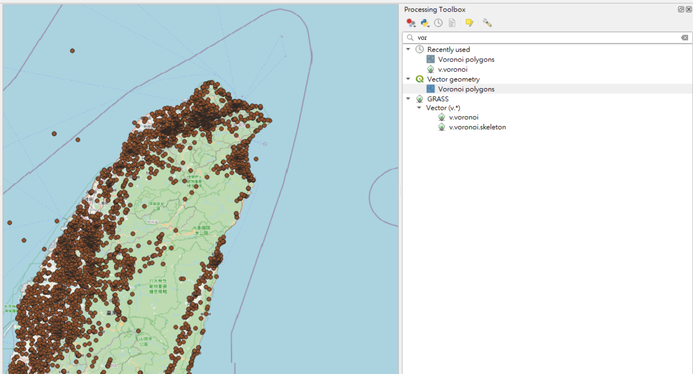



QGIS 是一套免費的地圖資料管理系統，除了可以將使用者蒐集到的資料以地理資續的方式呈現外，使用者也可透過 QGIS 來處理、分析及整合地理空間資料，並繪製主題地圖。在這個章節中，我們將利用 QGIS 來協助我們分析並呈現從民生公共物聯網上所得到的 PM2.5 資料，並在分析完成後將其結果輸出成主題式地圖以供判讀。我們同時也示範如何結合民生公共物聯網的災防資料，透過 QGIS 系統繪製防災避難所分佈圖，方便民眾自行查詢離家最近的防災避難所。

{}
本文所操作之 QGIS 版本為 3.16.8，惟本文所使用之功能皆為該軟體之基本功能，若使用其他版本軟體，應仍可正常操作。
{}

## 章節目標

- 如何將取得的資料導入 QGIS
- 在 QGIS 使用前面章節所介紹的地理空間分析功能 (Intersection、Buffer)
- 將結果輸出成一張主題地圖供別人觀賞

## QGIS操作說明

在執行 QGIS 軟體後，可以看到下方的操作介面，除了中間區域的資料框外，上方為標準工具列，提供各式不同的基本操作工具與功能；左方有兩個子區域，分別為資料目錄視窗與圖層；右邊則為分析工具列，提供各式不同的分析工具。

以下，我們將使用兩個簡單的範例，透過民生公共物聯網的空品資料與災防資料，介紹 QGIS 的基本操作。

## 範例一：空品測站分佈圖

### 資料匯入

資料來源：民生公共物聯網歷史資料 [https://history.colife.org.tw/#/?cd=%2F空氣品質%2F中研院_校園空品微型感測器](https://history.colife.org.tw/#/?cd=%2F空氣品質%2F中研院_校園空品微型感測器)

在這個部分會先介紹如何將資料成功導入到 QGIS 內。由於有些資料在儲存時，會把一張資料表拆開成多張不同的資料表，因此我們在進行分析時，必須要特別留意是否手邊的資料是否有這種情況，並將資料重新結合成原來的一張資料表，以下介紹資料結合的方法：

- 資料導入
  
  首先，我們要先介紹如何將從民生公共物聯網歷史資料直接下載下來的 csv 檔導入到 QGIS。由於資料中有中文，導入時會顯示亂碼，所以採用導入方法為 Layer（位於最上方選單） > Add Layer > Add Delimited Text Layer，匯入介面如下圖：
  
    
- 資料結合 (Join)

  由於原始資料將 PM2.5 與測站經緯座標分成兩個檔案，故須先將 PM2.5 與經緯座標進行 Join。
  
  Join方法如下，對要Join的檔案右鍵 > Properties > joins > 點+號進入 Add Vector Join，如下圖
  
  進入之後有四個主要的選項分別是：
  - Join Layer：想要 Join 的 Layer
  - Join field：與 Target field 所對應，為 Join 時的參考 (類似 Primary key)
  - Target field：與 Join field 所對應，為 Join 時的參考 (類似 Foreign key)
  - Joined field：選擇想要 Join 的欄位
  
    

### 產生 GeoJSON 檔案

接著我們利用 QGIS 內建的功能來將原本的 csv 資料轉換成 [GeoJSON](https://en.wikipedia.org/wiki/GeoJSON) 檔，操作程序為點選Processing > Toolbox > Create points from table。

請注意在點選後選擇要輸入的 Table，在 X 選擇 lon、在 Y 輸入 lat，並且在 Target CRS 指定為 [WGS 84](https://en.wikipedia.org/wiki/World_Geodetic_System)（經緯度座標）然後輸入要輸出的檔案名稱，如下圖。

接著選擇所要輸出的檔案格式後，點選「存檔」即可。

### 篩選資料與改變資料點位顏色

接下來我們示範如何使用 QGIS 來篩選所需要的測站，並讓測站的呈現顏色隨著 PM 2.5 數值而改變。

- 利用 Intersection 來根據縣市篩選所需要的測站
    
  在進行篩選前，需要先從政府資料開放平台下載直轄市、縣市界線的 shp 檔，之後將各縣市界線的 shp 檔匯入QGIS，如下圖：
  {}
  由於民生公共物聯網計畫中，將彰化和南投縣市的校園空品微型感測器佈建劃分由暨南大學負責，因此本次所取用的資料中，並無彰化和南投的資料。
  {}
  
  接著我們點選 Select Feature 的圖示，並點選 Country 的 Layer 並選取想要的縣市，被選取的縣市將會呈現黃色，這邊以新北為例，如下圖：
  
  在 Processing Toolbox 中找尋 Intersection 功能，點擊後會出現如下圖介面，其中有三個主要的輸入，分別是：
  - Input Layer
  - Overlay Layer
  - Intersection (Output)

  接著請在 Input Layer 中放入 PM2.5 的 layer，在 Overlay Layer 中放入縣市界線的 layer 並勾選Select features only，代表只篩選出和上一步驟中選取的新北市有交集的測站，接著在 Intersection 中輸入要輸出的檔案名稱，其中可支援輸出的檔案格式選項和之前可選擇的選項相同。

  執行過後將會得到下圖成果

    
- 根據 PM2.5 的數值來顯示不同的顏色
    
  接著我們在 PM2.5 的 layer 上點選右鍵 > Properties > Symbology 便可以看到圓點的顏色設定，有關各 PM2.5 測站的顏色設定步驟如下：
    
  1. 在最上方原本的設定為 No Symbols，將其改為 Graduated 如下
  2. Value 部分選 PM25
  3. 點擊下方 Classify 按鈕
  4. 在 Classes 設定顏色數目（註：建議設定類別不宜過多，以不超過7類為原則）
  5. 到 Color ramp 設定各數值之顏色
  6. 完成後點擊 OK

  當一切都設定完成後，將可以得到下圖，其中圓點的顏色會隨著PM 2.5數值的不同而改變，而右邊的 Layer 則顯示不同顏色所代表的 PM 2.5 數值。
    
  {}
  新版的QGIS (3.16 後)裡已經有 OpenStreetMap 的底圖，可以點擊下圖中的 XYZ Tiles → OpenStreetMap 來添加 OSM 底圖
  {}
    

    

### 將成果輸出成主題式地圖

在完成了上述的設定後，接下來要將 QGIS 專案輸出成 JPG 圖片。我們點擊 Project > New Print Layout 後會跳出 Layout 名稱設定，設定完成後會出現如下畫面：

點擊左方的 Add map，並在繪圖區上框選範圍，來加入 PM 2.5 的地圖，如下圖

接下來點選左邊的 Add Legend 並選取一範圍來匯入標籤，而在右方的 Item Properties 可以改變標籤中的字體大小、顏色等；最後再匯入標題、比例尺、指北針來完成主題圖。

最後點選左上角的 Layout > Export as Image 便可將主題圖輸出成圖片檔案。

## 範例二：避難所分佈圖

資料來源：[https://data.gov.tw/dataset/73242](https://data.gov.tw/dataset/73242)

在政府的開放資料中，已將全台灣的緊急避難所整理成電子檔案，方便民眾下載使用，在這個範例中，我們將使用這些資料，介紹如何透過 QGIS 尋找離家裡最近的避難所。

我們先去上面的網址取得避難所資料，接下來照前面所講的方法載入資料，如下圖：

由於全台灣的避難所數量眾多，我們在本文中只分析台北市的避難所，其餘縣市的部分也可以用相同的方法分析，歡迎讀者自行嘗試。我們先用前面所述的 intersection 方法把台北市的避難所找出來。接下來，我們使用旁邊工具列的 Voronoi Polygons 來繪製Voronoi Diagram，如下圖：

在 Voronoi Polygons 填入避難所的圖層，並按「執行」

根據 Voronoi Diagram 的特性 (第 5.2 章節)，我們可以得知離自己家最接近的避難所位置，如下圖：

在完成分析後，可以按照前面的方法將分析結果出成主題式地圖來供別人觀賞。

## QGIS總結

在本章節中我們介紹了如何將資料導入 QGIS，以及如何利用 QGIS 中的分析工具，來協助我們對資料進行分析。最後我們介紹了圖表匯出的方法，可以把分析好的資料製成主題圖供別人觀賞。當然，QGIS 中仍有許多功能是在這個章節中來不及介紹的，如果對 QGIS 還有更多的興趣，可以參考下方的一些其他資源。

## Reference

- QGIS: A Free and Open Source Geographic Information System (https://qgis.org/)
- YouTube：[GIS 網上小教室系列：第1集 — 從零開始學 QGIS](https://www.youtube.com/watch?v=rtmxj7ddm4w)
- QGIS 英文說明：[QGIS Tutorials and Tips](https://www.qgistutorials.com/en/)
- QGIS Documentation (https://www.qgis.org/en/docs/index.html)
