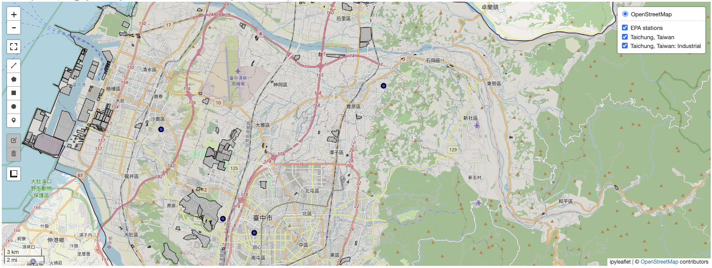
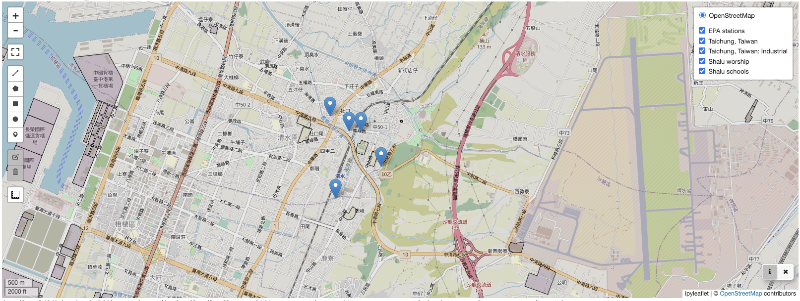

[](https://colab.research.google.com/drive/1Ra0184leoQ7nQGqCY-utlEd2a_wonZEz?usp=sharing)



我們在之前的章節中，已經示範了如何使用程式語言針對地理屬性的資料進行分析，同時也示範了如何使用 GIS 軟體進行簡易的地理資料分析與呈現。接下來我們介紹如何使用 Python 語言中的 Leafmap 套件進行 GIS 應用，以及 Streamlit 套件進行網站開發。最後，我們將結合 Leafmap 和 Streamlit，自行製作簡單的網頁 GIS 系統，並將資料處理與分析後的結果，透過網頁方式來呈現。

## 套件安裝與引用

在本章節中，我們將會使用到 pandas, geopandas, leafmap, ipyleaflet, osmnx, streamlit, geocoder 及 pyCIOT 等套件，這些套件除了 pandas 外，在我們使用的開發平台 Colab 上皆沒有預先提供，因此我們需要先自行安裝。由於本次安裝的套件數量較多，為了避免指令在執行後產生大量的文字輸出訊息，因此我們在安裝的指令中，增加了 ‘-q’ 的參數，可以讓畫面的輸出更精簡。

```python
!pip install -q geopandas
!pip install -q leafmap
!pip install -q ipyleaflet
!pip install -q osmnx
!pip install -q streamlit
!pip install -q geocoder
!pip install -q pyCIOT
```

待安裝完畢後，即可使用下列的語法先行引入相關的套件，完成本章節的準備工作：

```python
import pandas as pd
import geopandas as gpd
import leafmap
import ipyleaflet
import osmnx
import geocoder
import streamlit
from pyCIOT.data import *
```

## 讀取資料

在本章的範例中，我們使用民生公共物聯網資料平台上的環保署空品測站資料，以及中央氣象局與國震中心地震監測站資料。

在環保署空品測站的部分，我們使用 pyCIOT 套件擷取所有環保署空品測站的最新一筆量測結果，並且透過 pandas 套件的 `json_normalize()` 方法，將所獲得的 JSON 格式資料，轉換成 DataFrame 格式，並且只留下其中測站名稱、緯度、經度與臭氧 (O3) 濃度資訊，以待後面操作時使用。這部分資料擷取與處理的程式碼如下：

```python
epa_station = Air().get_data(src="OBS:EPA")
df_air = pd.json_normalize(epa_station) 
df_air['O3'] = 0
for index, row in df_air.iterrows():
  sensors = row['data']
  for sensor in sensors:
    if sensor['name'] == 'O3':
      df_air.at[index, 'O3'] =  sensor['values'][0]['value']
df_air = df_air[['name','location.latitude','location.longitude','O3']]
df_air
```


接著我們用類似的方法，擷取中央氣象局與國震中心地震監測站的測站資料，並且只留下其中測站名稱、緯度與經度資訊，以待後面操作時使用。這部分資料擷取與處理的程式碼如下：

```python
quake_station = Quake().get_station(src="EARTHQUAKE:CWB+NCREE")
df_quake = pd.json_normalize(quake_station) 
df_quake = df_quake[['name','location.latitude','location.longitude']]
df_quake
```


以上我們已經成功示範空品資料 (air) 和地震資料 (quake) 的讀取範例，在接下來的探討中，我們將利用這些資料進行 leafmap 套件的操作與應用，相同的方法也可以輕易改成使用其他民生公共物聯網資料平台上的其他資料而得到類似的結果，大家可以自行嘗試看看。

## Leafmap 基本操作

### 資料基本呈現方法

根據我們目前已處理好的空品測站資料 `df_air` 與地震測站資料 `df_quake`，我們首先這兩份資料的格式，從原本 pandas 套件所提供的 DataFrame 格式，轉成支援地理資訊屬性的 geopandas 套件所提供的 GeoDataFrame 格式；接著我們利用 leafmap 的 `add_gdf()` 方法，將兩份資料分為兩個圖層一次加入地圖。

```python
gdf_air = gpd.GeoDataFrame(df_air, geometry=gpd.points_from_xy(df_air['location.longitude'], df_air['location.latitude']), crs='epsg:4326')
gdf_quake = gpd.GeoDataFrame(df_quake, geometry=gpd.points_from_xy(df_quake['location.longitude'], df_quake['location.latitude']), crs='epsg:4326')

m1 = leafmap.Map(center=(23.8, 121), toolbar_control=False, layers_control=True)
m1.add_gdf(gdf_air, layer_name="EPA Station")
m1.add_gdf(gdf_quake, layer_name="Quake Station")
m1
```


從程式輸出的地圖中，我們可以在地圖的右上角看到兩份資料的內容，已經依照兩個圖層的方式加入地圖，使用者可以依照自己的需求點選所要查詢的圖層進行瀏覽。然而，當我們想同時瀏覽兩個圖層的資料時，會發現兩個圖層使用相同的圖示進行呈現，因此在地圖上將產生混淆。

為了解決這個問題，我們介紹另外一種資料呈現的方式，使用 ipyleaflet 套件所提供的 GeoData 圖層資料格式，並使用 leafmap 的 `add_layer()` 方法將 GeoData 圖層加入地圖。為了方便辨認，我們使用藍色的小圓形圖案表示空品測站的資料，並使用紅色的小圓形圖案表示地震測站的資料。

```python
geo_data_air = ipyleaflet.GeoData(
    geo_dataframe=gdf_air,
    point_style={'radius': 5, 'color': 'black', 'fillOpacity': 0.8, 'fillColor': 'blue', 'weight': 3},
    name="EPA stations",
)
geo_data_quake = ipyleaflet.GeoData(
    geo_dataframe=gdf_quake,
    point_style={'radius': 5, 'color': 'black', 'fillOpacity': 0.8, 'fillColor': 'red', 'weight': 3},
    name="Quake stations",
)

m2 = leafmap.Map(center=(23.8, 121), toolbar_control=False, layers_control=True)
m2.add_layer(geo_data_air)
m2.add_layer(geo_data_quake)
m2
```


### 資料叢集呈現方法

在某些資料應用場合，當地圖上的資料點位數量太多時，反而不容易進行觀察，這時我們可以使用叢集 (cluster) 的方式來呈現資料，也就是當小範圍內資料點位數量太多時，會將這些點位聚集在一起，並且顯示點位的數量；當使用者拉近 (zoom in) 地圖時，隨著地圖比例尺的修改，這些原本叢集的點位會被慢慢抽離，當小範圍內只剩下一個點位時，便可以直接看到點位的資訊。

我們使用地震測站的資料進行示範，使用 leafmap 的 `add_points_from_xy()` 方法，便能將 df2 的資料以叢集的方式放上地圖。

```python
m3 = leafmap.Map(center=(23.8, 121), toolbar_control=False, layers_control=True)
m3.add_points_from_xy(data=df_quake, x = 'location.longitude', y = 'location.latitude', layer_name="Quake Station")
m3
```


### 更改 Leafmap 底圖

Leafmap 使用 OpenStreetMap 的圖層做為預設的地圖底圖，但是也提供了超過百種的其他底圖選項，使用者可以依照自己的喜好與需求進行更改，並且可以使用下列語法獲知目前 leafmap 所支援的底圖：

```python
layers = list(leafmap.basemaps.keys())
layers
```

我們從這些底圖中挑選 SATELLITE 和 Stamen.Terrain 作為示範，使用 leafmap 套件的 `add_basemap()` 方法將底圖加入成為新的圖層，加入後 leafmap 預設會開啟所有圖層，並按照加入順序進行疊加，但仍然可以透過右上角的圖層選單，點選自己所要使用的圖層。

```python
m4 = leafmap.Map(center=(23.8, 121), toolbar_control=False, layers_control=True)
m4.add_gdf(gdf_air, layer_name="EPA Station")

m4.add_basemap("SATELLITE")
m4.add_basemap("Stamen.Terrain")
m4
```


除了使用 leafmap 所提供的底圖外，也可以使用 Google Map 的 XYZ Tiles 服務，加入 Google 衛星影像的圖層，其方法如下：

```python
m4.add_tile_layer(
    url="https://mt1.google.com/vt/lyrs=y&x={x}&y={y}&z={z}",
    name="Google Satellite",
    attribution="Google",
)
m4
```


### 整合 OSM 資源

Leafmap 除了內建的多項資源外，也整合了許多外部的地理資訊資源，其中 OSM (OpenStreetMap) 便是一個著名且內容豐富的開源地理資訊資源，有關 OSM 所提供的各式資源，可以在 OSM 網站中查詢[完整的屬性列表](https://wiki.openstreetmap.org/wiki/Map_features)。

在下列的範例中，我們透過 leafmap 套件提供的 `add_osm_from_geocode()` 方法，示範如何獲取城市的邊界輪廓，作為地圖呈現使用。我們以台中市為例，搭配之前使用的環保署空品測站點位資料，可以清楚看到哪些測站位於台中市內。

```python
city_name = "Taichung, Taiwan"

m5 = leafmap.Map(center=(23.8, 121), toolbar_control=False, layers_control=True)
m5.add_layer(geo_data_air)
m5.add_osm_from_geocode(city_name, layer_name=city_name)
m5
```


我們接著繼續使用 leafmap 套件提供的 `add_osm_from_place()` 方法，針對台中市境內進一步尋找特定的設施，並加入地圖圖層。下方的程式以工廠設施為例，透過 OSM 的土地利用資料，找出台中市內的相關工廠地點與區域，可以與空品測站位置搭配進行分析判讀使用。有關 OSM 更多的設施種類，可以參考[完整的屬性列表](https://wiki.openstreetmap.org/wiki/Map_features)。

```python
m5.add_osm_from_place(city_name, tags={"landuse": "industrial"}, layer_name=city_name+": Industrial")
m5
```



此外，leafmap 套件也提供以特定地點為中心，搜尋 OSM 鄰近設施的方法，對於分析與判讀資料，提供十分便利的功能。例如，在以下的範例中，我們使用 `add_osm_from_address()` 方法，搜尋台中清水車站 (Qingshui Station, Taichung) 方圓 1,000 公尺內的相關宗教設施 (屬性為 "amenity": "place_of_worship")；同時，我們使用 `add_osm_from_point()` 方法，搜尋台中清水車站 GPS 座標  (24.26365, 120.56917) 方圓 1,000 公尺內的相關學校設施 (屬性為 "amenity": "school”)。最後，我們將這兩項查詢的結果，分別用不同的圖層疊加到既有的地圖上。

```python
m5.add_osm_from_address(
    address="Qingshui Station, Taichung", tags={"amenity": "place_of_worship"}, dist=1000, layer_name="Shalu worship"
)
m5.add_osm_from_point(
    center_point=(24.26365, 120.56917), tags={"amenity": "school"}, dist=1000, layer_name="Shalu schools"
)
m5
```




### Heatmap 應用

[熱力圖](https://en.wikipedia.org/wiki/Heat_map)是一種以顏色變化來顯示事件強度的一種二維空間表示法，將熱力圖與地圖搭配時，可以根據所使用的地圖比例不同，表達不同尺度下的事件強度狀態，是資料視覺化表示方法中一個非常普遍使用與功能強大的工具。然而，在繪製熱力圖時，使用者必須確認資料本身的特性適合使用熱力圖來呈現，否則極易與我們在單元五所介紹的 IDW 和 Kriging 等圖形化資料內插表示法產生混淆。例如，我們以上面空品測站資料的 O3 濃度資料為例，繪製對應的熱力圖如下：

```python
m6 = leafmap.Map(center=(23.8, 121), toolbar_control=False, layers_control=True)
m6.add_layer(geo_data_air)
m6.add_heatmap(
    df_air,
    latitude='location.latitude',
    longitude='location.longitude',
    value="O3",
    name="O3 Heat map",
    radius=100,
)
m6
```


這張圖乍看之下並無明顯的問題，但如果我們將地圖拉近，放大台中市的區域後，便會發現熱力圖的樣貌發生極大的變化，在不同的尺度下呈現完全不同的結果。


上述的範例其實便是一個熱力圖被誤用的案例，因為 O3 濃度的資料反映的是當地的 O3 濃度，其數值並不能因為地圖比例更改而隨著測站叢集後直接進行累加，同時也不能因為地圖比例更改而將累加的數值均勻分散給地圖上的鄰近區域；因此，範例中所使用的 O3 濃度資料，並不適用於熱力圖來表示，而應使用第五章所介紹的地理內插方法來繪製圖形。

為了呈現熱力圖的真實效果，我們改用地震測站的點位資料，並且加入一個新的欄位 num，且預設值設為 10，接著我們用下列的程式碼產製台灣地震測站狀態的熱力圖。

```python
df_quake['num'] = 10
m7 = leafmap.Map(center=(23.8, 121), toolbar_control=False, layers_control=True)
m7.add_layer(geo_data_quake)
m7.add_heatmap(
    df_quake,
    latitude='location.latitude',
    longitude='location.longitude',
    value="num",
    name="Number of Quake stations",
    radius=200,
)
m7
```


### 分割視窗功能

在資料分析判讀的過程中，有時常需要切換不同的底圖以獲取不同的地理資訊，leafmap 套件因此提供 `split_map()` 的方法，可以將原本的地圖輸出分為所有兩個子畫面，並且各自套用不同的底圖，以方便地圖資訊的閱讀。其範例程式碼如下：

```python
m8 = leafmap.Map(center=(23.8, 121), toolbar_control=False, layers_control=True)
m8.add_gdf(gdf_air, layer_name="EPA Station")
m8.split_map(
    left_layer="SATELLITE",
    right_layer="Stamen.Terrain"
)
m8
```


## Leafmap 成果網頁化

Leafmap 套件的功能十分強大，為了能將處理好的地圖資訊快速分享出去，也特別提供了整合 Streamlit 套件的方式，可以將 Leafmap 的地理資訊 GIS 技術專長與 Streamlit 的 Web 技術專長結合，快速打造 Web GIS 系統。以下我們用一個簡單的範例進行示範，大家可以按照此原則自行擴充，建構自己的 Web GIS 服務。

在 Streamlit 套件的使用中，建構一個網頁系統分為兩個步驟：

1. 將所要執行的 Python 程式內容打包成一個 Streamlit 物件，並且將打包過程寫入 app.py 檔案
2. 在系統上執行 app.py

由於我們的操作過程都是使用 Google Colab 平台，在這個平台中我們可以直接將 app.py 用特殊的語法 `%%writefile` 寫入特殊的暫存區中，接著再由 Colab 直接從暫存區中讀取與執行。因此，針對步驟一的檔案寫入部分，我們可以按照下列的方式進行：

```python
%%writefile app.py
import streamlit as st
import leafmap.foliumap as leafmap
import json
import pandas as pd
import geopandas as gpd
from pyCIOT.data import *

contnet = """
Hello World!
"""
st.title('Streamlit Demo')
st.write("## Leafmap Example")
st.markdown(contnet)

epa_station = Air().get_data(src="OBS:EPA")
from pandas import json_normalize
df_air = json_normalize(epa_station) 
geodata_air = gpd.GeoDataFrame(df_air, geometry=gpd.points_from_xy(df_air['location.longitude'], df_air['location.latitude']), crs='epsg:4326')

with st.expander("See source code"):
  with st.echo():
    m = leafmap.Map(center=(23.8, 121), toolbar_control=False, layers_control=True)
    m.add_gdf(geodata_air, layer_name="EPA Station")  
        
m.to_streamlit()
```

針對步驟二的部分，我們則用下列的指令執行：

```python
!streamlit run app.py & npx localtunnel --port 8501
```

執行後便會出現類似下方的執行結果：


接著可以點選其中 “your url is:” 這個字串後面的這個網址，便會在瀏覽器中出現類似下方的內容


最後，我們點選 “Click to Continue”，便能成功開啟 app.py 中所打包的 Python 程式碼內容，在這個範例中，便能看到 leafmap 套件所呈現的環保署空品測站分佈圖。


## 小結

在本章節我們介紹了如何用 Python 語言的 Leafmap 套件進行地理資料的呈現與資源整合，也同時介紹了如何結合 Streamlit 套件的網頁功能，在 Google Colab 平台上建立簡易的網頁化地理資訊系統服務，必須補充說明的是，Leafmap 還有許多更進階的功能，以及與前面其他章節內容的整併與呈現，皆受限於文章篇幅無法在這篇文章中涵蓋到，這些更進一步的探索學習，皆可參考其他章節的內容，或下方的其他參考資料做更多加深加廣的學習。

## 參考資料

- Leafmap Tutorial ([https://www.youtube.com/watch?v=-UPt7x3Gn60&list=PLAxJ4-o7ZoPeMITwB8eyynOG0-CY3CMdw](https://www.youtube.com/watch?v=-UPt7x3Gn60&list=PLAxJ4-o7ZoPeMITwB8eyynOG0-CY3CMdw))
- leafmap: A Python package for geospatial analysis and interactive mapping in a Jupyter environment ([https://leafmap.org/](https://leafmap.org/))
- Streamlit 超快速又輕鬆建立網頁 Dashboard ([https://blog.jiatool.com/posts/streamlit/](https://blog.jiatool.com/posts/streamlit/))
- Streamlit Tutorial ([https://www.youtube.com/watch?v=fTzlyayFXBM](https://www.youtube.com/watch?v=fTzlyayFXBM))
- Map features - OpenStreetMap Wiki ([https://wiki.openstreetmap.org/wiki/Map_features](https://wiki.openstreetmap.org/wiki/Map_features))
- Heat map - Wikipedia ([https://en.wikipedia.org/wiki/Heat_map](https://en.wikipedia.org/wiki/Heat_map))
